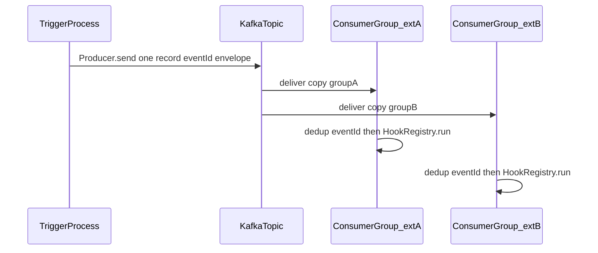

# Cluster-level extension hooks (multi-extension fan-out)

## Problem the plan must solve

Local [`HookRegistry`](packages/core/src/hooks/hook-registry.ts) runs **every** handler for the same **`HookScope` + `HookPhase`** in one process.

In the cluster, **`copyright-notice`** and **`example-transform`** may register the **same phases** (`onLoad`, `onRegister`, `onShutdown`, …) for shared scopes. When an event fires, **every** extension’s handlers must run. **Single-target** `invoke(extensionId, …)` is not the primary API — callers would have to know all extensions.

**Primary primitive:** **`publishClusterHookDispatch(scope, phase, payload)`** with a stable **`eventId`** (or correlation id used for idempotency). Each extension pod executes **`HookRegistry.run(scope, phase, payload)`** for the same envelope.

## Kafka and [effect-kafka](https://github.com/floydspace/effect-kafka)

[effect-kafka](https://github.com/floydspace/effect-kafka) exposes **Effect-native** `Producer`, `Consumer`, **streams**, and **Layers**, with pluggable engines (KafkaJS, Confluent, Platformatic). It fits the “publish once, many subscribers” model without maintaining a **per-runner address fan-out list** for every dispatch.

### Fan-out semantics (consumer groups)

In Kafka, **one consumer group** load-balances partitions across members — **not** what we want for “every extension type receives every message.”

**Pattern for N extension deployments each needing all hook events:**

- **One topic** (e.g. `eventiva.hook.dispatch`).
- **One producer** per publish (serialized envelope as value; optional **key** for partition affinity / ordering of related events).
- **Each extension consumer uses a distinct `groupId`**, stable per extension identity, e.g. `eventiva-hooks-${CLUSTER_EXTENSION_ID}` or `eventiva-hooks-copyright-notice` vs `eventiva-hooks-example-transform`.

Then **each group** independently reads the **full** topic stream from its committed offsets — every extension pod gets a copy of each published dispatch (subject to retention and consumer lag).

**Replicas** of the **same** extension: use the **same** `groupId` so partitions are shared within that extension only (load balance within the extension deployment).

### What Kafka improves vs PG NOTIFY / RPC fan-out

- **No dynamic “SELECT all runner addresses”** on every publish (participant registry becomes **optional** for observability, not required for routing).
- **Durability, retention, replay** for debugging or slow consumers.
- **Clear separation**: producer path vs consumer path; Effect `Layer` composition matches the rest of the stack.

### What Kafka does not solve alone

- **Double execution (local + message):** still require **one emission policy** (e.g. cluster-wide lifecycle hooks only via Kafka, or disable duplicate local path) plus **idempotent handlers** using **`eventId`** (at-least-once delivery can still redeliver).
- **Ordering across extensions:** not guaranteed globally; only per-partition ordering if keyed consistently.

## Package boundaries (repo policy)

Per [integration-core-and-features](.cursor/rules/integration-core-and-features.mdc):

- **`@eventiva/core`**: wire types, `HookScope` / phase encoding, optional **service tag** or interface for “hook dispatch bus” — **no** `effect-kafka` or Kafka engine dependency.
- **`@eventiva/integrations.kafka`** (or agreed name): depends on `effect-kafka` + chosen engine; exposes `Layer`s for **Producer** / **Consumer** and thin helpers (`publishDispatch`, `subscribeDispatchStream`).
- **Platform / runner entry**: merges integration `Layer` with runner stack; extensions stay thin.

## Relation to other transports (fallbacks)

1. **PG `LISTEN` / `NOTIFY`** (+ outbox row for large payloads) — no new infra; NOTIFY size limit ~8KB.
2. **Parallel `Runners.send`** to addresses from participant registry — no broker; needs address list and healthy runners.

Keep these documented for environments **without** Kafka.

## Effect cluster Postgres and tools/cluster

Still valuable for **runner identity** and ops: **`cluster_runners`**, **`cluster_locks`**, [`tools/cluster` shard-manager vs battleships](tools/cluster/src/shard-manager/index.ts). Phase 0 review unchanged.

## Target behavior (Kafka)

## Design decisions

| Topic | Choice |
|--------|--------|
| **Primary API** | **`publishClusterHookDispatch`** with **`eventId`** in envelope. |
| **Transport (preferred to explore)** | **Kafka** + [effect-kafka](https://github.com/floydspace/effect-kafka) `Producer` / `Consumer` / `Stream` + `Layer`. |
| **Consumer groups** | **Distinct `groupId` per extension identity** so every extension type receives all messages; same `groupId` across replicas of one extension. |
| **Dedupe** | Consumer checks **`eventId`** (short TTL store or idempotency table per extension pod); commit offset after successful `HookRegistry.run`. |
| **Emission policy** | Explicit rule: no duplicate **local + Kafka** for the same logical lifecycle without dedupe. |
| **Integration package** | `@eventiva/integrations.kafka` (vendor + `effect-kafka`); core defines envelope + tags only. |
| **Participant registry** | **Optional** for dashboards / JOIN `cluster_runners`; **not** required for Kafka publish path. |
| **Broker placement (dev)** | **Inside the same K8s cluster** as Effect runners (Podman local or otherwise), deployed by the **same** `platforms-postgresql:run` / `cluster:apply` pipeline — **no extra manual broker step** for the default workflow. |
| **Bootstrap address** | From pod: cluster DNS (e.g. `my-kafka-bootstrap.kafka.svc:9093`); document exact Service name/namespace in docs after implementation. |
| **Cluster management (FPK)** | **All** Kafka-related Kubernetes resources (namespace, Strimzi operator install if included, `Kafka` / `KafkaTopic` / `KafkaUser` CRs, RBAC, Services) are **authored with FPK** — same workflow as today: `@fpk/k8s` (see root [`package.json`](../../package.json)) modules under [`tools/cluster/src`](../../tools/cluster/src), rendered by [`scripts/cluster/render-fpk-cluster.mjs`](../../scripts/cluster/render-fpk-cluster.mjs) (`fpk -d tools/cluster/src -o tools/cluster/out`), applied by [`scripts/cluster/apply-fpk-cluster.mjs`](../../scripts/cluster/apply-fpk-cluster.mjs) and Nx `cluster:apply` on [`packages/platforms/postgresql/project.json`](../../packages/platforms/postgresql/project.json) / MySQL. **No parallel hand-maintained YAML tree** unless explicitly grandfathered and called out. |

## FPK workflow (reference)

Existing pattern (do the same for Kafka):

- Source: TypeScript under **`tools/cluster/src/<module>/index.ts`** importing **`@fpk/k8s`** (see [`tools/cluster/src/shard-manager/index.ts`](../../tools/cluster/src/shard-manager/index.ts), [`tools/cluster/src/pg/index.ts`](../../tools/cluster/src/pg/index.ts)).
- Render: **`node scripts/cluster/render-fpk-cluster.mjs`** → YAML under **`tools/cluster/out`**.
- Apply / delete / status / logs: existing **`scripts/cluster/*-fpk-cluster.mjs`** and Nx targets on the platform projects.

Optional: extend [`scripts/cluster/port-forward-fpk-cluster.mjs`](../../scripts/cluster/port-forward-fpk-cluster.mjs) (or docs) to forward the Strimzi **bootstrap** Service for host-side debugging.

## Implementation phases

### Phase 0 — Review and document

Effect cluster tables, **FPK** module layout under `tools/cluster/src`, ShardingConfig parity; add **Kafka topic + consumer group** contract to docs (documentation-creator).

### Phase 1 — Wire envelope and types (core)

Stable JSON (or Schema) for full `HookScope` + `HookPhase` + payload + **`eventId`** + version. No Kafka in core.

### Phase 2 — effect-kafka spike

1. Add dev dependency / integration package: `effect-kafka` + one engine (e.g. KafkaJS via documented path in [effect-kafka README](https://github.com/floydspace/effect-kafka)).
2. Prove: **one** `Producer.send`, **two** consumers with **different** `groupId`, **both** observe the same message.
3. Document broker config via env (brokers list, topic name, **TLS client props** — see **Kafka operations** section below).

### Phase 3 — integrations.kafka + publish/subscribe

1. Implement **producer** helper used by `publishClusterHookDispatch` (platform or service that has Producer layer).
2. Implement **consumer** stream in runner/extension entry: decode → **dedupe `eventId`** → `HookRegistry.run`.
3. Wire **Layer.merge** in [`makeRunnerBattleshipEntry`](packages/extensions/runner/src/runner.ts) (or platform) when `CLUSTER_HOOK_BUS=kafka` (config flag TBD).

### Phase 4 — Lifecycle emission + dedupe policy

Choose **single source** for cluster-wide events; add **idempotency** store (minimal: in-memory LRU + optional PG for crash safety). Start with **one** demo event before full lifecycle.

### Phase 5 — Demo + cluster manifests

- **Local + staging + prod:** Kafka is **in-cluster**, defined in **FPK** (new `tools/cluster/src/...` module). Recommended: **Strimzi** `Kafka` + `KafkaTopic` + `KafkaUser` CRs emitted from the same render pipeline as pg/shard-manager. **Local Podman:** minimal broker count (1 or 3) + TLS; same CR **shape** as prod where practical.
- **Developer workflow:** `pnpm nx run platforms-postgresql:run` runs **cluster:apply** (FPK) **including Kafka**; workloads use **`KAFKA_BOOTSTRAP_SERVERS`** to the in-cluster listener — no host Compose on the default path.
- Two extension pods, **distinct consumer `groupId`s**, both log on publish.
- **Optional:** retain a **host-only** Compose broker **only** for isolated effect-kafka spike without Kubernetes — not part of the platform gate.

### Optional

Targeted single-extension replay API; alternate transports (NOTIFY, RPC fan-out) documented.

## Files likely touched

- [`packages/core/src/hooks/types.ts`](packages/core/src/hooks/types.ts) — envelope encoding helpers as needed
- **New** `packages/integrations/kafka/` — `effect-kafka` Layers, produce/consume
- [`pnpm-workspace.yaml`](pnpm-workspace.yaml) — `packages/integrations/*` if new
- [`packages/extensions/runner/src/runner.ts`](packages/extensions/runner/src/runner.ts) — optional consumer fiber + Layer merge behind config
- [`tools/cluster/src`](tools/cluster/src) — **new FPK module** for Kafka/Strimzi (mirror [`shard-manager`](tools/cluster/src/shard-manager/index.ts) / [`pg`](tools/cluster/src/pg/index.ts)); output consumed by [`render-fpk-cluster.mjs`](scripts/cluster/render-fpk-cluster.mjs); optional `docker-compose.kafka.yml` **only** for off-cluster spike
- Docs — documentation-creator

## Kafka operations (decisions & steps)

**Captured from planning Q&A (2026-04-01):**

| Area | Decision |
|------|-----------|
| **Dev broker** | **In-cluster** on the same Kubernetes as Eventiva (Podman local included) — **Strimzi** (or agreed operator/chart) with a **dev-sized** Kafka cluster (may be 1 or 3 brokers per resource constraints); applied alongside postgres/mysql stack via **`nx run platforms-postgresql:run`**. |
| **Prod / staging broker** | **Strimzi** on Kubernetes — scale replicas + `min.insync.replicas` for HA; same CR patterns as dev where possible. |
| **Retention** | **Environment-tuned:** short in **dev** (e.g. 24–72h) to limit disk; **longer in staging/prod** (e.g. 7d) for incident replay — exact hours in topic config + docs. |
| **Security** | **TLS everywhere** — **Strimzi** (or chart) issues broker + user certs for in-cluster listeners; app pods mount trust material from **Secrets**; effect-kafka configured for TLS (optional mTLS later). |

### Dev ergonomics (single command)

1. **Default path:** Developer runs **`pnpm nx run platforms-postgresql:run`** (and **`platforms-mysql:run`** when validating MySQL). That target’s **cluster:apply** (or equivalent) brings up **Postgres/MySQL, shard-manager, battleships, and Kafka** in the local Podman Kubernetes cluster.
2. **No separate broker lifecycle** for day-to-day work — Kafka **readiness** should be wired like other workloads (init/wait job or deployment `ready` before runners that need Kafka start, if ordering is required).
3. **Env template:** `KAFKA_BOOTSTRAP_SERVERS` = **in-cluster DNS** + port for TLS listener; trust material from mounted **Secrets** (paths or env); document in [`.env.example`](.env.example) with comments that values are for pods / forwarded scenarios if any host client exists.
4. **Host access (optional):** if something on the laptop must talk to Kafka, document **`kubectl port-forward`** to the Strimzi bootstrap Service — **secondary** to in-cluster pod-to-pod traffic.
5. **CI:** reuse existing cluster-e2e patterns if present; optional compose-only spike remains **off** the critical path.

### Strimzi / cluster steps (dev + staging–prod)

1. **Namespace + operator:** install Strimzi operator (version pinned) **once per cluster** (local Podman included) **via FPK** — same `tools/cluster/src` tree and `apply-fpk-cluster` path as other workloads; if operator manifests are upstream YAML, vendor them into an fpk module or use fpk’s supported pattern for raw/custom resources (**no ad-hoc `kubectl apply` in docs as the primary install path**).
2. **Kafka cluster CR:** **local dev** may use **1 broker** if ISR/replication settings allow (or 3 for parity); **prod** replicas ≥ 3 for HA; storage class; **TLS listeners** on `9093` (or team standard); inter-broker TLS.
3. **KafkaTopic CR** for `eventiva.hook.dispatch`: **partitions** ≥ max expected concurrent publishers or partition-ordering needs (start small, e.g. 3–6); **replication factor** matches cluster min ISR; **`retention.ms` / `retention.bytes`** per env table (dev vs prod).
4. **KafkaUser** (SCRAM or TLS auth per Strimzi recipe) for **producers** and **consumers**; **ACLs:** producer principal `WRITE`, `DESCRIBE` on topic; consumer principals `READ`, `DESCRIBE` on topic + `READ` on consumer group id prefix `eventiva-hooks-*`.
5. **Workload secrets:** mount CA + user cert/key into Eventiva pods; **rotation** process noted (Strimzi certificate renewal).
6. **Observability:** Kafka metrics (JMX/Strimzi metrics) + consumer lag alerts for `eventiva-hooks-*` groups.

### ACLs checklist (v1 shippable)

- Separate credentials for **hook publisher** vs **extension consumers** if blast-radius matters.
- **No anonymous** access on staging/prod listeners.
- Document **how to add a new extension:** new consumer group id + ACL if using strict ACLs (or wildcard `eventiva-hooks-` prefix if policy allows).

## Testing plan (after implementation)

**Goal:** Prove the full stack still comes up on both SQL backends and that cluster hook dispatch (Kafka path) behaves under the same local Kubernetes setup you use day-to-day.

### Prerequisites

- **Kubernetes on Podman** running locally.
- **`pnpm nx run platforms-postgresql:run`** (and MySQL variant) — Kafka must come up **inside that cluster** as part of the applied stack (**no default dependency on a host Compose broker**).
- Repo root; dependencies installed (`pnpm install`).

### Required platform runs (integration gate)

Run **both** full platform entrypoints from the repository root (prefix with `pnpm` per [AGENTS.md](AGENTS.md)):

1. **`pnpm nx run platforms-postgresql:run`** — applies/reconciles the Postgres-oriented cluster stack as that target defines today, then runs the local platform process against it.
2. **`pnpm nx run platforms-mysql:run`** — same for the MySQL-oriented platform.

**Pass criteria (adjust to match implemented observability):**

- Targets complete without fatal errors (cluster apply, wait, local run).
- **Postgres path:** shard-manager / battleships (and any new extension or Kafka-related workloads) reach **Ready** where applicable; logs show expected runner + hook consumer behavior after a **published** test dispatch (if demo publisher is part of the change).
- **MySQL path:** equivalent workloads for the MySQL cluster manifests; hook/Kafka wiring matches whatever parity the implementation documents (if MySQL stack omits Kafka initially, state that explicitly in the gate checklist).

### What this plan does *not* replace

- **Unit / Effect tests** for `@eventiva/core` and `@eventiva/integrations.kafka` remain the responsibility of the **test-creator** agent per [tdd-test-creation](.cursor/rules/tdd-test-creation.mdc); the implementer does not add tests in the same work as the feature.
- This section is the **manual / integration gate** after feature work merges.

### Optional follow-ups

- Add an Nx target or script that encodes “Podman K8s up + both platform runs” for repeatability (only if the team wants it scripted).
- Document **in-cluster bootstrap Service DNS** and optional **port-forward** for host debugging in [`docs/parts/local-dev/`](docs/parts/local-dev/) when documentation-creator updates docs.

## Risks / follow-ups

- **effect-kafka maturity:** evaluate version vs Effect peer deps; roadmap items (transactions, ack management) from upstream.
- **Message size:** large payloads — prefer compact references in value + blob store if needed.
- **Local TLS friction:** Strimzi-generated certs for dev clusters; document trust bundle mounting for app pods.
- **Strimzi upgrade path:** pin operator/Kafka versions; test upgrades on staging.
- **Resource usage:** Strimzi + Kafka on **local Podman** can be heavy — dev Kafka CR may use single broker + small PVC; document minimum CPU/RAM.
- **Apply ordering:** ensure Kafka listener is ready before pods that fail-fast without broker (init containers or Helm dependencies).
- **Tests:** test-creator; implementer per TDD policy.
