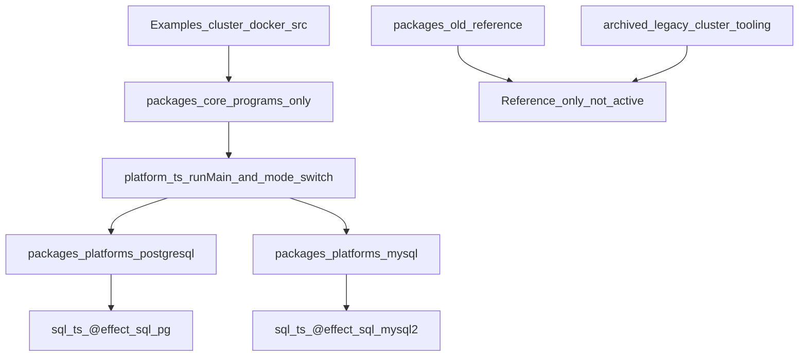

# Rebuild Core From Cluster Example

## Goals

- Preserve old implementation for reference by renaming `/packages` to `/packages-old`.
- Start a fresh `/packages` with a new `core` project copied from the working example, with a **strict file split**: domain programs in `core`, cluster + SQL + **single `runMain` entry** in each platform package.
- Split platform concerns into two new projects: PostgreSQL and MySQL, each with **minimal `src/`** (`sql.ts`, `shardManager.ts`, `platform.ts`, `index.ts`) and `**platform.ts**` switching modes via env (replacing multiple FPK `setArgs` JS targets where possible).
- Keep legacy cluster tooling archived (not hard-deleted), then switch active Nx wiring to new paths.
- Complete mandatory runtime verification (build + run + ship/shooter behavior + DB table population) before proceeding.

## Current-State Inputs Used

- Nx wiring currently depends on `/packages` and project files such as `[/run/media/tgtgamer/Dev/Eventiva/packages/core/project.json](/run/media/tgtgamer/Dev/Eventiva/packages/core/project.json)` and `[/run/media/tgtgamer/Dev/Eventiva/packages/platforms/postgresql/project.json](/run/media/tgtgamer/Dev/Eventiva/packages/platforms/postgresql/project.json)`.
- Workspace package discovery currently points to `/packages/*` in `[/run/media/tgtgamer/Dev/Eventiva/pnpm-workspace.yaml](/run/media/tgtgamer/Dev/Eventiva/pnpm-workspace.yaml)`.
- Example source baseline is `[/run/media/tgtgamer/Dev/Eventiva/Examples/cluster-docker/src](/run/media/tgtgamer/Dev/Eventiva/Examples/cluster-docker/src)`, especially `[/run/media/tgtgamer/Dev/Eventiva/Examples/cluster-docker/src/runner.ts](/run/media/tgtgamer/Dev/Eventiva/Examples/cluster-docker/src/runner.ts)` and `[/run/media/tgtgamer/Dev/Eventiva/Examples/cluster-docker/src/Sql.ts](/run/media/tgtgamer/Dev/Eventiva/Examples/cluster-docker/src/Sql.ts)`.

## Target Architecture

## Core vs platform source layout (required)

This split fixes the earlier attempt where platform packages grew too many files or duplicated app logic.

`**packages/core/src/` — domain and programs only**

- `runner.ts` — battleship/live runner (lift from `Examples/cluster-docker/src/effect-days/runner.ts`).
- `schema.ts` — entity schema (from `effect-days/schema.ts`).
- `shooter.ts`, `slow-shooter.ts`, `speed-shooter.ts` — client programs (from `effect-days/`*).

Core exports **Effects/programs** (e.g. the `Effect` or layered program to run) and **does not** call `NodeRuntime.runMain` for shooter modes; those call sites move to the platform (see below). Any shared counter demo or non-effect-days code from the example stays in core only if still needed; keep `packages/core` as the single place for app-specific modules that are not SQL or cluster wiring.

`**packages/platforms/postgresql/src/` and `packages/platforms/mysql/src/` — minimal platform surface**

Keep the platform package to a **small, fixed set** of files:

| File              | Responsibility                                                                                                                                                                                                                                                                                                                                        |
| ----------------- | ----------------------------------------------------------------------------------------------------------------------------------------------------------------------------------------------------------------------------------------------------------------------------------------------------------------------------------------------------- |
| `sql.ts`          | `SqlLayer` only — `@effect/sql-pg` (Postgres) or `@effect/sql-mysql2` (MySQL), matching env vars used in FPK/K8s.                                                                                                                                                                                                                                     |
| `shardManager.ts` | Shard manager entry using platform `SqlLayer` (same as today’s `shardManager.ts` pattern).                                                                                                                                                                                                                                                            |
| `platform.ts`     | **Single runtime entry** for runner + all shooter modes: read an **env var** (e.g. `CLUSTER_APP_MODE` or `PLATFORM_MODE`, to be wired in FPK manifests), switch on mode, import the corresponding **program** from `@eventiva/core`, compose with cluster/SQL layers, then `**NodeRuntime.runMain`** here — not inside `packages/core` shooter files. |
| `index.ts`        | Public exports (barrel) for the package; may re-export `sql`, shard manager, and platform entry if needed for tooling.                                                                                                                                                                                                                                |

**Note on file count:** The desired baseline was three modules (`sql.ts`, `shardManager.ts`, `index.ts`) plus a dedicated `**platform.ts`** for the unified entry. Treat that as **four small files** under `src/`; `index.ts` stays a thin barrel so the platform package does not accumulate extra modules.

## Unified platform entry and FPK (replaces per-app `setArgs`)

**Problem:** `Examples/cluster-docker` used multiple FPK manifests with `setArgs` pointing at different built JS files per role.

**Approach:** One built entry per platform image (or one primary entry) that runs `**platform.ts`**. FPK sets **one env var** (document the exact name in manifests) to select mode, for example:

- `battleships` / `runner` — battleship server program from core
- `shooter` / `speed-shooter` / `slow-shooter` — corresponding programs from core

`platform.ts` implements: parse env → select program from `@eventiva/core` → `Effect.provide` cluster/SQL/logger layers as today → `**NodeRuntime.runMain`**.

**Refactor in `packages/core`:** Remove duplicate `runMain` / `program.pipe(..., NodeRuntime.runMain)` from `shooter.ts`, `slow-shooter.ts`, `speed-shooter.ts`, and from `runner.ts` if it currently ends with `runMain`; export the runnable `Effect` or `Layer` composition instead so `**platform.ts` is the only place that calls `runMain`** for those modes.

## Implementation Plan

1. Archive and reset package root

- Rename existing `/run/media/tgtgamer/Dev/Eventiva/packages` to `/run/media/tgtgamer/Dev/Eventiva/packages-old`.
- Create a fresh `/run/media/tgtgamer/Dev/Eventiva/packages` root and reintroduce only the new projects needed for this rebuild phase.
- Update workspace-level paths in `[/run/media/tgtgamer/Dev/Eventiva/pnpm-workspace.yaml](/run/media/tgtgamer/Dev/Eventiva/pnpm-workspace.yaml)`, `[/run/media/tgtgamer/Dev/Eventiva/tsconfig.base.json](/run/media/tgtgamer/Dev/Eventiva/tsconfig.base.json)`, and Nx project references to the new package layout.

1. Archive old cluster scripts/tooling (no hard deletes)

- Move legacy cluster scripts under an archive location (for example, `scripts/cluster/legacy/`) and legacy tooling (for example, `tools/cluster-legacy/` or equivalent archive path).
- Keep stable entrypoint names (wrapper/forwarders) temporarily where needed so root scripts/Nx targets do not break abruptly.
- Replace active Nx targets to call the new implementation paths as they are introduced.

1. Create fresh `packages/core` from working example

- Copy **only** the domain/demo modules listed in **Core vs platform source layout** from `[/run/media/tgtgamer/Dev/Eventiva/Examples/cluster-docker/src/effect-days](/run/media/tgtgamer/Dev/Eventiva/Examples/cluster-docker/src/effect-days)` (and any minimal shared helpers core still needs) into `[/run/media/tgtgamer/Dev/Eventiva/packages/core/src](/run/media/tgtgamer/Dev/Eventiva/packages/core/src)`.
- Refactor exports so shooter/runner files expose **programs** (Effects/Layers) without `NodeRuntime.runMain` at the bottom; the single `runMain` lives in each platform’s `platform.ts`.
- Add fresh `project.json`, package metadata, TS config, and build target(s) so `core` compiles under Nx.
- Ensure `packages/core` builds as a library consumed by both platform packages.

1. Extract platform projects

- Create `[/run/media/tgtgamer/Dev/Eventiva/packages/platforms/postgresql](/run/media/tgtgamer/Dev/Eventiva/packages/platforms/postgresql)` and `[/run/media/tgtgamer/Dev/Eventiva/packages/platforms/mysql](/run/media/tgtgamer/Dev/Eventiva/packages/platforms/mysql)`.
- Each platform `src/` contains **only** `sql.ts`, `shardManager.ts`, `platform.ts`, and `index.ts` (see table above).
- Implement `**platform.ts`**: env-driven mode switch, import programs from `@eventiva/core`, provide `ShardingLive` / cluster layers + `SqlLayer`, then `Layer.launch` / `NodeRuntime.runMain` as appropriate per mode (mirror previous `runner.ts` / effect-days wiring).
- Move platform bootstrap concerns (`Entities`, `ShardingLive`, `Entities.pipe(...)` composition) into `**platform.ts`** (or small helpers colocated only if unavoidable — prefer keeping helpers inline to preserve the four-file cap).
- Keep Postgres and MySQL platform trees **identical** except `sql.ts` (and any driver-specific config keys if strictly necessary).

1. Split SQL adapters by platform

- PostgreSQL platform uses `@effect/sql-pg` equivalent of current example `Sql.ts`.
- MySQL platform uses `@effect/sql-mysql2`.
- Ensure env/config contract stays consistent so runtime substitution is only by platform package, not by app logic.

1. Wire Nx projects and scripts

- Register new `core`, `platforms-postgresql`, and `platforms-mysql` projects with correct roots/targets.
- Update root scripts that currently target legacy platform project names/paths.
- Ensure module-boundary tags in each new `project.json` are valid with workspace rules.

1. Mandatory validation gate (must fully pass)

- Build: run Nx build targets for `core`, `platforms-postgresql`, `platforms-mysql`.
- Runtime: run cluster deployment flow for both platform variants.
- Behavior proof: verify runner and shooter logs show expected spawn/activity.
- Data proof: verify DB-side table/data creation in both Postgres and MySQL.
- Only continue to further refactors after all checks pass end-to-end.

## Verification Checklist (Gate)

- `core` compiles from Nx with no unresolved imports; shooter/runner modules do not call `runMain` (only export programs).
- `platforms-postgresql` and `platforms-mysql` each compile with **only** the four `src/` files (`sql`, `shardManager`, `platform`, `index`).
- For each mode value supported by `platform.ts`, FPK sets the env var and a **single** image entry runs the correct behavior (no separate `setArgs` JS bundle per shooter unless required for other reasons).
- `platforms-postgresql` runs with Postgres SQL layer; `platforms-mysql` with `@effect/sql-mysql2`.
- Shooter/ship activity is visible in runtime logs for both variants.
- Database schemas/tables are present and receiving data for both variants.
- No active target depends on archived legacy tooling paths.

## Notes

- This plan intentionally archives legacy assets instead of deleting them.
- Documentation updates should follow once the validation gate passes so docs reflect verified behavior only.
- FPK manifests: add the new env var for mode; remove or simplify multiple `setArgs` pointing at different built JS files where superseded by `platform.ts`.

