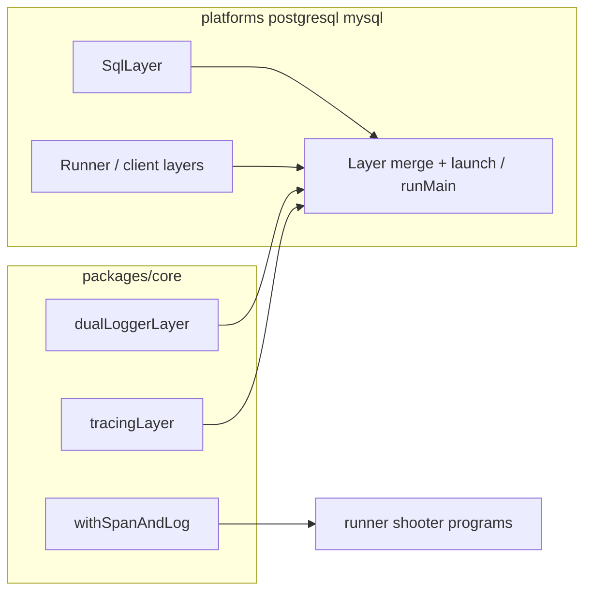

# Core logging and observability upgrade

## Goals

- **Dual logging**: pretty console + logfmt file using [PlatformLogger](https://effect.website/docs/platform/platformlogger/) (`Logger.logfmtLogger.pipe(PlatformLogger.toFile(...))`, `Logger.zip(Logger.prettyLoggerDefault, ...)`, `Logger.replaceScoped`, `NodeFileSystem.layer`).
- **Spans + metrics + tracing**: recreate [`packages-old/core/src/observability/helpers.ts`](packages-old/core/src/observability/helpers.ts) in new [`packages/core`](packages/core) (`withSpanAndLog` using `Effect.withSpan`, `Metric.timer`, `Metric.trackDuration`, counters, `Effect.logTrace` on entry/exit). Align tracing export with [Effect tracing + Sentry](https://effect.website/docs/observability/tracing/#sentry) and [metrics](https://effect.website/docs/observability/metrics/).
- **Composition**: expose **Layer factories** from core; **platforms** merge them the same way they already merge `RunnerLive`, `SqlLayer`, and `Logger.minimumLogLevel` (see [`packages/platforms/postgresql/src/platform.ts`](packages/platforms/postgresql/src/platform.ts), [`packages/platforms/mysql/src/platform.ts`](packages/platforms/mysql/src/platform.ts)).

## Design decisions

- **Log file path**: use env **`EVENTIVA_LOG_FILE`** (default e.g. `/tmp/eventiva.log`). If unset or empty, ship **console-only** (pretty) to avoid hard failures on read-only filesystems; document that cluster workloads should set a writable path when file logging is desired.
- **Tracing backend**: build `NodeSdk.layer` from [`@effect/opentelemetry`](https://effect.website/docs/observability/tracing/). When **`SENTRY_DSN`** (or agreed env) is set, use **`SentrySpanProcessor`** from `@sentry/opentelemetry` per docs; otherwise use a quiet default (e.g. no exporter, or optional `EVENTIVA_OTEL_CONSOLE=1` for `ConsoleSpanExporter` for local debugging). Initialize Sentry only when DSN is present so local runs stay unchanged.
- **Scope of `withSpanAndLog`**: apply to **battleship RPC bodies** and **CronShip** in [`packages/core/src/runner.ts`](packages/core/src/runner.ts); wrap **shooter programs** at program scope ([`shooter.ts`](packages/core/src/shooter.ts), [`speed-shooter.ts`](packages/core/src/speed-shooter.ts), [`slow-shooter.ts`](packages/core/src/slow-shooter.ts)) — **not** per-shot in tight loops (avoids metric/trace storms). Inner `Effect.forEach` in slow-shooter can use one span per ship iteration via `withSpanAndLog` on the `fnUntraced` body (bounded concurrency).

## Implementation steps

1. **Dependencies** ([`packages/core/package.json`](packages/core/package.json))
   - Add `@effect/opentelemetry`.
   - Add OpenTelemetry peers used by NodeSdk: `@opentelemetry/api`, `@opentelemetry/sdk-trace-base`, `@opentelemetry/sdk-trace-node`, `@opentelemetry/sdk-metrics`, `@opentelemetry/resources`, `@opentelemetry/semantic-conventions` (versions consistent with `@effect/opentelemetry` peer range).
   - Add `@sentry/opentelemetry` for `SentrySpanProcessor` when tracing to Sentry.
2. **New modules under `packages/core/src/observability/`**
   - **`logger.ts`**: export `dualLoggerLayer: Layer.Layer<never, PlatformError, never>` (or `Effect` factory if you need async path resolution) implementing the user’s zip pattern; internal `Layer.provide(NodeFileSystem.layer)`.
   - **`tracing.ts`**: export `tracingLayer` (or `makeTracingLayer({ serviceName })`) building `NodeSdk.layer` with resource `serviceName` from env (e.g. `EVENTIVA_SERVICE_NAME` default `eventiva-core`). Branch span processor: Sentry vs noop/console.
   - **`helpers.ts`**: port `withSpanAndLog` from old file; use `import { Effect, Metric, ... } from "effect"` to match the repo; keep metric names parameterized or fixed per span name as today.
   - **`index.ts`**: re-export public API.
3. **Wire programs** ([`packages/core/src/runner.ts`](packages/core/src/runner.ts), shooters)
   - Wrap each RPC generator body and CronShip work with `withSpanAndLog("Battleship.Shoot" | ...)` (namespaced span names).
   - Wrap `shooterProgram` / `speedShooterProgram` / `slowShooterProgram` outer `Effect.gen` (or the inner `forEach` callback for slow-shooter only where it adds clarity).
4. **Exports** ([`packages/core/src/index.ts`](packages/core/src/index.ts))
   - Export `dualLoggerLayer`, `tracingLayer`, `withSpanAndLog`, and any small config types.
5. **Platforms**
   - **PostgreSQL / MySQL** [`platform.ts`](packages/platforms/postgresql/src/platform.ts): for every branch (`battleship`/`runner`, `shooter`, `speed-shooter`, `slow-shooter`), merge **`dualLoggerLayer`** and **`tracingLayer`** with existing layers (order: ensure `Logger.minimumLogLevel(LogLevel.All)` still applies; typically merge logger replacement **before** min level or follow Effect docs for `Logger.replaceScoped` + `minimumLogLevel` composition — verify one `Layer.merge`/`provide` order that preserves both).
   - **`slowShooterProvided`** ([`slow-shooter.ts`](packages/core/src/slow-shooter.ts)): replace bare `Logger.pretty` with the same observability stack exported from core (or drop redundant logger if platform now supplies everything — avoid duplicate `Logger.replaceScoped`).
6. **Shard manager** ([`packages/platforms/postgresql/src/shardManager.ts`](packages/platforms/postgresql/src/shardManager.ts))
   - Mirror platform logging/tracing merge so shard-manager processes get the same behavior as runners.
7. **Verification**
   - `pnpm nx run core:build` and platform packages’ build/lint targets for touched projects.
   - **Runtime gate**: run the full platform entrypoint — `pnpm nx run platforms-postgresql:run` — and confirm the process starts cleanly with the new logger/tracing layers (same expectations as today for cluster/SQL dependencies; interrupt when satisfied).
   - No new or modified tests (per [TDD policy](docs/learnings/tdd-and-test-creation.md)).

## Non-goals (this pass)

- Changing K8s manifests or cluster scripts (only optional env vars in docs if you add a short note elsewhere later).
- Full OTLP HTTP exporter to Grafana stack (can be a follow-up; Sentry path covers production tracing per your link).
