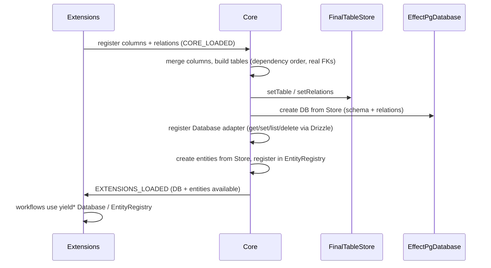

# Drizzle effect-postgres integration plan

## Current state

- **Table building**: [packages/databases/pg/src/table-builder.ts](packages/databases/pg/src/table-builder.ts) uses a hardcoded `contactSkeleton` for `createdBy.references(() => contactSkeleton.id)` in `buildTableInternal` and `createTableFinal` — wrong; should reference the real table from the finalized store.
- **Database**: Core defines a generic [Database](packages/core/src/database/database.ts) interface (get/set/list/delete by tableName + id). Only [DatabaseLiveInMemory](packages/core/src/database/database.ts) exists; there is no PostgreSQL implementation in the repo today. [packages/databases/pg](packages/databases/pg) only exports `createTable`, `pgTable`, `buildTableInternal`, `testColumns`, and `SchemaFinalizerPg` — no Database layer.
- **Startup**: [run-core-startup.ts](packages/core/src/runtime/run-core-startup.ts) finalizes tables, resolves relations, then for each table creates `DynamicEntity` via `Base()(entityName, createSelectSchema(table), { tableName })` and registers it in `EntityRegistry`. CRUD handlers use the `Database` service from context.
- **Drizzle beta**: You already depend on `drizzle-orm@1.0.0-beta.16-ea816b6`. Drizzle’s [effect-postgres driver](https://github.com/drizzle-team/drizzle-orm/blob/beta/drizzle-orm/src/effect-postgres/driver.ts) provides `make(config)` / `makeWithDefaults(config)` returning `EffectPgDatabase`; config accepts `schema` and `relations`. It requires `PgClient` (@effect/sql-pg), `EffectCache`, and `EffectLogger`.

## Target flow (high level)

## 0. Relationship system and entity schema (before FK resolution)

**Goal**: Support all Drizzle relation types (m2o, o2m, m2m, o2o) and wire them into the generated entity schema so that entities expose relation fields (e.g. `creator`, `createdContacts`) using a `getEntity('Contact')`-style lazy resolution. This gives the utilities needed to complete the FK resolution fix (section 1) and keeps relations in sync between Drizzle and the Effect entity layer.

**Why first**: So that when we fix FK resolution (createdBy referencing the real contact table), extensions can already register both sides of relations (e.g. contact self-reference: many-to-one “creator” and one-to-many “createdContacts”) and have them appear on the entity schema.

### 0.1 Relation types and registration API

- **Current**: [TableRelationsRegistry](packages/core/src/schema/table-relations-registry.ts) accepts callbacks `(helpers, schema) => Record<string, relationConfig>`. [Contact extension](packages/extensions/contact/src/workflow.ts) registers only `creator: helpers.one.contact({ from: createdBy, to: contact.id })` (m2o).
- **Support all types**:
  - **m2o / o2o**: `helpers.one.tableName({ from: thisTable.fkColumn, to: otherTable.id })` — one related record.
  - **o2m / m2m (one side)**: `helpers.many.tableName({ from: otherTable.fkColumn, to: thisTable.id })` — array of related records. For m2m, both sides use `many` (often via a join table).
- **Contact self-reference**: Extension should register both:
  - `creator`: one (contact who made this record) — from `createdBy` to `contact.id`.
  - `createdContacts`: many (contacts created by this contact) — from `contact.createdBy` to `contact.id`.
- **Concrete**: Document and validate that callbacks can return multiple relations per table; ensure `defineRelations` merge in run-core-startup supports one + many for the same table. Add contact’s `createdContacts` registration in the contact extension as the example.

### 0.2 Relation metadata for entity schema

- When building the Effect schema for an entity, we need to know for each relation: **name**, **cardinality** (one vs many), and **related entity name** (for `EntityRegistry.lazy`). Drizzle’s merged relation config is table-specific and can be inspected, or we can capture metadata when merging callbacks.
- **Option A**: When merging relation callbacks in run-core-startup, also build a small **relation metadata** structure per table: `Array<{ relationName: string, cardinality: 'one' | 'many', relatedTableName: string }>`. Store it in FinalTableStore (e.g. `setRelationMetadata(tableName, metadata)`) or derive it from the Drizzle relations config.
- **Option B**: Derive from Drizzle’s stored relations: after `defineRelations`, the config per table has relation names and references; we need to map “related table” and “one vs many” from Drizzle’s shape. Drizzle relation configs are typically objects with relation name → config containing the referenced table/cardinality.
- **Recommendation**: Store minimal relation metadata (relationName, cardinality, relatedTableName) when merging callbacks or right after defineRelations, so entity building does not depend on Drizzle’s internal shape. Add to FinalTableStore: `getRelationMetadata(tableName): Array<{ relationName, cardinality, relatedTableName }>`.

### 0.3 Entity schema: add relation fields with getEntity / lazy

- **Current**: [run-core-startup.ts](packages/core/src/runtime/run-core-startup.ts) builds entity as `createSelectSchema(table)` only — no relation fields on the entity.
- **Target**: For each table, base schema = `createSelectSchema(table)`. Then for each relation in that table’s metadata:
  - **one**: add field `relationName: Schema.optional(EntityRegistry.lazy(relatedEntityName))` (or `Schema.optional(Schema.NullOr(...))` if nullable).
  - **many**: add field `relationName: Schema.optional(Schema.NullOr(Schema.Array(EntityRegistry.lazy(relatedEntityName))))`.
- **Entity name**: Map table name to entity name consistently: `tableName → tableName.charAt(0).toUpperCase() + tableName.slice(1)` (already used). So `contact` → `Contact` for `EntityRegistry.lazy("Contact")`.
- **Self-relations**: For Contact, `creator` and `createdContacts` both use `EntityRegistry.lazy("Contact")`. Use `Schema.suspend` so the thunk runs at decode/encode time, when Contact is already registered. [EntityRegistry.lazy](packages/core/src/entity/entity-registry.ts) already uses `Schema.suspend(() => EntityRegistry.get(name))`, so self-reference is supported as long as the entity is registered before any decode. Order: build entity class (with lazy relation fields), then `EntityRegistry.register(entityName, EntityClass)` — so when the schema is first used, the entity is already in the registry.
- **Concrete**: In run-core-startup, after building `safeTables` and merging relations:
  1. Build relation metadata per table (from merged Drizzle config or from a parallel structure filled when processing callbacks).
  2. For each table, let `baseSchema = createSelectSchema(table)`. For each relation metadata entry, add a property to the schema: one → `Schema.optional(EntityRegistry.lazy(relatedEntityName))`, many → `Schema.optional(Schema.NullOr(Schema.Array(EntityRegistry.lazy(relatedEntityName))))`. Merge baseSchema fields with these relation fields (e.g. `Schema.Struct({ ...baseSchema.fields, ...relationFields })` or equivalent).
  3. Pass the merged schema into `Base()(entityName, mergedSchema, { tableName })`, then register. Ensure EntityRegistry.lazy is available and that relatedEntityName is the PascalCase entity name (from relatedTableName).

### 0.4 getEntity-style API (optional naming)

- If desired, expose `getEntity(name)` as a synonym or wrapper around `EntityRegistry.get(name)` for use in extensions or in generated code, so “getEntity('Contact')” is the standard way to resolve an entity for schema building. This can be a simple export: `export const getEntity = EntityRegistry.get` or a small Effect service that reads from EntityRegistry. Plan assumes EntityRegistry.lazy already provides the lazy schema; getEntity is optional ergonomics.

---

## 1. FK resolution (remove contactSkeleton)

**Goal**: `createdBy` and any other FKs must reference the real table from the finalized schema, not a skeleton.

- **Where**: Table building lives today in [packages/databases/pg/src/table-builder.ts](packages/databases/pg/src/table-builder.ts) (`buildTableInternal`) and is used by [schema-finalizer-impl.ts](packages/databases/pg/src/schema-finalizer-impl.ts). Core’s [TableColumnRegistry](packages/core/src/schema/table-column-registry.ts) runs finalization in a single pass over `state.pending` (table names from the registry).
- **Approach**:
  - Build tables in **dependency order**. Define a fixed order for “standard” FKs: e.g. the table that owns `createdBy` (e.g. `contact`) must be built first; then any table that references it can use that table when building.
  - Change finalization so that it builds tables one-by-one and passes a **getTable(name)** callback into the finalizer: when building table `T`, `getTable('contact')` returns the already-built contact table. So `buildTableInternal(tableName, mergedColumns, extraConfigs, getTable)` and inside it use `getTable('contact')` (or a configured “creator table name”) for `createdBy.references(() => getTable('contact').id)`.
  - Remove `contactSkeleton` from table-builder and from any default column set. The “creator” table name could be configurable (e.g. `SchemaRegistryConfig.creatorTableName` default `'contact'`) so it’s not hardcoded.

**Concrete steps**:

- In [table-column-registry.ts](packages/core/src/schema/table-column-registry.ts) finalization loop: sort table names so that the configured creator table (e.g. `contact`) is first; then for each table, call a finalizer that receives a map of already-built tables (or a `getTable(name)` function).
- Extend [SchemaFinalizer](packages/core/src/schema/schema-finalizer.ts) interface: e.g. `buildTable(tableName, mergedColumns, extraConfigs, getTable?: (name: string) => unknown)`.
- In [table-builder.ts](packages/databases/pg/src/table-builder.ts): remove `contactSkeleton`; in `buildTableInternal` add a parameter `getTable: (name: string) => PgTable` (or unknown). Use it for `createdBy.references(() => getTable('contact').id)`. If `getTable` is missing or returns undefined for `contact`, either omit the FK or use a no-op reference per your product decision (document in plan).
- Update [schema-finalizer-impl.ts](packages/databases/pg/src/schema-finalizer-impl.ts) to pass the getter into `buildTableInternal`.

## 2. Database driver as extension; core provides registerDB()

**Goal**: Core does not depend on a specific driver. Core defines the [Database](packages/core/src/database/database.ts) tag and a way to **register** a DB implementation (e.g. `registerDB()` or a `DatabaseProvider` / Layer). The actual driver (Drizzle effect-postgres, future MySQL, etc.) lives in **packages/databases** and is installed by the platform by calling `registerDB(pgDriverLayer)` or merging a “database extension” layer. So the driver can be swapped (postgres vs mysql vs in-memory) without changing core.

- **Core**: Expose a single abstraction that the platform uses to provide the Database service:
  - **Option A**: `registerDB(Layer<Database>)` — a function or service that “sets” the Database implementation (e.g. stores a Layer or a Ref that gets fulfilled with the actual Database when the driver layer runs). The platform composes `registerDB(pgDatabaseLayer)` or `registerDB(DatabaseLiveInMemory)`.
  - **Option B**: Platform simply passes `databaseLayer` (as today); the only change is that `databaseLayer` is provided by a package in **packages/databases** (e.g. pg) that uses Drizzle effect-postgres internally. So “extension” = “the layer lives in packages/databases/pg”, and core still receives `Layer<Database>` in createPlatformTemplate.
- **Recommendation**: Keep the current pattern where createPlatformTemplate accepts `databaseLayer: Layer<Database>`. The “extension” aspect is: that layer is **implemented** in packages/databases/pg (or packages/databases/mysql, etc.), not in core. Optionally, add a small helper in core such as `registerDB(layer)` that is just `layer` (or a wrapper for documentation), so the platform can do `databaseLayer: registerDB(PgDatabaseLayer)` to make it explicit that the DB is pluggable. So: **registerDB** = semantic name for “this is the pluggable database layer”; implementation lives in packages/databases/pg.

**Concrete**:

- In core: add `registerDB(databaseLayer: Layer.Layer<Database>): Layer.Layer<Database>` that returns the same layer (or a merged layer with any core dependencies). Document that drivers in packages/databases should export a Layer that provides Database and be passed to registerDB.
- All runtime DB access (Drizzle effect-postgres) lives in **packages/databases/pg**: that package exports a Layer (e.g. `PgDatabaseLayer` or `DatabaseLivePg`) that requires PgClient (and optionally FinalTableStore for lazy init), uses Drizzle’s effect-postgres driver, and provides the core Database service. So we **keep** packages/databases/pg and **add** the driver + Database adapter there; we do **not** move the driver into core.

## 3. Use Drizzle effect-postgres inside packages/databases/pg

**Goal**: The PostgreSQL implementation in packages/databases/pg uses `drizzle-orm/effect-core` and `drizzle-orm/effect-postgres` for the runtime driver. Table building (buildTableInternal, testColumns, typeid, SchemaFinalizerPg) stays in the same package; the **new** part is adding a Layer that provides the core `Database` service by building EffectPgDatabase from FinalTableStore and implementing get/set/list/delete via Drizzle.

- **Dependency**: In packages/databases/pg, depend on `drizzle-orm` beta and `@effect/sql-pg`; use `PgDrizzle.make({ schema, relations })` (or makeWithDefaults) with PgClient, EffectCache, EffectLogger provided. [Drizzle Effect Postgres docs](https://orm.drizzle.team/docs/connect-effect-postgres).
- **What stays**: createTable, pgTable, buildTableInternal, testColumns, typeid, statusEnum, SchemaFinalizerPg — all remain in packages/databases/pg.
- **What’s added**: A Layer (e.g. `PgDatabaseLayer` or `DatabaseLivePg`) that implements the core `Database` interface using EffectPgDatabase (lazy-built from FinalTableStore when first used). So packages/databases/pg is the single “database extension” for PostgreSQL: schema building + SchemaFinalizer + Database driver.

## 4. Register EffectPgDatabase and provide Database to CRUD

**Goal**: After finalization, the system has an `EffectPgDatabase` instance built from `FinalTableStore` (schema + relations), and entity CRUD uses the existing [Database](packages/core/src/database/database.ts) interface implemented by an adapter that delegates to that Drizzle db.

- **Where**: Core owns the [Database](packages/core/src/database/database.ts) tag and [makeCrudHandlersFromDatabase](packages/core/src/crud/crud-handlers.ts); [entity-base](packages/core/src/entity/entity-base.ts) uses it. Platform composes [databaseLayer](packages/platforms/default/src/index.ts) in [createPlatformTemplate](packages/core/src/runtime/platform.ts).
- **Adapter**: Implement `Database` (get/set/list/delete by tableName + id) using EffectPgDatabase:
  - **get(tableName, id)**: select from the table by primary key (id column); map result to a single record or null.
  - **set(tableName, id, record)**: insert or update (upsert) the record; table reference comes from the schema used to build the db.
  - **list(tableName)**: select all rows from the table.
  - **delete(tableName, id)**: delete where id matches.
  Table references: the adapter needs the schema object (record of table name → PgTable) so it can run `db.insert(schema[tableName]).values(record)`, etc. That schema is the same object passed to `PgDrizzle.make({ schema })` — i.e. from `FinalTableStore.getAllTables()`.
- **When to build EffectPgDatabase**: FinalTableStore is populated **during** runCoreStartup (after waitUntilFinalized). So the Database implementation cannot be built at Layer construction time (layers are built before the main effect runs). Use **lazy initialization**: the Database service is an adapter that on first use (e.g. first get/set/list/delete) reads from FinalTableStore, builds EffectPgDatabase once (with PgClient and DefaultServices), caches it in a Ref, and delegates all subsequent calls to that instance. Ensure thread-safety (e.g. Ref + Deferred so the first caller builds and others wait).
- **Layers**:
  - **PgClient**: Provided by the platform (e.g. from config). The Database layer in **packages/databases/pg** requires: `PgClient`, `FinalTableStore`, and DefaultServices (or EffectCache + EffectLogger).
  - In **packages/databases/pg**: `Layer.effect(Database, ...)` that lazily builds EffectPgDatabase from FinalTableStore and implements get/set/list/delete. Platform uses `databaseLayer: registerDB(PgDatabaseLayer.pipe(Layer.provide(PgClientLayer), Layer.provide(DefaultServices)))`.

## 5. Global store for tables and relations

**Already in place**: [FinalTableStore](packages/core/src/schema/final-table-store.ts) holds tables and relations; [TableColumnRegistry](packages/core/src/schema/table-column-registry.ts) and [run-core-startup](packages/core/src/runtime/run-core-startup.ts) populate it. For section 0 (relationship system), extend FinalTableStore (or a parallel store) to hold **relation metadata** per table (relationName, cardinality, relatedTableName) so entity building can add relation fields to the Effect schema. No other change except using the store to build EffectPgDatabase in the lazy Database adapter.

## 6. Base entity overridable; extensions can override or replace

**Goal**: Core continues to create and register one entity per table (DynamicEntity); Base exposes default CRUD in an overridable way so extensions can subclass and override (e.g. `Contact extends Base() { override create() { ... } }`) or register a custom subclass.

- **Current**: [entity-base.ts](packages/core/src/entity/entity-base.ts) builds a class that has static `entity`, `layer`, and handlers; handlers are built by makeCrudHandlersFromDatabase and wrapped with runWithExtensions. There is no extension point to override a single method.
- **Approach**:
  - Refactor Base so that the **default** CRUD implementation is in overridable methods (e.g. a base class or a record of handlers that the subclass can replace). So the entity class has `create(req)`, `get(req)`, etc., and they delegate to internal default implementations unless overridden.
  - Allow an extension to **register a custom entity class** for a given table/entity name (e.g. Contact) that extends Base with the same schema but overrides some methods — and have the platform use that instead of the auto-created DynamicEntity when present. So: run-core-startup creates DynamicEntity and calls `EntityRegistry.register(name, DynamicEntity)`; if an extension has already registered a custom class for that name (during extension layer build), either skip the dynamic one or allow “replace” semantics. Simpler: core always creates and registers the dynamic entity; extensions that want overrides do so by providing their own entity **layer** that replaces the default handler set (e.g. Contact.toLayer(customHandlers) where customHandlers.create = myCreate). So the extension’s layer wins when merged. Document that pattern.
  - Alternatively, support an explicit “entity override” registry: after core registers all dynamic entities, a phase or callback allows extensions to replace an entity by name. That requires a clear ordering and API (e.g. EntityRegistry.registerOverride("Contact", ContactClass)).

**Concrete**: Prefer making Base’s handlers clearly overridable in the class (so a subclass can override `create`/`get`/etc.) and document that extensions can merge a layer that provides the same entity type with custom handlers (current mergeEntityLayers behavior). Add a short section in docs/learnings or architecture on “overriding entity CRUD”.

## 7. HTTP, RPC, clustering and extension workflows

**Goal**: No change to the high-level flow; only ensure Database and entities are provided so that extension workflows can use `yield* Database` and EntityRegistry.

- **Current**: [createPlatformTemplate](packages/core/src/runtime/platform.ts) merges databaseLayer, schema stack, hooks, and entity layers; [runMain](packages/core/src/runtime/run-main.ts) (or equivalent) runs the main effect which runs runCoreStartup then starts the server. Entity endpoints and RPC use entities from EntityRegistry; handlers already require Database in context.
- **After**: Database will be provided by the layer from packages/databases/pg (lazy). RunCoreStartup still runs before the server accepts requests, so FinalTableStore is populated before any RPC. Extension workflows that run on EXTENSIONS_LOADED_TOPIC or later can safely `yield* Database` and use EntityRegistry. No change to HTTP/RPC/cluster wiring beyond ensuring databaseLayer (e.g. registerDB(PgDatabaseLayer)) is provided and PgClient is available when using PostgreSQL.

## 8. Migration and compatibility

- **In-memory**: Keep `DatabaseLiveInMemory` for tests and environments without PostgreSQL. Platform can still choose `databaseLayer = DatabaseLiveInMemory` and `SchemaFinalizerNoOp` so no real tables are built.
- **Extensions**: Contact (and any other extension) continues to register columns/relations on CORE_LOADED; no change to the registration API. If contact currently uses `createTable` or direct `registerTableColumns`, that stays the same. Only the implementation behind Database and the removal of contactSkeleton change.

## To-dos (implementation order)

Work through these in order. Each item is a single, actionable task for the agent. **Observability:** Follow [.cursor/rules/effect-observability.mdc](.cursor/rules/effect-observability.mdc) for every code change: use `withSpanAndLog`, `Effect.log`*, and metrics where appropriate; pipe external/extension code execution through logging and tracing.

1. **rel-store-metadata** — Extend FinalTableStore ([packages/core/src/schema/final-table-store.ts](packages/core/src/schema/final-table-store.ts)) with relation metadata: add `setRelationMetadata(tableName, metadata)` and `getRelationMetadata(tableName)`. Metadata shape: `Array<{ relationName: string, cardinality: 'one'|'many', relatedTableName: string }>`. Implement in FinalTableStoreLive (new Ref or Map). Apply observability: use `withSpanAndLog` on new store methods (effect-observability.mdc).
2. **rel-build-metadata-startup** — In [run-core-startup.ts](packages/core/src/runtime/run-core-startup.ts) after merging relation callbacks and calling defineRelations, build relation metadata per table. For each table in allCallbacksMap, infer from merged Drizzle relation config (or from callback return shape) the relationName, cardinality (one vs many), and relatedTableName. Call `finalTableStore.setRelationMetadata(tableName, metadataArray)` for each table. Ensure any new effect paths use `withSpanAndLog` or `Effect.log`* (effect-observability.mdc).
3. **rel-contact-createdContacts** — In [packages/extensions/contact/src/workflow.ts](packages/extensions/contact/src/workflow.ts) inside registerRelations callback, add the one-to-many side: `createdContacts: helpers.many.contact({ from: helpers.contact.createdBy, to: helpers.contact.id })`. Keep existing creator relation. This gives Contact self-reference (creator = m2o, createdContacts = o2m). Observability already on registerRelations (effect-observability.mdc).
4. **rel-entity-schema-merge** — In run-core-startup.ts entity-building loop: for each table get metadata via `finalTableStore.getRelationMetadata(tableName)`. Build relation fields: for cardinality `'one'` use `Schema.optional(EntityRegistry.lazy(PascalCase(relatedTableName)))`; for `'many'` use `Schema.optional(Schema.NullOr(Schema.Array(EntityRegistry.lazy(PascalCase(relatedTableName)))))`. Merge these with `createSelectSchema(table)` fields (e.g. `Schema.Struct({ ...baseSchema.fields, ...relationFields })`). Pass merged schema to `Base()(entityName, mergedSchema, { tableName })`. Add `withSpanAndLog` / logging for entity build step (effect-observability.mdc).
5. **rel-getEntity-export** — Optionally in packages/core export `getEntity` as alias for `EntityRegistry.get` (e.g. `export const getEntity = EntityRegistry.get`) so extensions can use `getEntity('Contact')` for schema building. If getEntity wraps with logging/tracing, follow effect-observability.mdc.
6. **fk-finalizer-interface** — In [packages/core/src/schema/schema-finalizer.ts](packages/core/src/schema/schema-finalizer.ts) extend `SchemaFinalizer.buildTable` to accept optional fourth parameter `getTable?: (name: string) => unknown`. Update interface and SchemaFinalizerNoOp to pass through. Ensure buildTable call sites keep `withSpanAndLog` (effect-observability.mdc).
7. **fk-registry-order-gettable** — In [packages/core/src/schema/table-column-registry.ts](packages/core/src/schema/table-column-registry.ts) runFinalization: sort table names so the configured creator table (e.g. contact) is first. Add `SchemaRegistryConfig.creatorTableName` (default `'contact'`). Build tables one-by-one; maintain a Map of tableName -> built table; pass `getTable = (name) => map.get(name)` into `finalizer.buildTable(tableName, columns, extraConfigs, getTable)`. Keep runFinalization and buildTable effects under `withSpanAndLog` (effect-observability.mdc).
8. **fk-table-builder-remove-skeleton** — In [packages/databases/pg/src/table-builder.ts](packages/databases/pg/src/table-builder.ts) remove the `contactSkeleton` constant and its usage. Add `getTable?: (name: string) => unknown` as fourth parameter to `buildTableInternal`. In the standard columns, use `createdBy` with `getTable?.('contact')` for `.references()` when present; omit or use placeholder when getTable missing. SchemaFinalizerPg already uses `withSpanAndLog` (effect-observability.mdc).
9. **fk-schema-finalizer-impl** — In [packages/databases/pg/src/schema-finalizer-impl.ts](packages/databases/pg/src/schema-finalizer-impl.ts) update buildTable implementation to accept getTable and pass it to `buildTableInternal(tableName, mergedColumns, configFns, getTable)`. Ensure buildTable effect remains wrapped with `withSpanAndLog` (effect-observability.mdc).
10. **reg-registerDB-core** — In packages/core add `registerDB(databaseLayer: Layer.Layer<Database>): Layer.Layer<Database>` that returns the layer unchanged (semantic marker for pluggable DB). Put in database/database.ts or database/register-db.ts. Document that drivers in packages/databases should export a Layer and be passed as `databaseLayer: registerDB(PgDatabaseLayer)`. Add log/trace at registration if applicable (effect-observability.mdc).
11. **pg-adapter-impl** — In packages/databases/pg create a Database adapter implementation: an Effect that provides the Database service. On first get/set/list/delete, yield FinalTableStore.getAllTables() and getAllRelations(), call PgDrizzle.make({ schema: tables, relations }) with PgClient and DefaultServices in context, store the db instance in a Ref, then delegate get/set/list/delete to Drizzle (select by id, insert/update, select all, delete where id). Map tableName to the table from the schema object. Apply observability: `withSpanAndLog` on get/set/list/delete, log success/failure, metrics for DB ops (effect-observability.mdc).
12. **pg-layer-export** — In packages/databases/pg export PgDatabaseLayer (or DatabaseLivePg): Layer.effect(Database, ...) that requires PgClient, FinalTableStore, and Drizzle DefaultServices. Implement lazy init inside the service. Add dependency on drizzle-orm/effect-postgres and @effect/sql-pg in package.json. Lazy init and all DB delegation must use `withSpanAndLog` and `Effect.log`* (effect-observability.mdc).
13. **pg-client-docs** — Document or provide a PgClient layer (from @effect/sql-pg) so the platform can supply it when using PostgreSQL. Either export a factory from packages/databases/pg that takes connection config and returns the layer, or document that the platform must provide PgClient. Mention observability (effect-observability.mdc) for any executed effects.
14. **base-overridable-refactor** — In [packages/core/src/entity/entity-base.ts](packages/core/src/entity/entity-base.ts) refactor so the CRUD handlers (create, get, update, list, delete) are built as a record and attached in a way that a subclass can override individual methods. Ensure runWithExtensions still wraps the active handler. Handlers already use `withSpanAndLog` in crud-handlers; preserve or add observability (effect-observability.mdc).
15. **base-override-docs** — Add a short section in docs/learnings/architecture.md on "Overriding entity CRUD": how to provide a custom entity layer with overridden handlers, or how to subclass Base and override methods. Reference effect-observability.mdc: overridden handlers should still use logging/tracing/metrics.
16. **platform-pg-wire** — In packages/platforms/default set databaseLayer to `registerDB(PgDatabaseLayer.pipe(Layer.provide(PgClientLayer), Layer.provide(DefaultServices)))` when targeting PostgreSQL. Ensure schema stack uses SchemaFinalizerPg when using pg. Keep DatabaseLiveInMemory and SchemaFinalizerNoOp as default for in-memory. Observability is provided by the layers (effect-observability.mdc).
17. **tests-contact-skeleton** — Update any tests that reference contactSkeleton or assume hardcoded contact table in table-builder. Fix or skip as needed after FK resolution changes. Ensure test effects that run extension/callback code are wrapped with observability (effect-observability.mdc) where external code runs.
18. **docs-relations** — Add to docs/learnings or architecture: relationship system (relation metadata in FinalTableStore, relation fields on entity schema via EntityRegistry.lazy, m2o/o2m/m2m/o2o support). Note that schema/registry code uses `withSpanAndLog` (effect-observability.mdc).
19. **docs-fk-registerdb** — Add to docs/learnings or architecture: FK resolution (getTable, dependency order, creatorTableName); registerDB and pluggable database drivers (packages/databases/pg, future mysql). Reference .cursor/rules/effect-observability.mdc for observability on DB and finalization paths.

## Open points / questions

- **Creator table name**: Should `createdBy` always reference a table named `contact`, or should it be configurable (e.g. `SchemaRegistryConfig.creatorTableName`)? Plan assumes configurable with default `'contact'`.
- **drizzle-kit generate/migrate**: Still out of scope; the schema object from FinalTableStore can later be passed to drizzle-kit’s programmatic API for migrations when you add that step.

