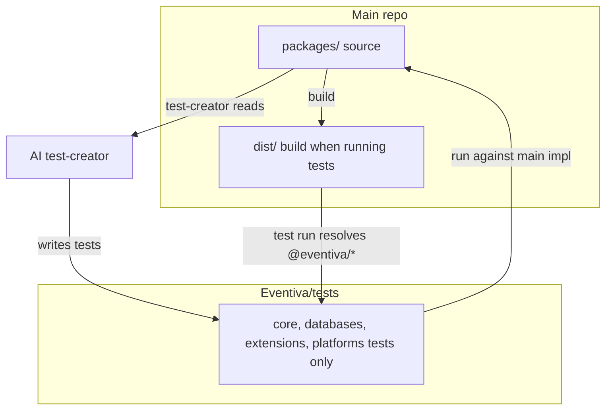

# Effect Vitest TDD and Tests Bootstrap Plan

## 1. Inline-first approach: is it worth it?

**Yes.** Your current TDD loop gives the test-creator only a `dist` git-diff and no runtime context, so it cannot write correct Effect-based tests (`it.effect`, `Effect.exit`, `TestClock`, layers, etc.). Authoring tests **inline in the main repo** (under a `tests/` mirror) and then **copying or syncing them into the tests repo** is a practical way to:

- Populate the tests repo with real, runnable Effect/Vitest examples.
- Give the test-creator a strong starting point (existing tests as patterns) and eventually schema + docstrings from `dist/**/*.d.ts`.
- Keep the rule that implementers do not write tests for the same feature; the inline tests are written in a dedicated “bootstrap test authoring” phase, then maintained by the test-creator agent from schema/docs.

So the plan assumes: **bootstrap by creating tests in the main repo under `tests/` (mirroring `packages/`), then sync those into Eventiva/tests** so the tests repo is populated. After that, TDD CI uses the tests repo as source of truth, with the **test-creator having full access to main repo code** (see CI redesign below).

---

## 2. CI redesign: test-creator sees all code, builder never sees tests, no dist

**Principle:** The AI that creates tests may see **all implementation code**. The AI that creates implementation code must **never** see the tests. This keeps the software tested fully without the implementation being written to “beat” specific tests instead of satisfying the real contract.

**Concrete visibility:**

- **Test-creator (CI):** Has read access to the **full main repo** (all of `packages/`**). No schema-only restriction. It uses the real code to write exhaustive, correct Effect/Vitest tests. No `dist` is passed to or stored in the tests repo.
- **Builder / implementation (CI and local):** When running implementation tasks (build, lint, typecheck, or an “implementation” agent), the **tests repo is not present** in the workspace (or is explicitly excluded from Cursor/AI context). So the code-creating AI never sees test files.

**Drop `dist` from both repos:**

- **Tests repo:** Does **not** store or receive `dist`. Remove all steps that sync `dist` into the tests repo, commit `dist`, or compute a “dist diff” for the test-creator. The tests repo holds only test files, config, and Step CI workflows.
- **Main repo:** Build `dist` only when needed **to run tests** (in the same job that executes tests, or as an artifact consumed only by the test-execution job). Do not use `dist` as the “schema feed” for the test-creator; the test-creator reads **source** from the main repo.

**Workflow changes** (to apply in [.github/workflows/tests-repo-pr-tdd.yml](.github/workflows/tests-repo-pr-tdd.yml) and related):

1. **Job: test creation (sync-tests-repo, or rename to “create-tests”)**
  - Checkout **main repo** at PR head (full source: `packages/`, scripts, etc.).
  - Checkout **tests repo** at the same branch (clone into e.g. `tests-repo/`).
  - **Do not** build or sync `dist`. Do not copy dist into the tests repo. Do not compute a dist diff.
  - Run the **AI test-creator** with the **main repo workspace available** (e.g. agent runs with cwd or context including the main repo so it can read `packages/**/*.ts`). Invoke Cursor CLI with `--model auto` or `--model composer-1` to minimize API usage (Auto + Composer pool). Prompt: “You have full access to the implementation in the main repo (packages/). Use it to write or update tests. Never delete existing tests. Place tests only under /src/**/*.spec.ts and allowed workflow paths.”
  - Commit and push **only test-related changes** in the tests repo (no `git add dist`).
  - Remove any “bootstrap from dist” step that writes dist into the tests repo; bootstrap (if still used) only creates project layout/config, not dist.
2. **Job: run tests (run-tdd-tests)**
  - Checkout main repo, install deps, **build** (to produce `dist/` in the main workspace for module resolution when tests run).
  - Clone tests repo into `tests/` (or submodule update). **Do not** put dist into the tests repo.
  - Run `pnpm nx run-many -t test --projects='tests-*'`; resolution of `@eventiva/`* points at main’s built output or packages. Publish coverage and results as today.
  - Optionally keep a **build** job that only produces the `dist` artifact for the test job (so test job just downloads artifact and restores `dist/` in main workspace). The important point: dist stays in the main repo workspace only; tests repo never contains dist.
3. **Implementation / builder context**
  - The **main CI** (e.g. [.github/workflows/ci.yml](.github/workflows/ci.yml)) that runs build/lint/typecheck does **not** clone the tests repo. So when a “builder” agent or contributor runs in that context, tests are not in the workspace.
  - Document and enforce: “Implementation work (including AI-assisted implementation) must be done in an environment where the tests repo is not checked out or is excluded from AI context.” The development devcontainer (and any implementation-only workflow) follows this.

**Simplified data flow:**

- Test-creator: **main repo source** → writes/updates tests in tests repo. No dist.
- Test runner: **main repo** (build dist in workspace) + **tests repo** (cloned into `tests/`) → run tests; dist only in main workspace.
- Builder: **main repo only** (no tests repo). No dist in tests repo ever.

**Docs and learnings to update:**

- [docs/learnings/tdd-and-test-creation.md](docs/learnings/tdd-and-test-creation.md): Change “Test-creator has no context or workspace access to the implementation” to “Test-creator has full read access to the implementation (main repo) so it can write exhaustive tests. Builder/implementer must never have access to the tests repo when doing implementation work.”
- Remove or reword “schema-only” and “declaration-only” for the test-creator; the test-creator uses **full source** plus docstrings. Optionally keep “no deletion of tests” and “test-creator is a separate agent from the builder.”
- [docs/plans/2026-03-14-tests-repo-sync-and-tdd-ci.md](docs/plans/2026-03-14-tests-repo-sync-and-tdd-ci.md) and bootstrap script: remove dist sync and dist-committed-in-tests-repo; simplify to “tests repo = tests only.”

---

## 3. Test folder structure (mirror of packages)

- **Location:** `tests/<package-path>/` mirroring `packages/<package-path>/`.
- **Spec files:** One `*.spec.ts` per source file (or per logical module), colocated by path:
  - `packages/core/src/cluster/config.ts` → `tests/core/src/cluster/config.spec.ts`
  - `packages/core/src/cluster/entities.ts` → `tests/core/src/cluster/entities.spec.ts`
  - `packages/databases/pg/src/table-builder.ts` → `tests/databases/pg/src/table-builder.spec.ts`
  - Same pattern for `tests/databases/shared`, `tests/extensions/hello-world`, `tests/extensions/contact`, `tests/platforms/default`.

Current CI clones the tests repo into `tests/remote/`, so today paths are `tests/remote/core/src/...`. If you introduce a **submodule** at `tests/` (see below), the repo root would be `tests/`, giving `tests/core`, `tests/extensions/contact`, etc., which matches your desired structure.

**Nx:** Test projects stay discoverable via `tests/<project>/project.json` (e.g. `tests/core/project.json` with `name: "tests-core"`). The bootstrap script in [scripts/bootstrap-tests-repo.mjs](scripts/bootstrap-tests-repo.mjs) already creates this layout in the tests repo; the same layout can be used when tests are authored inline in main under `tests/`.

---

## 4. Tests repo as submodule and “do not pull for AI” rule

- **Add Eventiva/tests as a git submodule** at path `tests/` (or keep current “clone into `tests/remote`” and document that as “tests directory”).
  - **Option A (recommended for your wording):** Submodule at `tests/`. When not inited, `tests/` is empty (or only a `.gitmodules` entry). When inited, `tests/` contains `core/`, `databases/`, `extensions/`, `platforms/`, `.placeholder/`, `tools/`, etc. The **placeholder** then lives inside the tests repo so that `nx run-many -t test --projects='tests-*'` has at least one project when the submodule is inited.
  - **Option B:** Keep cloning into `tests/remote/` (no submodule); document that “tests folder” = `tests/remote/` and that contributors should only clone/pull the tests repo when running or writing tests.
- **Document clearly:**
  - In [README.adoc](README.adoc), [docs/learnings/tdd-and-test-creation.md](docs/learnings/tdd-and-test-creation.md), and a short **tests repo** section in learnings or CONTRIBUTING:
    - **Do not** run `git submodule update --init tests` (or do not clone the tests repo) for normal **development work using AI**; keep the tests folder unpopulated so AI tooling does not use test code as context for implementation.
    - **Do** init the submodule (or clone the tests repo) when you need to **run tests** or **write/review tests**.
  - State explicitly: “Never pull the tests repo for development work using AI; only for testing purposes.”
- **CI:** Already clones the tests repo (or will use submodule update) in the TDD workflow; no change to the gate logic. Local test runs: document `git submodule update --init tests` then `pnpm nx run-many -t test --projects='tests-*'`.

---

## 5. Two devcontainers: development vs test-running

- **Development devcontainer (current):** [.devcontainer/devcontainer.json](.devcontainer/devcontainer.json) — used for implementation work. Do **not** init the tests submodule (or exclude `tests/` from Cursor/AI context). Add a short comment or README note: “Tests submodule is not inited here; use the test-runner devcontainer to run or author tests.”
- **Test-runner devcontainer (new):** e.g. `.devcontainer/test-runner/devcontainer.json` (or `.devcontainer-tests/`) that:
  - Uses the same base image and services (e.g. Node, pnpm, Postgres) as the main devcontainer.
  - Runs `git submodule update --init tests` in `postCreateCommand` so `tests/` is populated.
  - Optionally sets an env var or Cursor rule so that this environment is clearly “for tests only.”
  - Documents in its README: “Use this devcontainer only for running or writing tests; do not use for feature implementation with AI.”

This keeps the “never pull tests for AI-driven development” rule enforceable by environment.

---

## 6. Documentation: how to write Effect Vitest tests

- Add a **learnings doc** (e.g. `docs/learnings/effect-vitest-testing.md`) that:
  - References the official guide: [Effect Vitest README](https://github.com/Effect-TS/effect/blob/main/packages/vitest/README.md).
  - Summarises:
    - `import { it, expect } from "@effect/vitest"`.
    - `it.effect("name", () => Effect)` for Effect tests with TestContext (e.g. TestClock).
    - `it.live` for live environment; `it.scoped` when the effect needs a Scope; `it.scopedLive` for both.
    - Testing success: assertions inside the effect; testing success/failure via `Effect.exit` and `Expect.toStrictEqual(Exit.succeed(...))` / `Exit.fail(...)`.
    - TestClock for time; skipping (`it.effect.skip`), only (`it.effect.only`), and `it.effect.fails` when a test is expected to fail temporarily.
    - Logging: suppressed by default in `it.effect`; use `Effect.provide(Logger.pretty)` or `it.live` if logs are needed.
  - Adds **project-specific conventions:** tests live under `tests/<package-path>/src/**/*.spec.ts`; use `@effect/vitest`; no implementation imports from `packages/` in the tests repo at runtime (resolution points at main’s implementation when run from main CI).
  - Links from [docs/learnings/README.md](docs/learnings/README.md) and from [docs/learnings/tdd-and-test-creation.md](docs/learnings/tdd-and-test-creation.md).

---

## 7. Docstrings in declarations (100% and emitted for test-creator)

- **Goal:** 100% docstring coverage for exported callables, with declarations emitted so the test-creator can see what each function is meant to do.
- **Current machinery:** [scripts/check-dts-docs.mjs](scripts/check-dts-docs.mjs) and [scripts/enrich-dts-docs.mjs](scripts/enrich-dts-docs.mjs) (and root `dts:docs:enrich` / `dts:docs:check`) already enforce `@remarks`, `@example`, `@param`, `@returns` per [docs/learnings/conventions.md](docs/learnings/conventions.md). CI runs these in [.github/workflows/ci.yml](.github/workflows/ci.yml) and [.github/workflows/tests-repo-pr-tdd.yml](.github/workflows/tests-repo-pr-tdd.yml).
- **Plan:**
  - Audit all packages for missing or incomplete JSDoc on exported callables; add or enrich so `dts:docs:check` passes with 100% coverage.
  - Ensure `declaration: true` (and where used `declarationMap: true`) so that `dist/**/*.d.ts` contains these docstrings. TypeScript emits JSDoc into `.d.ts` when present in source.
  - Document in `docs/learnings/tdd-and-test-creation.md` (or the new Effect-vitest doc) that the test-creator’s contract input includes these declaration docs so it can generate behaviour-focused tests.

With the CI redesign, the test-creator has full source access, so docstrings complement the code (e.g. for `@remarks` and intended behaviour). No new tooling is strictly required; the main work is completing docstrings.

---

## 8. Bootstrap test projects and exhaustive Effect Vitest tests

- **Scope:** All packages that contain runtime code and are part of the TDD surface:
  - `packages/core`
  - `packages/databases/pg`, `packages/databases/shared`
  - `packages/extensions/hello-world`, `packages/extensions/contact`
  - `packages/platforms/default`
- **Bootstrap script:** Extend [scripts/bootstrap-tests-repo.mjs](scripts/bootstrap-tests-repo.mjs) `PROJECTS` to include `databases/shared` and `extensions/contact` so the tests repo has a project for every such package. Ensure Nx project names and paths align with the desired `tests/<path>` layout.
- **Creating the tests (inline in main, then sync to tests repo):**
  - For each export-bearing source file under `packages/<path>/src/**/*.ts`, add a corresponding `tests/<path>/src/**/<name>.spec.ts`.
  - Use `@effect/vitest`: `it.effect` (or `it.live` / `it.scoped` where needed); test both success and failure paths with `Effect.exit` and `Expect`; use TestClock for time-dependent code.
  - Tests must be **exhaustive of outcomes:** success, failure, boundary/edge cases, and optional/error branches as implied by the declaration and docstrings. Prefer one describe per module or file, and one or more `it.effect` per exported callable or behaviour.
  - Do **not** delete any existing test (e.g. in `tests/.placeholder`); only add or refine.
- **Step CI:** The TDD plan already uses Step CI inside Vitest ([docs/plans/2026-03-14-tests-repo-sync-and-tdd-ci.md](docs/plans/2026-03-14-tests-repo-sync-and-tdd-ci.md), [.cursor/plans/tests_repo_sync_and_tdd_ci_36220dcc.plan.md](.cursor/plans/tests_repo_sync_and_tdd_ci_36220dcc.plan.md)):
  - Contract tests (e.g. OpenAPI-aligned), SSE coverage for endpoints, CO2 checks where relevant.
  - Workflows live under the tests repo (e.g. `tests/**/workflows/*.yml`) and are invoked from Vitest via `@stepci/runner` (`runFromFile` / `run`).
  - **Updates:** Add or adjust Step CI workflow YAMLs so they match current API surface (from `dist/` or OpenAPI); ensure Vitest specs that invoke Step CI are in the right test projects and pass when the implementation is available. Improve any “placeholder” workflow (e.g. in bootstrap) into real contract/SSE/CO2 steps.

---

## 9. Sync inline tests into the tests repo and run

- **One-time or scripted sync:** After authoring tests under `tests/` in the main repo (with the mirror structure), copy them into the tests repo (e.g. via a small script that rsyncs `tests/`* into a clone of Eventiva/tests, excluding `.git` and maybe `node_modules`), then commit and push from the tests repo. Alternatively, treat the tests repo as the submodule and author directly in `tests/` when working in the test-runner devcontainer, then push from the tests repo.
- **CI:** Existing PR TDD workflow already clones the tests repo and runs `pnpm nx run-many -t test --projects='tests-*'`; no change needed for “run tests.” If you adopt a submodule, the workflow will run `git submodule update --init tests` (or equivalent) before running tests.
- **Run all tests and fix:** Execute `pnpm nx run-many -t test --projects='tests-*'` (and `contracts:coverage` if used). For any failure:
  - **Fix the implementation** if the test correctly encodes the contract (docstrings/schema), or
  - **Improve the test** if the test was wrong or incomplete (e.g. missing layer, wrong assertion).
  - **Never delete an existing test** to make the suite pass.

---

## 10. Summary diagram

- **Test-creator:** Has full read access to main repo (`packages/`); writes only to tests repo. No dist in tests repo.
- **Builder:** Uses main repo only; tests repo not in workspace. Implementation cannot see tests.
- **Test run:** Main builds dist; tests repo cloned into `tests/`; tests run with resolution to main.

---

## 11. Deliverables (concise)

| Item              | Action                                                                                                                                                                                                                                                                                                                                                                                                                                                                                                                                                                          |
| ----------------- | ------------------------------------------------------------------------------------------------------------------------------------------------------------------------------------------------------------------------------------------------------------------------------------------------------------------------------------------------------------------------------------------------------------------------------------------------------------------------------------------------------------------------------------------------------------------------------- |
| **CI redesign**   | Test-creator sees full main repo source; builder never sees tests. Drop dist from tests repo (no sync, no commit). Update [tests-repo-pr-tdd.yml](.github/workflows/tests-repo-pr-tdd.yml): test-creator job gets main repo + tests repo, no dist diff; run-tdd-tests builds dist in main only. **Use Cursor CLI with** `--model auto` **or** `--model composer-1.5` when invoking the test-creator agent to minimize API usage (Auto + Composer pool). Update [tdd-and-test-creation.md](docs/learnings/tdd-and-test-creation.md) and plans to reflect visibility and no dist. |
| Test structure    | Mirror `packages/` under `tests/` with `*.spec.ts` next to each file path (e.g. `tests/core/src/cluster/config.spec.ts`).                                                                                                                                                                                                                                                                                                                                                                                                                                                       |
| Inline-first      | Author Effect Vitest tests in main repo under `tests/`; sync or push into Eventiva/tests to populate the repo.                                                                                                                                                                                                                                                                                                                                                                                                                                                                  |
| Submodule / clone | Add Eventiva/tests as submodule at `tests/` (or keep clone into `tests/remote`); document “do not pull for AI dev, only for testing.”                                                                                                                                                                                                                                                                                                                                                                                                                                           |
| Docs              | README, learnings, CONTRIBUTING: explicit “never pull tests for development using AI.”                                                                                                                                                                                                                                                                                                                                                                                                                                                                                          |
| Devcontainers     | Keep current devcontainer for development (no tests submodule). Add test-runner devcontainer that inits tests and is “for tests only.”                                                                                                                                                                                                                                                                                                                                                                                                                                          |
| Effect Vitest doc | New `docs/learnings/effect-vitest-testing.md` summarising `it.effect`, `it.live`, `it.scoped`, Exit, TestClock, etc., per Effect README.                                                                                                                                                                                                                                                                                                                                                                                                                                        |
| Docstrings        | 100% exported-callable coverage; docstrings inform test-creator (which has full source) about intended behaviour.                                                                                                                                                                                                                                                                                                                                                                                                                                                               |
| Bootstrap         | Extend bootstrap script to include `databases/shared` and `extensions/contact`; remove dist sync; tests repo holds only tests and config.                                                                                                                                                                                                                                                                                                                                                                                                                                       |
| Tests             | Add exhaustive Effect Vitest specs for all packages; update Step CI workflows and Vitest integration.                                                                                                                                                                                                                                                                                                                                                                                                                                                                           |
| Run and fix       | Run full test suite; fix failures by fixing code or improving tests; never delete tests.                                                                                                                                                                                                                                                                                                                                                                                                                                                                                        |

This plan keeps your TDD policy (implementers don’t write tests for the same feature; test-creator uses schema/docs; tests never deleted) while using an inline bootstrap to give the tests repo a solid, Effect-aware starting point and clear contributor and AI rules.