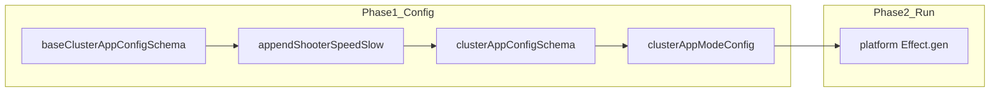

# Extendable typesafe configuration + two-phase groundwork

## Goal

- Introduce an **extendable, typesafe** configuration API (`defineConfig`, `configSet`) so keys like `CLUSTER_APP_MODE` gain new literal options via `**append`** while preserving `**as const`**-style inference for completions and `Config.literal` typing.
- Establish **phase 1 (configuration)** as the place where the merged schema and derived Effect `Config` are built; **phase 2 (run)** remains the existing `Effect.gen` + `NodeRuntime.runMain` in `[packages/platforms/postgresql/src/platform.ts](packages/platforms/postgresql/src/platform.ts)` and `[packages/platforms/mysql/src/platform.ts](packages/platforms/mysql/src/platform.ts)` (aligned with [Effect configuration](https://effect.website/docs/configuration/) — `Config` + `ConfigProvider.fromEnv()`, with composition happening before `yield*`).

Reference from `[packages-old/core/src/config/runtime-config.ts](packages-old/core/src/config/runtime-config.ts)`: load related settings into a single place and expose to the app; here we generalize the **schema** side for multiple keys and extensions.

## Design

### 1. Core types and helpers (new)

Add something like `[packages/core/src/config/config-set.ts](packages/core/src/config/config-set.ts)`:

- `**ConfigSchema`**: `Record<string, readonly string[]>` (string-literal union keys only for this iteration; document that other primitives can be added later via separate branches or overloads).
- `**TupleAppend<T, U>`**: `[...T, ...U]` for `readonly string[]` tuples.
- `**defineConfig<const S extends ConfigSchema>(schema: S): S`**: identity helper for inference.
- `**configSet<S, K, A>(schema: S, key: K, opts: { readonly append: A })`**: returns `Omit<S, K> & { readonly [P in K]: TupleAppend<S[K], A> }` with `K extends keyof S & string`.

This gives **typesafe** growth of `CLUSTER_APP_MODE` literals without `as` casts at call sites.

### 2. Base vs composed cluster app mode

- **Base schema** (core-only modes): e.g. `battleship`, `runner` — lives in a small file such as `[packages/core/src/config/cluster-app-base.ts](packages/core/src/config/cluster-app-base.ts)` exporting `baseClusterAppConfigSchema = defineConfig({ CLUSTER_APP_MODE: ['battleship', 'runner'] as const })`.
- **Per-program registration** (your “within shooter” requirement): in `[packages/core/src/shooter.ts](packages/core/src/shooter.ts)` (and similarly for speed/slow), export:
  - `shooterClusterModeAppend = ['shooter'] as const` (or inline in the helper)
  - `**appendShooterClusterModes<S extends ConfigSchema>(schema: S)`** implemented as `configSet(schema, 'CLUSTER_APP_MODE', { append: shooterClusterModeAppend })` — the `**configSet` call lives in shooter**.
  - Parallel `**appendSpeedShooterClusterModes`**, `**appendSlowShooterClusterModes`** in `[speed-shooter.ts](packages/core/src/speed-shooter.ts)` / `[slow-shooter.ts](packages/core/src/slow-shooter.ts)`.

**Composition file** (avoids `speed-shooter` importing `shooter` for ordering): new `[packages/core/src/config/cluster-app-config.ts](packages/core/src/config/cluster-app-config.ts)` imports `baseClusterAppConfigSchema` and each `append`* from the program modules, then exports a **single** merged constant, e.g.:

`clusterAppConfigSchema = appendSlowShooterClusterModes(appendSpeedShooterClusterModes(appendShooterClusterModes(baseClusterAppConfigSchema)))`

(append order only affects inferred tuple order, not runtime validation if the final tuple contains all members.)

### 3. Derive public types and Effect `Config`

- Replace the hand-written list in `[packages/core/src/config/cluster-app-mode.ts](packages/core/src/config/cluster-app-mode.ts)` with types and values **derived from** `clusterAppConfigSchema`:
  - `clusterAppModes = clusterAppConfigSchema.CLUSTER_APP_MODE` (satisfies `readonly` tuple)
  - `export type ClusterAppMode = (typeof clusterAppModes)[number]`
  - `clusterAppModeConfig`: build with `Config.literal(...clusterAppModes)('CLUSTER_APP_MODE').pipe(Config.withDefault('battleship'))` — ensure TypeScript accepts the spread (non-empty tuple; `battleship` must remain in the merged tuple).

Re-export from `[packages/core/src/index.ts](packages/core/src/index.ts)`: keep existing names (`clusterAppModes`, `ClusterAppMode`, `clusterAppModeConfig`) where possible; optionally export `clusterAppConfigSchema`, `defineConfig`, `configSet`, and append helpers for advanced consumers.

### 4. Two-phase mental model (minimal code change now)

- **Phase 1**: constructing `clusterAppConfigSchema` + `clusterAppModeConfig` (and, later, other `Config`s / `Layer`s). Document in a short file comment or existing learnings link that full “setup layers” can wrap this schema (similar spirit to `[RuntimeConfigLive` in packages-old](packages-old/core/src/config/runtime-config.ts)).
- **Phase 2**: unchanged platform `program` that `yield`* `clusterAppModeConfig` and branches on `mode`.

### 5. Platforms

- No behavioral change expected: still `import { clusterAppModeConfig, ... } from '@eventiva/core'` and `Effect.withConfigProvider(ConfigProvider.fromEnv())`.
- Re-run `**pnpm nx run platforms-postgresql:run**` and `**pnpm nx run platforms-mysql:run**` with a few `CLUSTER_APP_MODE` values (at least `battleship` and one shooter mode) to confirm parity.

### 6. Constraints

- **TDD policy**: implementation only; do not add or change tests in the tests repo.
- **Scope**: focus on the string-literal union pattern; defer non-string keys / nested namespaces unless needed for this milestone (Effect docs cover `[Config.nested](https://effect.website/docs/configuration/)` for later).

## Files to add/touch (summary)

| Action | File                                                                                                                                                                                              |
| ------ | ------------------------------------------------------------------------------------------------------------------------------------------------------------------------------------------------- |
| Add    | `[packages/core/src/config/config-set.ts](packages/core/src/config/config-set.ts)`                                                                                                                |
| Add    | `[packages/core/src/config/cluster-app-base.ts](packages/core/src/config/cluster-app-base.ts)` (optional; may be inlined)                                                                         |
| Add    | `[packages/core/src/config/cluster-app-config.ts](packages/core/src/config/cluster-app-config.ts)`                                                                                                |
| Edit   | `[packages/core/src/config/cluster-app-mode.ts](packages/core/src/config/cluster-app-mode.ts)`                                                                                                    |
| Edit   | `[packages/core/src/shooter.ts](packages/core/src/shooter.ts)`, `[speed-shooter.ts](packages/core/src/speed-shooter.ts)`, `[slow-shooter.ts](packages/core/src/slow-shooter.ts)` — append helpers |
| Edit   | `[packages/core/src/index.ts](packages/core/src/index.ts)` — exports                                                                                                                              |

## Risk notes

- **Tuple spread into `Config.literal`**: may need a small type assertion or helper if `tsc` complains about non-empty tuple requirement — keep it localized.
- **Circular imports**: `cluster-app-config.ts` must only import **append helpers + base**; program files must not import `cluster-app-config.ts`.

