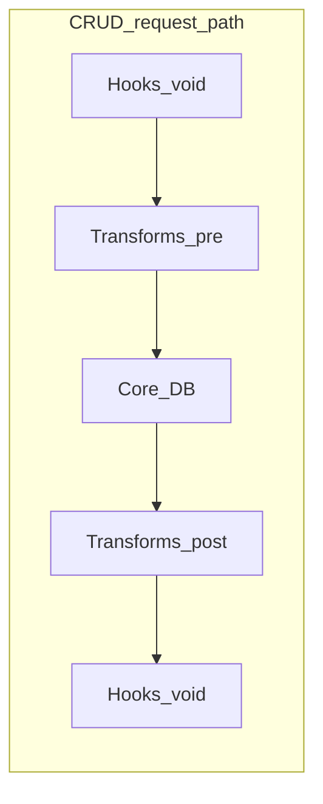

---

name: Hooks and Transforms
overview: "Introduce **transforms** (pre/post pipelines + audit history) and **hooks** as **cluster-wide only**—no separate in-process hook transport; all void notifications use [@effect/cluster](https://effect-ts.github.io/effect/docs/cluster) messaging (`Message` / `MessageStorage` or current equivalents). **Transforms must be cluster-wide**: extension transform logic may run on a **different runner** than the entity RPC—design for **remote transform steps** (serialized context, RPC/Message round-trips, ordered merge), not only synchronous in-process `Effect` on the handler fiber. Align with current cluster APIs; use [cluster-docker](https://github.com/tim-smart/cluster-docker/tree/main) for ops principles only (API audit required). Local Docker multi-runner for tests. CRUD hot path stays plain `Effect` orchestration (not `@effect/workflow` durable). **Pre-alpha:** remove `entity-method-extensions` and **delete** [extension-hook-pubsub.ts](packages/core/src/extensions/extension-hook-pubsub.ts) application-hook usage in favor of the cluster bus—no dual paths."
todos:

- id: types-and-runner
content: Add `TransformContext`, `TransformStep`, `runTransforms` (local + remote step orchestration), registration + routing hooks for extension runner; diff/snapshot policy documented.
status: pending
- id: crud-integration
content: Integrate pre/post transforms + hook ordering into `crud-handlers.ts` / `entity-base.ts`; **remove** `entity-method-extensions.ts` and `runWithExtensions`—replace all usages with hooks (void) + transforms only; no parallel extension API.
status: pending
- id: event-pipeline
content: Event-scoped transforms + cluster-wide hook emit after final payload (same cluster protocols as CRUD).
status: pending
- id: workflow-registry-bridge
content: ""
status: pending
- id: docs-observability
content: Update architecture learnings + delegate docs-creator for hook vs transform glossary and CRUD ordering; ensure spans/metrics on all transform steps.
status: pending
- id: cluster-compatibility
content: Document cluster rules (hooks + transforms cluster-wide; no runner-local hook bus); align ClusterWorkflowEngine when CLUSTER is on.
status: pending
- id: cluster-api-audit
content: Read current @effect/cluster docs/modules (Message, MessageStorage, SqlMessageStorage, HttpRunner, Sharding, Runner) and diff mental model vs cluster-docker example; record any API renames or new preferred patterns before coding.
status: pending
- id: cluster-wide-hooks
content: Replace application [ExtensionHookPubSub](packages/core/src/extensions/extension-hook-pubsub.ts) with **one** cluster-backed hook bus (Message/MessageStorage per cluster-api-audit). **Remove** in-process PubSub for hooks—no `local` transport. Update all publishers/listeners to cluster APIs; delete obsolete code paths.
status: pending
- id: cluster-wide-transforms
content: "Design + implement transform execution so steps can run on **extension home runners** (not assumed colocated with entity handler): serializable `TransformContext`, correlation ids, ordered remote invocation via Entity/Message/`EntityProxy` as appropriate; prove with multi-runner Docker test."
status: pending
- id: distributed-cluster-mode
content: Extend [cluster/config.ts](packages/core/src/cluster/config.ts) beyond TestRunner—implement or wire `distributed`/multi-process path per current cluster APIs (replace stub throw); integrate with platform Layer composition.
status: pending
- id: local-docker-cluster
content: Add repo-local Docker (and/or minimal k8s) manifests/scripts inspired by cluster-docker for multi-runner local runs and CI smoke tests; document how to run clustered Eventiva instances on one machine.
status: pending
- id: fpk-k8s-cluster-stack
content: Implement an `@fpk/k8s`-based local cluster tooling suite and cluster stack manifests for Eventiva: Postgres service, shard-manager service, runner deployment with replicas, and one example entity workload deployment; include dev lifecycle commands (generate/apply/destroy/logs).
status: pending
- id: fpk-default-runtime-and-nx
content: Make the `@fpk/k8s` cluster stack the default platform runtime and default Nx run/dev entrypoint (no non-cluster default). Add Nx targets/executors for cluster render/apply/delete/status/logs and document operator flow.
status: pending
- id: pg-e2e-via-nx-cluster
content: Ensure `@scripts/pg-e2e-via-nx.mjs` runs against the fpk cluster stack through Nx orchestration and returns expected outputs as a regression gate.
status: pending
isProject: false

---

# Hooks + Transforms + CRUD consistency

## Pre-alpha policy: no legacy / dual code paths

The product is **pre-alpha** (single-device dev, no external users). Implementation must **commit fully** to the new model:

- **Do not** retain superseded APIs alongside new ones (no `registerEntityMethodExtension` next to `registerTransform`, no “legacy” branches).
- **Remove** [entity-method-extensions.ts](packages/core/src/entity/entity-method-extensions.ts) and `runWithExtensions` when hooks + transforms land; **update every call site** in the same change set.
- **Replace** `wrap` in [entity-base.ts](packages/core/src/entity/entity-base.ts) with a single pipeline (hooks → transforms → core → transforms → hooks)—not “augment” or keep an old path behind a flag.
- No compatibility shims or feature flags to preserve old behavior for callers.

## Goals (locked terminology)

- **Hooks** — **Void** notifications only (`Effect<void>`). **Single transport: cluster-wide** via [@effect/cluster](https://effect-ts.github.io/effect/docs/cluster) (e.g. `Message` / `MessageStorage`, storage backend TBD in API audit). **No** runner-only hook pub/sub for product hooks—every subscriber receives events through the same cluster mechanism so behavior is identical when extensions run on other runners. **Delete** in-process [extension-hook-pubsub.ts](packages/core/src/extensions/extension-hook-pubsub.ts) hook usage after migration (file removed or reduced to non-hook internals if anything remains).
- **Transforms** — **Ordered pre/post pipelines** with **audit metadata** (`extensionId`, `transformId`, phase, optional diff). **Must be cluster-wide**: the runner that handles an entity RPC **must not** assume transform code lives locally—**transform steps may execute on other runners** where the owning extension is registered. Implementation uses **serializable** `TransformContext` (or payload + cursor) and **remote execution** (or explicit cluster routing) per step; **original** + **current** remain required; **steps** append after each hop. **Single-process `TestRunner`** may still **simulate** the cluster for dev speed, but the **code path** is the same cluster protocol (no second “local only” transform path).

## Why not “CRUD as @effect/workflow workflows”

The codebase already has two different “workflow” ideas:

| Mechanism                                                                                              | Role                                                                                                |
| ------------------------------------------------------------------------------------------------------ | --------------------------------------------------------------------------------------------------- |
| `[@effect/workflow` `Workflow.make](packages/core/src/extensions/extension-hooks.ts)` + cluster engine | Durable/idempotent **extension lifecycle** and background work                                      |
| [Eventiva `WorkflowRegistry](packages/core/src/workflow/engine.ts)`                                    | In-memory **register-by-name / execute** (optional observability; not a second transform transport) |

Routing **every CRUD RPC** through `@effect/workflow` would add the wrong semantics: extra persistence/replay surface, idempotency keys for trivial reads, and latency—without fixing code reuse. **Reuse should be one shared Effect implementation** of transforms + hook dispatch, invoked from CRUD handlers (and optionally from event emitters).

If you want **named** invocations for debugging or admin tools, **register the same pipeline** (or a thin wrapper) with `WorkflowRegistry`—but the **source of truth** is one module, not two parallel implementations.

## Compatibility with @effect/cluster

Design and implementation must align with [Effect cluster](https://effect-ts.github.io/effect/docs/cluster) primitives (`Entity`, `Sharding`, `Runner`, `Message`, `MessageStorage`, `EntityProxy`, etc.).

### Hooks: cluster-wide only

- **All** hook notifications use the **cluster message bus** (exact API from **cluster-api-audit** todo). **Remove** the pattern where [extension-hook-pubsub.ts](packages/core/src/extensions/extension-hook-pubsub.ts) is an in-memory map for application hooks.
- **No** “local-only” hook mode—there is no product requirement for a hook that only fires on one runner.

### Transforms: cluster-wide (required)

- **Problem:** An **extension** that contributes a transform may **not** be loaded on the same runner as the **entity** handling the CRUD/event request.
- **Requirement:** The transform pipeline must **route each step** to the runner that can execute that extension’s code (or use a **cluster-wide** execution model defined in the audit), then **merge** results in order into `TransformContext`.
- **Implications:** Payloads must be **serializable**; **latency** is multi-hop; **ordering** and **idempotency** (if retries) must be explicit. **DB writes** for the core CRUD step still occur on the **entity’s** runner (or as defined by shard ownership); only **transform execution** may cross runners.
- **Homogeneous cluster option** (same extension layers on every runner) still allows **local** transform execution but **must not** be the only story—implementation must satisfy **heterogeneous** placement.

### Workflow engine

- `**@effect/workflow` + `ClusterWorkflowEngine`:** Keep using `ClusterWorkflowEngineLayer` when CLUSTER is on ([platform.ts](packages/core/src/runtime/platform.ts)) for **durable** extension lifecycle workflows; **do not** conflate that with the transform/hook **request path** protocol.

### Explicit rules

1. **Hooks**: Publish/subscribe only through **cluster**; subscribers register in a way that receives messages on **their** runner.
2. **Transforms**: Implement **remote-capable** step runner; **do not** assume `runTransforms` is only `Effect` on the current fiber without cluster sends.
3. **WorkflowRegistry** (Eventiva): Optional **metrics** naming only—not a substitute for cluster messaging or transform routing.

### Documentation

- Glossary: **Hooks** = cluster bus; **Transforms** = ordered pipeline with possible remote steps; **TestRunner** = in-process **simulation** of cluster, not a second product API.

## Cluster infrastructure: cross-runner messaging and local Docker

This is a **first-class** part of the same initiative: hooks and platform behavior must stay **in sync** when multiple runners exist (sharding, registration, message delivery). Today [cluster/config.ts](packages/core/src/cluster/config.ts) uses `TestRunner` by default and `**distributed` throws** (“Pods + RunnerStorage not yet implemented”). That gap must close for real multi-runner behavior.

### Reference: cluster-docker (principles, not copy-paste)

The Effect team’s [tim-smart/cluster-docker](https://github.com/tim-smart/cluster-docker/tree/main) demonstrates:

- **Multiple runners** in containers, orchestration-friendly layout (Dockerfiles, manifests under `manifests/`, compiled runner artifacts).
- **Runner registration and messaging** patterns that keep cluster state consistent across processes.

**Constraint:** that repository is **roughly 6–12 months old** relative to ongoing `@effect/cluster` work. **Do not** vendor its code without an **API audit** against current docs:

- Re-read [Effect cluster documentation](https://effect-ts.github.io/effect/docs/cluster) and the concrete modules you will use (`Message`, `MessageStorage`, `SqlMessageStorage`, `HttpRunner`, `SocketRunner`, `Sharding`, `Runner`, `ClusterWorkflowEngine`, etc.).
- Note any renames, deprecations, or recommended composition (e.g. storage backends for messages, HTTP vs socket runner) and **implement to current APIs**, using cluster-docker only for **topology** and **operational** ideas (how many pods, how runners discover each other in Docker/k8s).

### `@fpk/k8s` local cluster tooling suite (explicit requirement)

Create an Eventiva-owned cluster stack implemented with `**@fpk/k8s`** and checked into this repo.

- **Stack components (minimum):**
  - **Postgres** manifest equivalent to the cluster-docker `pg` reference (PVC + Deployment + Service).
  - **Shard manager** manifest equivalent to `shard-manager` reference (service discovery + probes).
  - **Runner** manifest equivalent to `runner` reference (replicas, env wiring for shard manager + host/pod ip).
  - **Example entity workload** manifest equivalent to `battleships` reference, used to prove entity traffic across runners.
- **Tooling commands/scripts:** add a small suite for local operator workflow:
  - `cluster:render` (generate manifests),
  - `cluster:apply`,
  - `cluster:delete`,
  - `cluster:status` / `cluster:logs`.
- `**fpk` conventions:** mirror the source layout and generation flow patterns from `fpk-k8s-example` for authoring manifests and rendering outputs, adapted to Eventiva folder conventions.
- **Env model:** centralize env inputs for DB credentials, shard-manager host, runner host/port, and image tags in one place for repeatable local runs.
- **Validation:** include a smoke run doc that boots the full stack and verifies:
  - runner registration,
  - cross-runner hook delivery,
  - cross-runner transform step execution.

References (topology only, re-audit APIs before implementation):

- PG: [cluster-docker `manifests/pg/index.ts](https://github.com/tim-smart/cluster-docker/blob/main/manifests/pg/index.ts)`
- Shard manager: [cluster-docker `manifests/shard-manager/index.ts](https://github.com/tim-smart/cluster-docker/blob/main/manifests/shard-manager/index.ts)`
- Runner: [cluster-docker `manifests/runner/index.ts](https://github.com/tim-smart/cluster-docker/blob/main/manifests/runner/index.ts)`
- Example entity workload: [cluster-docker `manifests/battleships/index.ts](https://github.com/tim-smart/cluster-docker/blob/main/manifests/battleships/index.ts)`
- Secondary `@fpk/k8s` authoring reference: [fpk-k8s-example `src](https://github.com/tim-smart/fpk-k8s-example/tree/master/src)`
- `fpk` upstream reference: [tim-smart/fpk](https://github.com/tim-smart/fpk)

### Target behavior

1. **Hooks** — **Only** cluster messaging (`Message` / `MessageStorage` or audited equivalent). **Remove** in-process `ExtensionHookPubSub` for application hooks; migrate publish/listen sites in one pass.
2. **Transforms** — **Cluster-wide execution model**: each transform step resolves **where** the owning extension runs (shard, runner id, or extension entity—**design in cluster-wide-transforms** todo) and **invokes** that step remotely if needed; merge **audit** steps into `TransformContext` in order.
3. **Distributed cluster mode** — Implement the `**distributed`** path in [cluster/config.ts](packages/core/src/cluster/config.ts) using current `@effect/cluster` APIs; wire [platform.ts](packages/core/src/runtime/platform.ts) for multi-process when enabled.
4. **Default runtime = fpk cluster** — Running the platform defaults to the `@fpk/k8s` cluster stack (not a local non-cluster mode).
5. **Nx support for cluster operations** — Nx targets own cluster lifecycle (`render` / `apply` / `delete` / `status` / `logs`) and are used by default run/dev flows.
6. **Existing e2e compatibility** — [@scripts/pg-e2e-via-nx.mjs](scripts/pg-e2e-via-nx.mjs) runs against the active cluster stack and produces expected outputs.

### Testing strategy

- **Fast dev:** `TestRunner` may **simulate** the cluster in one OS process if the cluster package supports it—**same code paths** as production, not a separate “local hooks” API.
- **Integration:** Docker/k8s multi-runner: **hook** received on non-originating runner; **transform** step executed on extension runner and result merged.
- **Nx regression gate:** run [@scripts/pg-e2e-via-nx.mjs](scripts/pg-e2e-via-nx.mjs) via Nx against the cluster stack as required acceptance criteria.

### Ordering relative to hooks/transforms CRUD work

- **Cluster messaging + routing** for hooks/transforms is **foundational**—implement or stub the **protocol** first, then wire CRUD/event entry points to call it. **No** temporary local-only hook bus.

## Core abstraction: transform context + runner

Add a small core API (new files under e.g. `[packages/core/src/transforms/](packages/core/src/transforms/)` — exact name TBD):

1. `**TransformContext<T>`** (or `TransformEnvelope<T>`)
  - `original: Readonly<T>` — set once, never mutated (use `Object.freeze` in dev or `Readonly` + convention).
  - `current: T` — value after each step.
  - `steps: ReadonlyArray<TransformStep>` — append-only audit entries.
2. `**TransformStep`**
  - `extensionId: string`
  - `transformId: string` (stable id for the function, e.g. `"acme.normalizeEmail"`)
  - `phase: 'pre' | 'post'`
  - Optional: `timestamp`, span id (for correlation with [withSpanAndLog](packages/core/src/observability/helpers.ts))
  - **Change payload**: choose one strategy (document in types):
    - **Lightweight (default):** store a shallow `{ path, before, after }[]` or RFC6902 JSON Patch for **changed paths only** (requires diff helper or explicit return from transform).
    - **Heavy (debug flag):** optional snapshot of `current` after each step (feature-flagged).
3. `**runTransforms<T, E, R>(options)`**
  - Ordered list of registered transforms (transforms own registration; old entity-method extensions **removed**).
  - Each step is **in-process** when colocated with the owning extension, or **remote** (cluster RPC/Message to the extension’s runner); orchestrator merges `current` + `TransformStep` in order.
  - **Fail-fast** by default; `T` must be **serializable** for cross-runner steps.
4. **Registration**
  - `registerTransform({ scope, phase, priority, extensionId, transformId, run })` with `scope` e.g. `entity:Contact:create:pre`; registry supports **routing** transforms to the runner that hosts `extensionId`.
  - Central registry keyed by `scope` (single map; replaces the old extension registry).

This satisfies: **original** + **current**, **audit history**, and **cluster-wide** execution where extensions are not colocated with the entity handler.

## Ordering: hooks vs transforms on CRUD

Define a **single canonical order** and document it in code + [docs/learnings/architecture.md](docs/learnings/architecture.md):

1. **beforeCall-style hooks** (void) — observability, validation that **does not** mutate payload (if you need mutation, use **pre transforms**).
2. **Pre transforms** — mutate input payload / patch before persistence.
3. **Core handler** — [makeCrudHandlersFromDatabase](packages/core/src/crud/crud-handlers.ts) (DB get/set).
4. **Post transforms** — mutate **outgoing** record (get/list) or **response** shape (create/update return value if needed).
5. **afterCall-style hooks** (void) — side effects, notifications, metrics.

Today [runWithExtensions](packages/core/src/entity/entity-method-extensions.ts) runs **after** base and **void** only—that file is **deleted**. Former “post extension” behavior splits into: **post transforms** (data shaping) and **afterCall hooks** (void). **Only transforms** may change data; **hooks** stay void.

## Integration points

### A. Entity `Base` / CRUD

- Wrap `[makeCrudHandlersFromDatabase](packages/core/src/crud/crud-handlers.ts)` (or the single place that calls DB after decode) so each method runs the pipeline above.
- **Thread `TransformContext`** through get/list (post-transform on decoded record) and create/update/delete (pre on payload, post on result if applicable).
- Decide whether `**TransformContext` metadata** is returned on the wire RPC (probably **no** by default; only internal logs/traces, or opt-in via feature flag / debug header).

### B. [entity-base.ts](packages/core/src/entity/entity-base.ts) `wrap`

- **Replace** `runWithExtensions` entirely: `wrap('create', handlers.create)` implements hooks → transforms → handler → transforms → hooks only (no second extension mechanism).

### C. Event path (non-CRUD)

- Run **the same `runTransforms`** with scope `event:<name>:pre|post` (cluster-wide steps as above).
- Emit **hooks** via the **cluster hook bus** with the **final** payload after transforms; hooks remain **void** from the publisher’s perspective (no return value), but delivery is cluster-wide.

## WorkflowRegistry (optional)

- If desired, during extension `Layer` setup, `WorkflowRegistry.register({ name: 'transform/Contact/create' }, ({ payload }) => runTransformScope(...))` so **metrics and tracing** align with a single name. **Do not** duplicate logic—delegate to `runTransforms`.

## Observability and policy

- Every transform step: **span** (`transformId`, `extensionId`, `phase`, `scope`), **metric** duration, **log** summary (not full PII unless safe).
- Align with [.cursor/rules/effect-observability.mdc](.cursor/rules/effect-observability.mdc).

## Documentation and boundaries

- After the surface is stable, delegate **documentation-creator** per [.cursor/rules/module-documentation-delegation.mdc](.cursor/rules/module-documentation-delegation.mdc) for `docs/` (hook vs transform glossary, canonical CRUD order).
- **Tests:** TDD policy says implementation does not add tests in the same work; test-creator agent adds Effect/Vitest coverage later.

## Risks / decisions to lock early

- **RPC response size:** embedding full `TransformStep` history in API responses is usually **off**; default to internal-only + optional debug.
- **Latency:** cluster-wide transforms add **round-trips**; cap payload size; consider **batching** or **co-location** policies for hot paths (product decision).
- **Concurrency:** **sequential** transform steps for determinism unless a formally specified merge for parallel remote steps exists.
- **Schema:** transforms must respect entity `Schema` boundaries; invalid outputs must be **typed errors** (`Effect.fail`).
- **Routing:** how an extension is mapped to **runner address** (registration table, shard map, or extension-as-entity) must be decided in **cluster-wide-transforms** design.

