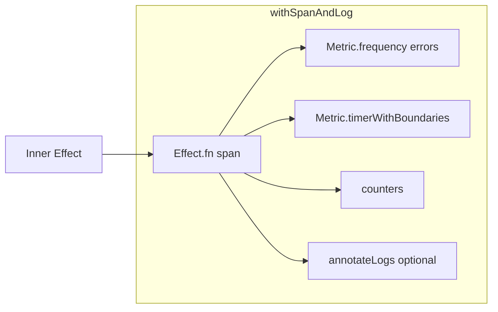

# Observability helpers + cluster app mode config

## Context

- Current helper: `[packages/core/src/observability/helpers.ts](packages/core/src/observability/helpers.ts)` uses `Effect.withSpan`, `Metric.timer` (already a duration **histogram** under the hood per [Effect metrics](https://effect.website/docs/observability/metrics/#histogram)), counters, and `Metric.trackDuration`.
- Platforms read mode synchronously: `[packages/platforms/postgresql/src/platform.ts](packages/platforms/postgresql/src/platform.ts)` and `[packages/platforms/mysql/src/platform.ts](packages/platforms/mysql/src/platform.ts)` use `process.env.CLUSTER_APP_MODE ?? "battleship"`.
- SQL config pattern already uses `Config` in `[packages/platforms/postgresql/src/sql.ts](packages/platforms/postgresql/src/sql.ts)`.

## 1. Frequency metric for errors

- Add a `Metric.frequency` per span/metric base, e.g. `${metricBase}_error_kinds` (description: distinct failure labels for that operation).
- In `Effect.tapError`, after logging, record one observation with a **low-cardinality** string, e.g.:
  - Prefer `Data.TaggedError` `_tag` when present (`Predicate.hasProperty` / `Data.isTagged`).
  - Else `error instanceof Error ? error.name : "unknown"`.
- Optionally cap/normalize very long strings (not needed if we stick to `_tag` / `name`).
- This follows the [Frequency](https://effect.website/docs/observability/metrics/#frequency) pattern: `yield* errorFrequency(Effect.succeed(label))`.

## 2. Histograms / timers

- Replace plain `Metric.timer(\`${metricBase}_duration) `with` **Metric.timerWithBoundaries`** and an explicit boundary array (e.g. ms buckets suited to RPC latency: small linear steps for sub-100ms work, plus an upper infinity bucket—align with [Timer metric](https://effect.website/docs/observability/metrics/#timer-metric) and `Array.range`-style boundaries).
- Keep `**Metric.trackDuration`** on the inner effect so behavior stays correct; document in a short comment that duration is recorded in ms with the `time_unit` tag (existing `Metric.timer` behavior).
- If useful without scope creep: add **one** extra histogram for a derived scalar only when cheap (e.g. optional future hook). If nothing natural exists, skip—counters + frequency + bounded timer already answer “analyze over time.”

## 3. Additional useful metrics (tight scope)

- `**Metric.counter` with `incremental: true`** for `${metricBase}_success_total` and `${metricBase}_error_total` (or keep existing counters but mark incremental where only increments matter) to match Prometheus-style semantics.
- Optional: `Effect.tagMetrics("span", spanName)` or `Metric.tagged("operation", metricBase)` on the timer/frequency so dashboards can filter—only if it does not duplicate OTEL span names awkwardly; prefer **one** consistent tag key (e.g. `operation` = `metricBase`).

## 4. `Effect.fn` + pipeable effect

- Refactor so the instrumented body is implemented as `**Effect.fn(spanName)(function* (effect: Effect.Effect<A,E,R>) { ... })`** and the public API remains:
`withSpanAndLog(spanName, options?)(effect)` **and** `effect.pipe(withSpanAndLog(spanName, options))`.
- **Remove duplicate tracing**: use **either** `Effect.withSpan` **or** `Effect.fn`’s automatic span—not both. Prefer `Effect.fn` with span name = `spanName` per [Effect.fn docs](https://github.com/effect-ts/effect/blob/main/packages/effect/src/Effect.ts) (user-attached excerpt): apply `**yield* Effect.annotateCurrentSpan(...)`** for each entry in `attributes` so parity with previous `Effect.withSpan({ attributes })` is preserved.
- Keep `**Effect.annotateLogs`** when `attributes` is non-empty (unchanged behavior).
- Ensure the returned value is still an `Effect` so callers in `[packages/core/src/runner.ts](packages/core/src/runner.ts)`, `[shooter.ts](packages/core/src/shooter.ts)`, etc. need **no** signature changes.

## 5. Verification (runtime)

- Build/lint affected projects: `pnpm nx run core:build` (and lint if configured).
- Run **both** (user-requested; cluster available):
  - `pnpm nx run platforms-postgresql:run`
  - `pnpm nx run platforms-mysql:run`
- Treat success as: targets start, mode branches run without `Unknown CLUSTER_APP_MODE`, and no regressions in cluster rollout (scripts already set `EVENTIVA_CLUSTER_STACK` per platform). If runs are long-lived, confirm healthy startup logs then stop—document that in the PR if needed.

**Note:** Per repo TDD policy, do **not** add or change automated tests in `tests/` as part of this work; the user’s “run tests” here means **runtime verification** via the two Nx targets above.

## 6. `CLUSTER_APP_MODE` via Effect `Config` (after step 5 passes)

- Add a **shared** `Config` in `@eventiva/core` (new small module, e.g. `[packages/core/src/config/cluster-app-mode.ts](packages/core/src/config/cluster-app-mode.ts)`) exporting something like:
  - `ClusterAppMode` union type matching current branches: `"battleship" | "runner" | "shooter" | "speed-shooter" | "slow-shooter"`.
  - `clusterAppModeConfig`: `Config.literal(...)("CLUSTER_APP_MODE").pipe(Config.withDefault("battleship"))` per [Configuration](https://effect.website/docs/configuration/).
- Refactor **both** `[packages/platforms/postgresql/src/platform.ts](packages/platforms/postgresql/src/platform.ts)` and `[packages/platforms/mysql/src/platform.ts](packages/platforms/mysql/src/platform.ts)` to a single `**Effect` program** that:
  1. `yield* clusterAppModeConfig`
  2. `switch`es on `mode` (same logic as today)
  3. Uses `NodeRuntime.runMain` / `Effect.runFork` as today.
- Re-export the config/type from `[packages/core/src/index.ts](packages/core/src/index.ts)` if other packages need them (optional).
- Update `[.env.example](.env.example)`: **append** a new subsection for cluster platform / `CLUSTER_APP_MODE` (and optionally `EVENTIVA_SERVICE_NAME` used in `[tracing.ts](packages/core/src/observability/tracing.ts)` if you want it documented—**do not remove** any existing variables).

## Dependency / architecture notes

- All new imports stay in `effect` / `@eventiva/core`—no new workspace packages; respect [module boundaries](.cursor/rules/module-boundaries.mdc) (`type:core` for core exports).

