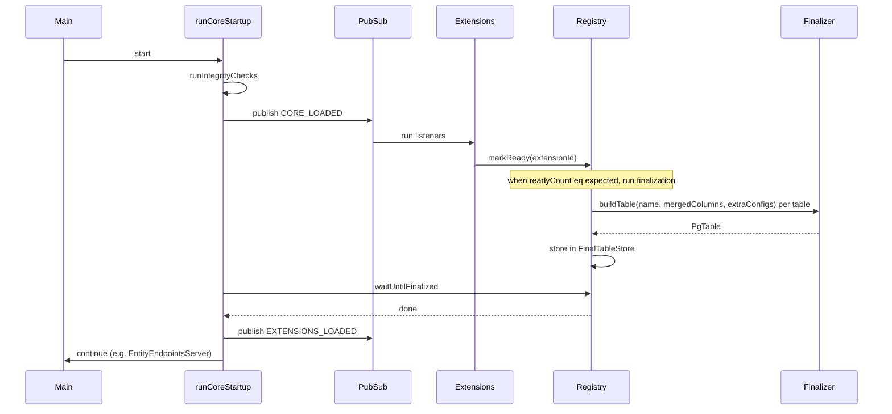

# Schema registry, createTable registration, and extension-ready table finalization

## Goals

- **createTable** (in [packages/databases/pg/src/table-builder.ts](packages/databases/pg/src/table-builder.ts)) registers table columns into a **core** registry that supports multiple extensions contributing to the same table and **rejects** any merge that would add a column name that already exists (error).
- Track **expected extension count** and have each extension **confirm finished loading** (e.g. publish a topic or call a service method). When the number of "ready" acks matches the expected count, run **createTableFinal** for all registered tables and store results in a **final tables** store.
- Final store must support **self-referencing tables** (e.g. `contact` referencing `contact`) without requiring a separate "stub then replace" flow; use a single build with a self-reference variable (see below).
- **Out of scope for this plan**: drizzle-kit generate, drizzle-kit migrate, and relationships (FK/relations) — to be designed and implemented later.

---

## 1. Core: Table column registry and final table store

**Location:** New service(s) in core (e.g. `packages/core/src/schema/` or under `packages/core/src/extensions/`).

- **TableColumnRegistry** (Effect Context service):
  - **State:**
    - Pending: `Map<tableName, { columns: Record<string, PgColumnBuilderBase>, extraConfigs: Array<...> }>` — merged column set per table and list of extraConfig callbacks.
    - Optional: `expectedReadyCount: number` (set once by platform).
    - `readyCount: number` or `readyIds: Set<string>` (incremented when an extension marks ready).
    - `finalized: boolean` (true after createTableFinal has been run).
  - **Methods:**
    - `registerTableColumns(tableName, extensionId, columns, extraConfig?)`: Effect. For the given table, **merge** the new `columns` into the existing column map. **If any key in `columns` already exists for that table, fail with a descriptive error** (e.g. `DuplicateColumnError { tableName, columnName, extensionId }`). Append `extraConfig` to the table’s extraConfig list. (Columns are the same shape as the second argument to `pgTable` — record of Drizzle column builders.)
    - `setExpectedReadyCount(n: number)`: set expected number of extensions that will call `markReady` (e.g. `options.extensions.length`).
    - `markReady(extensionId: string)` (or no-arg if using simple count): increment ready count / add id to set. If after this call `readyCount === expectedReadyCount`, trigger finalization (see below). Idempotent per extension (same extensionId calling twice counts once).
    - `waitUntilFinalized(): Effect<void>`: Effect that completes when finalization has run (e.g. via `Deferred` or `Ref` + polling). Used by startup after CORE_LOADED.
  - **Finalization (internal):** When `readyCount === expectedReadyCount` and not yet finalized:
    - For each table name in the registry, build the **merged** columns (already merged on each register) + standard columns (id, createdAt, updatedAt, etc.) and call **createTableFinal** (see below). Store the resulting PgTable in a **FinalTableStore** (second store).
    - Set `finalized = true` and complete any `Deferred` used by `waitUntilFinalized`.
- **FinalTableStore** (can be same service or a separate one):
  - **State:** `Map<tableName, PgTable>` (or `Record<string, PgTable>`) — the result of `createTableFinal` per table.
  - **Methods:**
    - `getTable(tableName): PgTable | undefined`
    - `getAllTables(): Record<string, PgTable>` (for drizzle-kit schema object later).
  - Populated only during finalization; read-only after.
- **Dependency:** TableColumnRegistry (and optionally FinalTableStore) must be provided by the platform and required by `createTable` and by the startup sequence. Core must not depend on `drizzle-orm` or `@eventiva/databases.pg` for the **registry types** if that would create a circular dependency. So:
  - Option A: Define the registry in core with column type as a minimal interface or `unknown` and let databases/pg pass column objects that satisfy it.
  - Option B: Move the registry into `@eventiva/databases.pg` and have core depend on it for the "expected count + ready" handshake only (e.g. core only knows about a generic "SchemaReady" service that has `setExpectedCount`, `markReady`, `waitUntilReady`). Then the table-building logic stays in databases/pg.

Recommendation: **Registry and finalization logic in core**, with column type kept generic (e.g. `Record<string, unknown>` or a minimal interface from a shared types package). The actual Drizzle `pgTable` and `createTableFinal` live in databases/pg; core calls into a **callback** or **SchemaFinalizer** service provided by databases/pg that performs the real `createTableFinal` and returns the table to store. That keeps core free of Drizzle and keeps a single place (databases/pg) for Drizzle-specific column handling.

So:

- **Core:** TableColumnRegistry (pending columns + merge + reject duplicate), expected count, ready count, `markReady`, `waitUntilFinalized`, and orchestration: when all ready, call a **SchemaFinalizer** service (provided by databases/pg) to build each table and then store results in FinalTableStore (or in the same registry).
- **databases/pg:** Implements SchemaFinalizer (takes merged columns + table name + extraConfigs, runs `createTableFinal`-like logic, returns PgTable). Exposes `createTable` which gets TableColumnRegistry and calls `registerTableColumns` with the validated columns from `testColumns`.

---

## 2. createTable implementation in databases/pg

**File:** [packages/databases/pg/src/table-builder.ts](packages/databases/pg/src/table-builder.ts).

- **createTable(name, columns, extraConfig?):**
  - **Sync vs Effect:** If the registry is an Effect service, `createTable` cannot be sync at module load. So either (a) `createTable` returns `Effect<void, DuplicateColumnError, TableColumnRegistry>` and extensions run it inside their Layer (e.g. `Layer.effectDiscard(createTable('contact', (db) => ({ ... })))`), or (b) the registry is a mutable global set by the platform before any extension code runs (fragile). Prefer (a): **createTable returns Effect** and requires TableColumnRegistry.
  - **Behavior:** Run `testColumns(name, db, columns)` to get the validated column object. Call `TableColumnRegistry.registerTableColumns(name, extensionId, validatedColumns, extraConfig)`. ExtensionId must be passed in (e.g. `createTable('contact', extensionId, columns, extraConfig)` or via a context/local that the extension sets).
  - **Signature:** e.g. `createTable(tableName, extensionId, columns, extraConfig?): Effect<void, DuplicateColumnError, TableColumnRegistry>`.
- **Merging semantics:** Handled in core: for each table, merge is one-level: existing columns + new columns; if any key from new columns already exists, throw DuplicateColumnError. No deep merge of nested objects (column definitions are leaf values).

---

## 3. Extension loading and “schema ready” handshake

- **Expected count:** The platform knows the number of extensions (e.g. `options.extensions.length`). This count must be provided to TableColumnRegistry before any extension runs. So in [packages/core/src/runtime/platform.ts](packages/core/src/runtime/platform.ts), when building the platform layer, add a layer or an effect that calls `TableColumnRegistry.setExpectedReadyCount(options.extensions.length)` (or a variant that takes an explicit list of extension ids and uses `expectedExtensionIds.length`).
- **Who must call markReady:** Extensions that contribute to the schema (register tables) must call `markReady(extensionId)` once they have finished registering. Extensions that do not register any table can also call `markReady` so that the count matches (so the platform can treat “all extensions loaded” uniformly), or the platform only counts extensions that are expected to register schema (e.g. optional `expectedSchemaExtensionIds`). Simplest: **every extension in `options.extensions` must call `markReady(extensionId)` exactly once**; expected count = `extensions.length`. Then each extension’s layer, when it runs (e.g. on CORE_LOADED or when its layer is built), calls `markReady`. So the platform must know each extension’s id — e.g. change to `extensions: ReadonlyArray<{ id: string, layer: ExtensionLayer }>` or keep a parallel `extensionIds: string[]` with the same length as `extensions`.
- **Topic vs service:** Use the **service approach**: `TableColumnRegistry.markReady(extensionId)`. No new topic required for “schema ready”; the existing CORE_LOADED flow can be used so that after core publishes CORE_LOADED, each extension’s listener runs and inside that they call `markReady(extensionId)`. When the last one calls `markReady`, the registry runs finalization. So we need **runCoreStartup** to wait until finalization is done before publishing EXTENSIONS_LOADED. So the flow is: runCoreStartup → integrity → publish CORE_LOADED (all listeners run; each extension that contributes schema has already registered tables during layer build and now calls markReady in its onLoad) → **wait until TableColumnRegistry has finalized** (e.g. yield* registry.waitUntilFinalized()) → publish EXTENSIONS_LOADED.
- **When do extensions register columns?** If registration is Effect-based (createTable returns Effect), then extensions register when their Layer is built. So when the platform merges all extension layers, building those layers runs the Effects that call createTable, so by the time the platform layer is built, all table columns are registered. Then at runtime, runCoreStartup runs; we publish CORE_LOADED; each extension’s onLoad runs and calls markReady. So we need finalization to run **after** all markReady calls. That implies we should not finalize inside the last markReady call synchronously; instead, we can run finalization in a small Effect that runs after CORE_LOADED publish completes (because all listeners have run, so all markReady calls have happened). So: runCoreStartup → publish CORE_LOADED → when publish returns, all listeners (and thus all markReady) have run → then run registry.finalizeIfReady() (or waitUntilFinalized already covers “when ready count reached, finalize then complete”) → then publish EXTENSIONS_LOADED. So the registry’s internal logic: when markReady makes readyCount === expectedReadyCount, it runs finalization asynchronously (or in a deferred) and completes waitUntilFinalized. And runCoreStartup after publish(CORE_LOADED) does yield* registry.waitUntilFinalized() then publish(EXTENSIONS_LOADED).

---

## 4. Final table store and self-references

- **Storing final tables:** TableColumnRegistry (or a separate FinalTableStore) holds the result of createTableFinal per table name. Finalization iterates over pending tables in a **deterministic order** (e.g. alphabetical by table name). For each table, it calls the SchemaFinalizer (from databases/pg) with the merged columns + standard columns + extraConfigs, and stores the returned PgTable.
- **Self-referencing tables (e.g. contact referencing contact):** Drizzle’s `.references(() => table.id)` requires the table variable to exist. So when building table `contact`, we can use a self-reference by assigning the result of `pgTable(...)` to a variable and using that variable inside the column builder: `let contactTable; contactTable = pgTable('contact', (db) => ({ ...mergedColumns, parentId: ... .references(() => contactTable.id) }))`. So the **SchemaFinalizer** in databases/pg, when building a single table, can support an optional self-reference by building the table with a closure that captures the table variable (assign-after-construct pattern). The registry does not need a “suspended” store for that; the finalizer in databases/pg handles it when it detects or is told that a table has a self-FK. So: no stub-and-replace; one build per table with self-reference handled inside the finalizer for that table.

---

## 5. createTableFinal usage and SchemaFinalizer

- **createTableFinal** in [packages/databases/pg/src/table-builder.ts](packages/databases/pg/src/table-builder.ts) already exists; it takes `(name, columns, extraConfig?)` and returns a Drizzle table with standard columns. It does not need to change for this plan except that it will be **invoked by the SchemaFinalizer** with the merged column set (and merged extraConfigs).
- **SchemaFinalizer** (Effect service provided by databases/pg): One method, e.g. `buildTable(tableName, mergedColumns, extraConfigs): Effect<PgTable>`. It runs the same logic as createTableFinal (standard columns + mergedColumns + extraConfig) and returns the PgTable. Core’s finalization loop calls this for each table and stores the result in FinalTableStore.

---

## 6. Startup order (mermaid)

---

## 7. Platform and API changes

- **createPlatformTemplate** ([packages/core/src/runtime/platform.ts](packages/core/src/runtime/platform.ts)): Add optional `extensionIds?: string[]` (length must equal `extensions.length`) so that each extension has an id for markReady. Or change `extensions` to `ReadonlyArray<{ id: string, layer: ExtensionLayer }>`. Provide TableColumnRegistry with `setExpectedReadyCount(extensions.length)` (and if using ids, expectedExtensionIds). Provide SchemaFinalizer (from databases/pg) and FinalTableStore.
- **runCoreStartup** ([packages/core/src/extensions/extension-hooks.ts](packages/core/src/extensions/extension-hooks.ts)): After `hooks.publish(CORE_LOADED_TOPIC, {})`, add `yield* TableColumnRegistry.waitUntilFinalized()`, then `hooks.publish(EXTENSIONS_LOADED_TOPIC, {})`. Requires TableColumnRegistry in context.
- **Contact extension (and others):** When they start using createTable, they must (1) run `createTable('contact', 'contact', (db) => ({ ... }))` inside their layer (Effect) and (2) in their CORE_LOADED listener (or equivalent) call `TableColumnRegistry.markReady('contact')`. So each extension needs an explicit id (e.g. 'contact', 'hello-world') and the platform must pass the same ids in extensionIds or in the new extensions array shape.

---

## 8. To-dos (implementation order)

1. **Core: TableColumnRegistry service** — Ref-based state: pending map (tableName -> merged columns + extraConfigs), expectedReadyCount, readyCount (or readyIds), finalized flag. Methods: registerTableColumns (merge, reject duplicate key with error), setExpectedReadyCount, markReady (idempotent per id), waitUntilFinalized (Deferred). On readyCount === expectedReadyCount, run finalization: call SchemaFinalizer for each table, store results in FinalTableStore, then complete Deferred.
2. **Core: FinalTableStore service** — Map tableName -> PgTable; getTable(name), getAllTables(). Provided by same layer that runs finalization (or by databases/pg).
3. **Core: SchemaFinalizer interface** — Context tag for a service that has buildTable(tableName, mergedColumns, extraConfigs): Effect. Implemented in databases/pg.
4. **Core: DuplicateColumnError** — Data type or tagged error for tableName, columnName, extensionId.
5. **databases/pg: SchemaFinalizer implementation** — Layer that provides SchemaFinalizer; buildTable runs createTableFinal logic (standard columns + merged columns + extraConfigs), supports self-reference by table variable pattern for a single table. Register this layer in platform when using pg.
6. **databases/pg: createTable** — Change to Effect-returning, require TableColumnRegistry (and extensionId). Call testColumns then registry.registerTableColumns. Export createTable and keep createTableFinal internal or export for direct use by finalizer.
7. **Core: Platform options** — Add extension ids (either extensionIds: string[] or extensions as { id, layer }[]). In createPlatformTemplate, provide TableColumnRegistry with setExpectedReadyCount(extensions.length) and, if needed, expectedExtensionIds.
8. **Core: runCoreStartup** — After publish(CORE_LOADED), yield* TableColumnRegistry.waitUntilFinalized(), then publish(EXTENSIONS_LOADED). Add TableColumnRegistry (and SchemaFinalizer/FinalTableStore) to the platform stack so they are available.
9. **Extensions: markReady** — Update contact (and any other extension that will register tables) to call TableColumnRegistry.markReady(extensionId) in their CORE_LOADED listener (e.g. in the same workflow that publishes extension/contact/onLoad).
10. **Docs / learnings** — Short note in docs/learnings or architecture on the flow: createTable registers columns; extensions mark ready; when all ready, finalization builds tables and stores them; later drizzle-kit and relationships will consume FinalTableStore.

---

## 9. Out of scope (follow-up)

- **drizzle-kit generate / migrate:** After this plan, the final schema object (getAllTables()) can be passed to drizzle-kit’s programmatic API (generateDrizzleJson / generateMigration) and migrations run; not part of this plan.
- **Relationships (FK and defineRelations):** FKs that reference other tables and Drizzle relations() will need getTable(name) and build order; to be designed once the final store exists.

