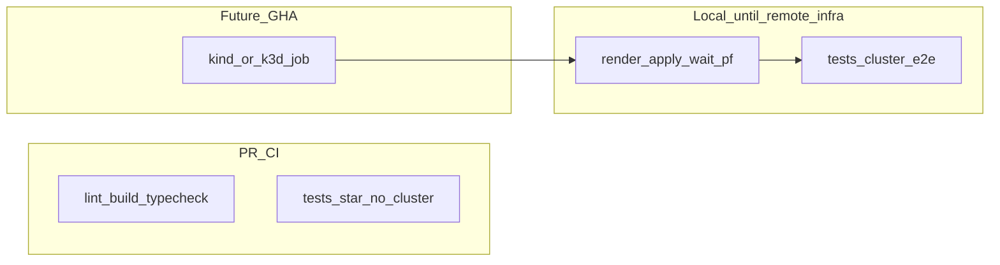

# Vitest, FPK cluster E2E, and Nx integration

## Important clarification: `Cluster.TestRunner`

The module you referenced (`[effect/packages/cluster/src/TestRunner.ts](file:///run/media/tgtgamer/Dev/effect/packages/cluster/src/TestRunner.ts)`) exports an **in-memory** `layer` for `@effect/cluster` (MessageStorage/RunnerStorage in memory). It does **not** deploy to Kubernetes. Use it for **fast unit/integration tests** of cluster-facing code without a real cluster.

For **FPK + kubectl live cluster** tests, use:

- `**@effect/vitest`**: `it.live` / `it.scoped` for real clock, processes, and network.
- `**@effect/platform` / `@effect/platform-node`**: `Command`, `FileSystem`, `Terminal` (and process spawning) so cluster lifecycle and assertions are typed, testable Effects instead of ad-hoc `.mjs` only.

This matches [Effect’s Vitest guidance](https://github.com/Effect-TS/effect/blob/main/packages/vitest/README.md) and your existing [docs/learnings/effect-vitest-testing.md](docs/learnings/effect-vitest-testing.md).

---

## 1. Local full cluster pipeline (primary until remote CI exists)

**Goal:** One command developers run on their machine that reproduces the **future** “full cluster CI” job: same order of operations you use manually today ([package.json](package.json) cluster scripts + [platforms-postgresql](packages/platforms/postgresql/project.json) targets), ending in **Vitest cluster E2E** with `EVENTIVA_CLUSTER_E2E=1`.

**Concrete deliverable (implementation phase):**

- Add a **root script** and/or **Nx target** (e.g. `local-ci:cluster`, `cluster:verify`, or `cluster:e2e`) that chains:
  1. `cluster:render` → `cluster:images:build` → `cluster:apply` → `cluster:wait` (already expressed via existing `dependsOn` on `platforms-postgresql:run` / `cluster:wait`).
  2. Optionally **port-forward** in the background (same as [port-forward-fpk-cluster.mjs](scripts/cluster/port-forward-fpk-cluster.mjs)) if tests hit localhost—document whether E2E assumes PF already running vs target starts it.
  3. `nx run tests-cluster-e2e:test` with `EVENTIVA_CLUSTER_E2E=1` (and env for HTTP/RPC/DB ports matching PF defaults).
- **Documentation** (short section in root README or [docs/parts/local-dev/](docs/parts/local-dev/)): prerequisites (working `kubectl` context, Podman/Docker, local Kind/Minikube/Podman machine—whatever Eventiva assumes), and the **exact** command to run the full check.
- **Future GitHub Actions:** When infrastructure exists, the same sequence becomes a workflow job (Kind/k3d + install + the same Nx commands). No redesign—**copy the local recipe**.

**PR CI (until infra):** lint, build, typecheck, unit tests only; cluster E2E **not** required on PR. Cluster tests stay skipped unless `EVENTIVA_CLUSTER_E2E=1` (or run only via the local pipeline target).

---

## 2. Policy and automation (move away from split builder/tester for now)

**Update** (when you execute this work):

- [docs/learnings/tdd-and-test-creation.md](docs/learnings/tdd-and-test-creation.md) — add a **transition state**: implementers **may** add/update tests in the same change until the team re-enforces separation; keep the “never delete tests” golden rule.
- [.cursor/rules/tdd-test-creation.mdc](.cursor/rules/tdd-test-creation.mdc) — align with the same transition (remove or soften “builders do not write tests” / tests-repo isolation while noting future reinstatement).
- [.github/workflows/ci.yml](.github/workflows/ci.yml) — **do not** block on remote cluster yet; **optional** placeholder job `workflow_dispatch` or commented docstring pointing at the local pipeline. When infra is ready, add main/nightly job mirroring section 1.
- Trim or repurpose `**create-tests`** / tests-submodule bootstrap if you no longer want AI test-creator on every PR—otherwise it will fight the new “tests with code” model.

---

## 3. Consolidate FPK/cluster scripts into testable modules

Today, lifecycle lives in shell-oriented scripts under [scripts/cluster/](scripts/cluster/) (e.g. [render-fpk-cluster.mjs](scripts/cluster/render-fpk-cluster.mjs), [apply-fpk-cluster.mjs](scripts/cluster/apply-fpk-cluster.mjs), [wait-for-cluster-rollout.mjs](scripts/cluster/wait-for-cluster-rollout.mjs), [build-local-images.mjs](scripts/cluster/build-local-images.mjs)). [packages/platforms/postgresql/project.json](packages/platforms/postgresql/project.json) wires these as Nx `run-commands` targets.

**Recommended shape:**

1. Add a small workspace package (e.g. `packages/tools/cluster-ops` or under `tools/cluster` with `project.json` + `package.json`) exporting **Effect programs**:
  - `renderCluster`, `applyCluster`, `waitRollout`, `buildImages`, `clusterStatus` — each implemented with `Command` / `Process` from `@effect/platform-node`, reading env the same way current scripts do (`EVENTIVA_CLUSTER_STACK`, etc.).
2. Keep thin **CLI entrypoints** (`scripts/cluster/*.mjs` or `.ts` via `tsx`) that call `Effect.runPromise` with the same behavior as today so Nx targets change minimally at first.
3. Port [scripts/pg-e2e-via-nx.mjs](scripts/pg-e2e-via-nx.mjs) logic into **Effect + `it.live`** (HTTP, runner RPC port wait, optional `psql`) so E2E is a first-class Vitest suite, not only a standalone Node script.

**Nx targets** on [platforms-postgresql](packages/platforms/postgresql/project.json) can later call the new CLI entrypoints or `node packages/tools/cluster-ops/dist/cli.mjs`—same env and `dependsOn` chain (`cluster:render` → `cluster:images:build` → `cluster:apply` → `cluster:wait`).

---

## 4. Vitest project layout for cluster E2E

- **New Nx project** under `tests/` (e.g. `tests/cluster-e2e/`) with its own `vitest.config.ts`, `project.json`, `tsconfig.json`, tags like `scope:tests`, `type:e2e` (or `scope:e2e`).
- **Dependencies**: `@effect/vitest`, `vitest`, `effect`, `@effect/platform`, `@effect/platform-node`, and workspace packages under test (`@eventiva/core`, extensions, `@eventiva/integrations.kafka`, platforms).
- **Test flow** (single suite or describe blocks):
  1. Preconditions: `kubectl cluster-info`, optional skip if `EVENTIVA_CLUSTER_E2E !== '1'` (for PR).
  2. Orchestrate: render → build images → apply → wait (reuse exported Effect programs; **do not** duplicate rollout map from [wait-for-cluster-rollout.mjs](scripts/cluster/wait-for-cluster-rollout.mjs)—import one source of truth).
  3. Optional: start port-forward ([port-forward-fpk-cluster.mjs](scripts/cluster/port-forward-fpk-cluster.mjs)) in setup/teardown with `Scope` + `it.scoped` or global setup.
  4. Assertions: HTTP health/RPC checks per workload, DB connectivity, Kafka/Redpanda smoke if in stack—mapped to **every extension and integration** you care about.

**Per-extension / integration coverage** (incremental checklist):

| Area                                                                              | Suggested checks                                                                                                                   |
| --------------------------------------------------------------------------------- | ---------------------------------------------------------------------------------------------------------------------------------- |
| Platform Postgres path                                                            | Extend current pg E2E: HTTP + runner RPC + shard-manager/battleships/shooter workloads (names from `deploymentMap` in wait script) |
| `@eventiva/integrations.kafka`                                                    | Produce/consume or broker health against forwarded Redpanda port                                                                   |
| Extensions (runner, shooter, speed-shooter, slow-shooter, hooks-kafka-demo, etc.) | One concrete RPC or manifest-level assertion per extension that proves it is registered and responding                             |

Start with **postgresql stack** (`EVENTIVA_CLUSTER_STACK=postgresql`); add **mysql** stack tests as a second phase using [platforms-mysql](packages/platforms/mysql/project.json) targets.

---

## 5. Nx integration details

- **Existing**: `@nx/vitest` is already in [nx.json](nx.json) plugins; `tests-`* projects use `@nx/vitest:test` ([tests/core/project.json](tests/core/project.json)).
- **New cluster E2E project**: add `project.json` with `test` target; use env guard (`EVENTIVA_CLUSTER_E2E`) so default `nx test` skips cluster tests. The **local full pipeline** target (section 1) sets env and may use `dependsOn: ["platforms-postgresql:cluster:wait"]` or run cluster targets before tests; remote GHA will reuse the same graph later.
- `**targetDefaults`**: consider longer timeout for `@nx/vitest:test` on e2e project via `test` options or Vitest `testTimeout`.
- **Production inputs**: ensure [nx.json](nx.json) `namedInputs.production` excludes new `*.spec.ts` under e2e if they should not invalidate library builds (usually fine as-is).

---

## 6. `@nx/docker` ([Nx Docker plugin](https://nx.dev/docs/technologies/build-tools/docker/introduction))

Already configured in [nx.json](nx.json). The plugin infers `docker:build` / `docker:run` per **project that contains a `Dockerfile` in its root**.

- Today, images are built via [build-local-images.mjs](scripts/cluster/build-local-images.mjs) using `-f tools/cluster/Dockerfile.runtime` from repo root—not Nx-inferred.
- **Options**:
  - **A**: Add an Nx project at `tools/cluster/` with a `Dockerfile` (or symlink/copy) so inference works, and map tags to current image names; or
  - **B**: Keep explicit `nx:run-commands` `docker build` targets on that project and treat `@nx/docker` as optional for discoverability.

Pick **A** if you want `nx run tools-cluster:docker:build` aligned with docs; **B** if minimizing file moves is priority.

---

## 7. Documentation-creator delegation

Per [.cursor/rules/module-documentation-delegation.mdc](.cursor/rules/module-documentation-delegation.mdc), after adding `packages/tools/cluster-ops` (or similar), run the **documentation-creator** subagent to update `docs/` (hub + parts) with: how to run unit tests vs cluster E2E, env vars, and CI matrix.

---

## Suggested implementation order

1. **Local full pipeline** target/script + docs (section 1)—so “CI parity” is runnable today.
2. `tests/cluster-e2e` Vitest project + port pg E2E into `it.live`; wire pipeline to set `EVENTIVA_CLUSTER_E2E=1`.
3. `cluster-ops` package + refactor scripts to thin wrappers + unit tests for pure logic (stack parsing, deployment lists).
4. Policy + PR CI (no cluster); stub future remote job.
5. Expand assertions per extension/integration; add mysql stack.
6. Optional: `@nx/docker` alignment for `tools/cluster` Dockerfiles.

