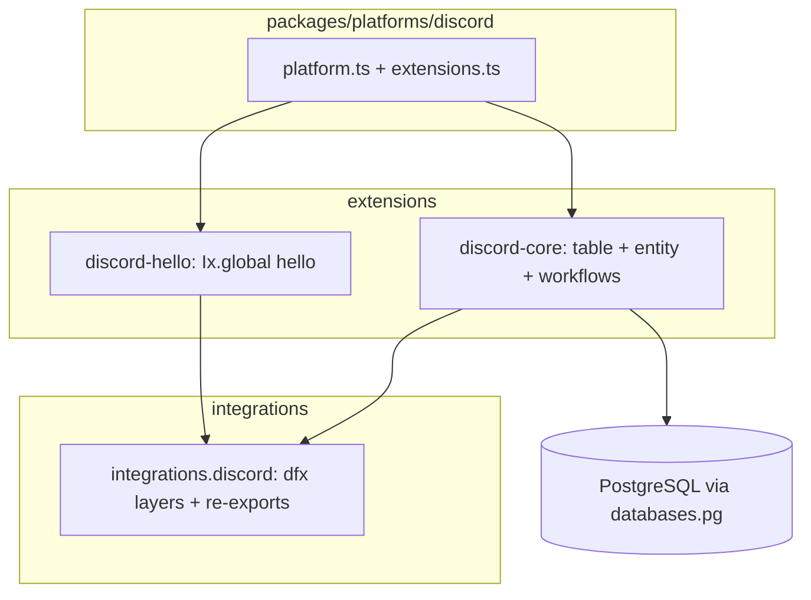

# Discord platform and dfx extensions

## Scope and constraints

- **TDD policy**: Implementation only—no new tests in this repo (`[.cursor/rules/tdd-test-creation.mdc](.cursor/rules/tdd-test-creation.mdc)`).
- **Vendor SDK placement**: Declare `**dfx`** (and any Discord-specific wiring helpers) in a new `**packages/integrations/discord`** package (`@eventiva/integrations.discord`), not in `@eventiva/core`, per `[.cursor/rules/integration-core-and-features.mdc](.cursor/rules/integration-core-and-features.mdc)`.
- **Path convention**: Use `[packages/platforms/discord](packages/platforms/discord)` (plural `platforms`, matching `[packages/platforms/postgresql](packages/platforms/postgresql)`).
- **Extension id**: You chose `**@eventiva/extensions.discord-core`** for the connection extension; the slash-command extension should be a **separate** package (e.g. `@eventiva/extensions.discord-hello`) to avoid clashing with the existing RPC-only `[@eventiva/extensions.hello-world](packages/extensions/hello-world)`.

## Architecture (high level)

- **Integration layer** (`@eventiva/integrations.discord`): Owns npm deps on `dfx`, `@effect/platform-node`, and `effect` (verify **Effect major** matches the workspace—`[dfx` README]([https://github.com/tim-smart/dfx/blob/main/README.md](https://github.com/tim-smart/dfx/blob/main/README.md)) shows `DiscordConfig`, `Ix`, `DiscordIxLive`, `InteractionsRegistry` from `dfx/gateway`). Export small factories such as “build Discord HTTP/WebSocket + config from redacted token” so extensions stay thin.
- `**discord-core` extension**: Follow `**[packages/extensions/contact](packages/extensions/contact)`** for the **data model** (Drizzle via `defineExtensionTable`, `Base` entity class, `makeExtensionOnLoadLayer` for `TableColumnRegistry`, optional relations if needed).
- `**discord-hello` extension**: Follow `**[dfx` README example]([https://github.com/tim-smart/dfx/blob/main/README.md)**—register](https://github.com/tim-smart/dfx/blob/main/README.md)**—register) `Ix.global({ name: "hello", ... }, Effect.succeed({ type: 4, data: { content: "Hello!" } }))` via `InteractionsRegistry`—but split into its own extension package that **depends on** the same dfx/registry wiring provided by `discord-core` (see “Composition” below).

## 1. Workspace and Nx wiring

- Add `**packages/integrations/*`** to root `[pnpm-workspace.yaml](pnpm-workspace.yaml)` (first integration package).
- Add Nx projects (mirror `[packages/platforms/postgresql/project.json](packages/platforms/postgresql/project.json)` and `[packages/extensions/contact/project.json](packages/extensions/contact/project.json)`):
  - `integrations-discord`: tags `**type:core`**, `**layer:backend`** (no workspace runtime deps except what the matrix allows—if you must depend on `@eventiva/core` for shared tags only, prefer keeping the integration package free of domain; see module-boundaries skill if the graph forces `type:extension`).
  - `extensions-discord-core`: `**type:extension**`, `**layer:backend**`, `**capability:entities**`, `**capability:workflows**`.
  - `extensions-discord-hello`: same tags as other workflow extensions (entities optional—likely none).
  - `platforms-discord`: `**type:platform**`, `**layer:backend**`.
- Link packages with pnpm workspace protocol per `[.cursor/skills/link-workspace-packages/SKILL.md](.cursor/skills/link-workspace-packages/SKILL.md)`: `platforms-discord` → `extensions.discord-core`, `extensions.discord-hello`, `integrations.discord`, `@eventiva/core`, `@eventiva/databases.*`, etc.

## 2. `discord-core`: persisted connection + “connect bot” workflow

**Table + entity** (contact-style):

- Table name e.g. `discord_connection` with at least:
  - `id` typeid (`type: 'discord_connection'` or similar).
  - **Token**: store **ciphertext** in a `text` column (encrypt on write / decrypt on read using `[PiiEncryption](packages/core/src/security/encryption.ts)` from `discord-core` handlers or dedicated RPC flows—never log raw token; use `Effect.withSpan` + structured logs without secrets).
  - **Intents**: `bigint` or `text` (JSON bitmask)—match what `dfx` / Discord API expects when building the gateway client.
  - Optional: `applicationId`, `publicKey` (for interactions verification if you add HTTP later), `label`, `enabled` boolean.
- Export `DiscordConnectionEntity extends Base...`, register in `[index.ts](packages/extensions/contact/src/index.ts)`-style merge: `Layer.mergeAll(DiscordCoreWorkflowLayer, DiscordConnectionEntity.layer)`.

**Workflows** (hello-world + contact patterns):

- `**makeExtensionOnLoadLayer`**: register `discord_connection` columns (and relations) like `[contact/src/workflow.ts](packages/extensions/contact/src/workflow.ts)`.
- `**makeExtensionWorkflowLayer('discord-core', 'connect', PROCESS_RUNTIME_READY_TOPIC, ...)`**: read connection row (or `DiscordCoreConfig` env fallback for dev), decrypt token, build and **fork** the long-running dfx gateway effect so the process stays alive like `[runtimeOnlyProgram](packages/core/src/runtime/run-runtime.ts)` (HTTP server + `Effect.never`). Reference [tim-smart/discord-bot](https://github.com/tim-smart/discord-bot/tree/main) for production-style layering (Dockerfile/fly.toml are optional; focus on Effect layers).
- **Config layer**: `DiscordCoreConfig` via `Config.nested(..., 'DISCORD_CORE')` and `.env.example` keys (e.g. `DISCORD_CORE_SEED_ENABLED`, optional env token override for local dev without DB).

**Composition hook for `discord-hello`:**

- Expose a stable Effect service or Layer output that `**discord-hello`** can use to call `InteractionsRegistry.register(...)` in an **extension onLoad** that runs **before** gateway connect (array order in `[extensions.ts](packages/platforms/postgresql/src/extensions.ts)`: `**discord-core` first**, then `**discord-hello`**). If `dfx` requires a single merged `Layer.launch` graph, implement `discord-core` so it merges the **interaction registration layer** from `discord-hello` via `Layer.provideMerge` / shared `Layer` composition (concrete API depends on dfx’s `InteractionsRegistry` lifecycle—inspect `dfx` types during implementation).

## 3. `discord-hello`: slash command

- New package `**@eventiva/extensions.discord-hello`**: only `Ix.global` hello + `registry.register(Ix.builder.add(hello)...)` as in the [dfx README](https://github.com/tim-smart/dfx/blob/main/README.md).
- Dependency: `@eventiva/integrations.discord` + `@eventiva/extensions.discord-core` (for registry wiring) or only integration if registry is provided from integration—**prefer** keeping Discord-specific Effect services in `discord-core` and `discord-hello` as thin registration.

## 4. `packages/platforms/discord`

- Copy structure from `[packages/platforms/postgresql](packages/platforms/postgresql)`: `[src/platform.ts](packages/platforms/postgresql/src/platform.ts)`, `[src/extensions.ts](packages/platforms/postgresql/src/extensions.ts)`, `[src/register-database-backends.ts](packages/platforms/postgresql/src/register-database-backends.ts)`, `[src/index.ts](packages/platforms/postgresql/src/index.ts)`.
- `**extensions.ts`**: register `{ id: 'discord-core', layer, configLayer }` and `{ id: 'discord-hello', layer, configLayer }` (order: core then hello).
- `**package.json`**: add workspace deps on the new extension and integration packages.
- `**project.json`**: `run` target with env vars for Postgres + Discord (e.g. `DISCORD_BOT_TOKEN` or `DISCORD_CORE_`*), similar to existing `[platforms-postgresql` run](packages/platforms/postgresql/project.json).

## 5. Observability

- Apply `[withSpanAndLog](packages/core/src/observability/helpers.ts)` and logging on all gateway start/stop/failure paths (see `[.cursor/rules/effect-observability.mdc](.cursor/rules/effect-observability.mdc)`).

## 6. Documentation

- After creating the Nx projects, invoke the **documentation-creator** subagent per `[.cursor/rules/module-documentation-delegation.mdc](.cursor/rules/module-documentation-delegation.mdc)` to add short adoption notes under `docs/` (hub, parts) for the new platform and extensions.

## Side quest: `hello-world` vs `contact`

- **Today**: `[hello-world](packages/extensions/hello-world/src/entity.ts)` uses `make()` for a **RPC-only** demo; `[contact](packages/extensions/contact/src/entity.ts)` is the **current** Drizzle + `Base` + cluster pattern.
- **Recommendation**: Treat alignment as a **separate follow-up** (either migrate hello-world to a trivial table + `Base`, or document it explicitly as “RPC-only tutorial”). Avoid mixing that refactor into the Discord milestone unless you want a larger diff.

## Verification (after implementation)

- `pnpm nx run integrations-discord:build` (and parallel builds for new projects).
- `pnpm nx run platforms-discord:build`.
- `pnpm nx lint` (module boundaries / tags).
- Manual: run `platforms-discord` with valid bot token and confirm gateway connects and `/hello` responds.

