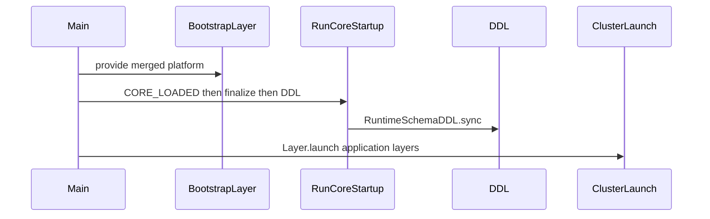

# Reimplement `packages/databases/*` and dynamic Drizzle entities (embedded in cluster)

## Situation

- `**[docs/learnings/architecture.md](docs/learnings/architecture.md)**` still documents **TableColumnRegistry**, **FinalTableStore**, **SchemaFinalizer**, `**runCoreStartup`**, and `**createPlatformTemplateTwoPhase`** — but those paths **do not exist** in current `[packages/core](packages/core/src/index.ts)` (cluster + hooks only; no Drizzle imports under `packages/`).
- `**[Examples/packages-old](Examples/packages-old)`** is a complete reference: `[databases/pg](Examples/packages-old/databases/pg/src/index.ts)`, `[databases/shared](Examples/packages-old/databases/shared/src/index.ts)`, `[databases/sqlite](Examples/packages-old/databases/sqlite/src/index.ts)`, plus core `[schema/](Examples/packages-old/core/src/schema/index.ts)`, `[entity/](Examples/packages-old/extensions/contact/src/entity.ts)`, `[runtime/run-core-startup.ts](Examples/packages-old/core/src/runtime/run-core-startup.ts)`, and `[runtime/run-runtime.ts](Examples/packages-old/core/src/runtime/run-runtime.ts)` (`runPlatform` = bootstrap `runCoreStartup` then runtime layer).
- **Workspace** today only includes `[packages/core`, `extensions/`*, `integrations/`*, `platforms/](pnpm-workspace.yaml)*` — no `packages/databases/*`.

## Target architecture (embedded cluster)

You chose **embed in the existing cluster platform** (same process; coexistence with `@effect/cluster` entities).

- **Phase 1 (schema / System 1):** Same semantics as packages-old: integrity → `setExpectedReadyCount` → publish `**CORE_LOADED_TOPIC`** → extensions register Drizzle column builders + `markReady` → finalization → `**RuntimeSchemaDDL.sync()`** → relation pass + **EntityRegistry** population (see `[run-core-startup.ts](Examples/packages-old/core/src/runtime/run-core-startup.ts)`).
- **Phase 2 (cluster / “runtime”):** Existing `[clusterPlatformApplicationLaunch](packages/core/src/platform/cluster-platform-main.ts)` (`Layer.launch` + `ClusterPlatformContext`) runs **after** Phase 1 completes, so services that depend on **FinalTableStore** / **EntityRegistry** see finalized state.

Layering must follow the old invariant: **bootstrap stack includes** schema services, **PgClient** (or equivalent), **database layer that reads FinalTableStore**, **ExtensionHookPubSub** + **ExtensionHooks** + **merged extension layers** that subscribe to `CORE_LOADED` and call `createTable` / `markReady`. That is the same composition as `[buildBootstrapStack](Examples/packages-old/core/src/runtime/platform.ts)` (minus duplicating HTTP; cluster path uses cluster launch instead of `EntityEndpointsServer` unless you also re-enable HTTP entity endpoints).

## Implementation plan

### 1. Workspace and packages

- Add `**packages/databases/*`** to `[pnpm-workspace.yaml](pnpm-workspace.yaml)`.
- Create `**@eventiva/databases.shared`** and `**@eventiva/databases.pg`** by porting from `[Examples/packages-old/databases/shared](Examples/packages-old/databases/shared)` and `[Examples/packages-old/databases/pg](Examples/packages-old/databases/pg)`: `defineExtensionTable`, `createTable`, `[table-builder.ts](Examples/packages-old/databases/pg/src/table-builder.ts)`, `[schema-finalizer-impl.ts](Examples/packages-old/databases/pg/src/schema-finalizer-impl.ts)`, `[pg-database-layer.ts](Examples/packages-old/databases/pg/src/pg-database-layer.ts)`, `[runtime-schema-ddl-pg.ts](Examples/packages-old/databases/pg/src/runtime-schema-ddl-pg.ts)`, `[pg-ddl-create-statements.ts](Examples/packages-old/databases/pg/src/pg-ddl-create-statements.ts)`, `[drizzle-pg.ts](Examples/packages-old/databases/pg/src/drizzle-pg.ts)`, etc.
- Optionally add `**@eventiva/databases.sqlite`** later (same reference folder); Postgres-first is enough to validate the pipeline.
- Each package: `**project.json**` with Nx tags per [module boundaries](.cursor/rules/module-boundaries.mdc): `type:database`, `layer:backend` (and `capability:entities` if applicable). Dependencies: `**type:database` → only `type:core**` for workspace edges; keep `**@eventiva/databases.shared**` as the shared chunk so `**databases.pg` → core + databases.shared** matches the matrix (database may depend on database).

### 2. Core: port schema + entity + startup (from packages-old)

Port into `**@eventiva/core`** (adjust imports/paths to current layout):

| Area                            | Reference                                                                                                                                                                                                |
| ------------------------------- | -------------------------------------------------------------------------------------------------------------------------------------------------------------------------------------------------------- |
| Schema registry                 | `[Examples/packages-old/core/src/schema/](Examples/packages-old/core/src/schema/index.ts)`                                                                                                               |
| Entity base + registry          | `[entity-base.ts](Examples/packages-old/core/src/entity/entity-base.ts)`, `[entity-registry.ts](Examples/packages-old/core/src/entity/entity-registry.js)`                                               |
| Startup                         | `[run-core-startup.ts](Examples/packages-old/core/src/runtime/run-core-startup.ts)`                                                                                                                      |
| Extension pubsub + hooks wiring | `[extension-hook-pubsub.ts](Examples/packages-old/core/src/extensions/extension-hook-pubsub.ts)`, relevant parts of `[extension-hooks.ts](Examples/packages-old/core/src/extensions/extension-hooks.ts)` |
| `Database` service              | `[database/database.ts](Examples/packages-old/core/src/database/database.js)` if not present                                                                                                             |

**Rename / avoid collision:** current `[packages/core/src/schema.ts](packages/core/src/schema.ts)` is `**DemoEntity` / RPC demo** — keep it but export registry modules from e.g. `**packages/core/src/schema-registry/`** (or keep `schema/` as in old tree) so “schema registry” does not clash with the demo file name.

### 2b. Transforms system: pipeline table via Drizzle (not raw SQL)

Today `[packages/core/src/hooks/transform-pipeline-table.ts](packages/core/src/hooks/transform-pipeline-table.ts)` defines `**eventiva_transform_pipeline`** with `**ensureTransformPipelineTable`**: ad hoc `**CREATE TABLE IF NOT EXISTS`** + index via `**SqlClient.unsafe**`. That bypasses the packages-old pattern (column builders → TableColumnRegistry → SchemaFinalizer → FinalTableStore → `**RuntimeSchemaDDL.sync()**` from `**buildPgDdlStatements`**).

**Target (aligned with Examples/packages-old):**

1. **Define the table in Drizzle** using the same helpers as extensions — e.g. `**defineExtensionTable`** / column builders from `**@eventiva/databases.pg`** for `eventiva_transform_pipeline` (columns: `extension_id`, `transform_id`, `rpc_name`, `phase`, `ordering`, `enabled`, plus PK strategy matching current behavior — today `**id SERIAL PRIMARY KEY`**).
2. **Register during bootstrap** as a **core-owned** table so every platform gets it without each extension re-declaring it:
  - Either a small **core layer** that on `**CORE_LOADED_TOPIC`** runs `**createTable('eventiva_transform_pipeline', 'eventiva-core', columns, …)`** and `**markReady`** for a dedicated core id counted in `**SchemaRegistryConfig`**, or equivalent registration inside `**runCoreStartup**` once registries exist.
  - Ensure **expected ready count** includes this core participant (or fold core tables into the count model so finalization still runs after all contributions).
3. **Remove or narrow `ensureTransformPipelineTable`**: after `**RuntimeSchemaDDL.sync()**` runs, the physical table must exist; keep `**ensureTransformPipelineTable**` only as a thin no-op / assert, or delete it and rely on ordering (`**loadTransformPipelineRows**` runs only after bootstrap DDL).
4. `**loadTransformPipelineRows**`: prefer reading via the **finalized Drizzle table** from **FinalTableStore** + `**@effect/sql-pg`** / `**EffectPgDatabase`** for a single query API, **or** keep `**SqlClient`** `SELECT` **if** the connection matches the same DB — but the **definition** of columns must be **only** in Drizzle to avoid drift.

**Note:** `Examples/packages-old` did not have this RPC pipeline table; it is **new** in current core. The migration is **conceptually** the same as contact-style tables: one Drizzle source of truth + registry + DDL sync.

### 3. Drizzle / Effect versions

- Root `[package.json](package.json)` pins **Effect** via pnpm overrides; `**drizzle-orm` is not** in the main workspace yet (only `**drizzle-kit`**).
- Add `**drizzle-orm`** (and align `**drizzle-kit`**) to versions that support `**drizzle-orm/effect-schema`** used in packages-old. Validate against current `**@effect/sql-pg**` — the old packages used `**@effect/sql-pg**` + `**postgres**` for DDL; keep that split unless you standardize on one client.

### 4. Embed in `createClusterDatabasePlatform`

- Extend `[CreateClusterDatabasePlatformConfig](packages/core/src/platform/create-cluster-database-platform.ts)` with an optional `**dynamicSchema**` (name TBD) block, e.g.:
  - Schema stack layers (TableColumnRegistry, FinalTableStore, SchemaRegistryConfig, SchemaFinalizer from `**@eventiva/databases.pg**`, RuntimeSchemaDDL).
  - `**bootstrapExtensions**` or reuse `**applicationLayers**` with a clear contract: N extensions must `**markReady**` (or derive expected count from config).
- Change `[clusterPlatformMainFor](packages/core/src/platform/cluster-database-platform.ts)` / `[clusterPlatformApplicationLaunch](packages/core/src/platform/cluster-platform-main.ts)` so that when dynamic schema is enabled, the main effect is:
`runCoreStartup` **then** existing `Layer.launch` (mirroring `[runPlatform](Examples/packages-old/core/src/runtime/run-runtime.ts)`: sequential `flatMap`, single merged `**platform.Default`** that includes everything Phase 1 needs).
- Ensure `**PlatformDefinition.Default`** layer merges: existing SQL/observability/hook wiring **+** schema stack **+** Pg client + PgDatabaseLayer requirements **+** extension layers that participate in `CORE_LOADED`.
- **Local colocated path:** apply the same ordering inside `[localColocatedSupervisedLaunch](packages/core/src/platform/local-colocated-supervised-launch.ts)` / `[localColocatedClusterStack](packages/core/src/platform/local-colocated-cluster-stack.ts)` so `EVENTIVA_CLUSTER_INFRASTRUCTURE=local` does not skip schema bootstrap.

### 5. Extensions and proof entity

- Add or adapt one extension (e.g. revive **contact**-style `[entity.ts](Examples/packages-old/extensions/contact/src/entity.ts)`) that uses `**defineExtensionTable`** + `**Base`** + `**RegisteredEntities`** augmentation and registers columns on `**CORE_LOADED`**.
- Wire it into `[packages/platforms/postgresql](packages/platforms/postgresql/src/platform.ts)` `**applicationLayers`** only after the platform can supply the schema stack.

### 6. Verification

- `**pnpm nx lint**` (module boundaries).
- **Build** affected projects (`core`, `databases.pg`, `platforms-postgresql`).
- **Manual / e2e:** run platform with local infra; confirm tables created in Postgres and EntityRegistry populated before cluster demo traffic.
- **Transforms RPC mode:** with `EVENTIVA_TRANSFORM_PIPELINE=rpc`, confirm `**eventiva_transform_pipeline`** appears in DB from the Drizzle DDL path (not only from legacy raw SQL) and `**TransformRegistryPipelineRpcLive`** still loads rows correctly.

### 7. Documentation (optional follow-up)

- Update `[docs/learnings/architecture.md](docs/learnings/architecture.md)` “Key paths” to match new file locations after the port (per workspace rule on doc drift — only if you touch public behavior).

## Risks / decisions baked into this plan

- **HTTP entity endpoints** (`makeEntityEndpointsLayer`, Swagger): packages-old Phase 2 used `**EntityEndpointsServer`**. Embedding cluster does not require them for Drizzle tables to exist; add them only if you need REST/RPC discovery alongside cluster — either a second runtime layer or a feature flag.
- **Single Layer graph:** Phase 1 and Phase 2 must share **FinalTableStore** / **EntityRegistry** — same composed `**Layer`**, sequential `**Effect`** (as in `**runPlatform**`), not two unrelated processes.

