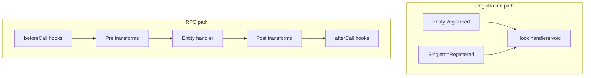

# Hooks, transforms, and demo extensions (battleship)

## Context and references

- **Design intent** (not a copy-paste port): `[.cursor/plans/completed/hooks_and_transforms_6f7d0343.plan.md](.cursor/plans/completed/hooks_and_transforms_6f7d0343.plan.md)` — cluster-wide hooks/transforms and audit trail; this implementation can start with **same-runner** RPC transforms + local hook dispatch, with types and docs that leave room for **remote transform steps** later.
- **Reference pub/sub API** (patterns only): `[packages-old/core/src/extensions/extension-hooks.ts](packages-old/core/src/extensions/extension-hooks.ts)` — phases (`onLoad`, `onRegister`, `beforeCall`, `afterCall`, `onShutdown`, extensible `string`) and ergonomic registration; battleship version will use **Effect `Context` services + explicit scopes** instead of in-process PubSub for product hooks.
- **Cluster registration events**: `[ShardingRegistrationEvent](https://github.com/Effect-TS/effect/blob/main/packages/cluster/src/ShardingRegistrationEvent.ts)` — `EntityRegistered` / `SingletonRegistered`; `[Sharding](node_modules/@effect/cluster/src/Sharding.ts)` exposes `getRegistrationEvents: Stream.Stream<ShardingRegistrationEvent>` (in-process stream on each runner) — use this for `**onRegister`-style** hooks when entities/singletons are registered (`[Sharding.ts` publishes at ~1227 / ~1319](node_modules/@effect/cluster/src/Sharding.ts)).
- **Wordart**: ASCII blocks live in `[packages-old/core/src/runtime/startup-banner.ts](packages-old/core/src/runtime/startup-banner.ts)` (Eventiva / By Resnovas / copyright lines), not under `packages-old/extensions/hello-world/`. Reuse those strings (or a trimmed subset) in the new extension.

## Hook scope model (taxonomy)

Define a small **closed + extensible** scope union in core, mapped to how code can run in cluster:

| Scope                      | Meaning                                 | Primary trigger (MVP)                                                                                                                            |
| -------------------------- | --------------------------------------- | ------------------------------------------------------------------------------------------------------------------------------------------------ |
| `runner`                   | Once per runner process / layer startup | Explicit `onLoad` after runner stack is provided (Effect in runner entry or Layer `launch` ordering)                                             |
| `entityType`               | Per logical entity family               | `EntityRegistered` where `entity` matches schema (e.g. Battleship)                                                                               |
| `singleton`                | Per singleton registration              | `SingletonRegistered` (e.g. CronShip)                                                                                                            |
| `rpc`                      | Per RPC invocation                      | `beforeCall` / `afterCall` around handler (same fiber as entity RPC today)                                                                       |
| `shard` (optional / later) | Per shard acquisition                   | Not in `ShardingRegistrationEvent`; document as **future** (subscribe to internal shard lifecycle or add a thin adapter when cluster exposes it) |

**Hooks** remain `**Effect<void>`** (void-only), with structured payloads per phase. **Ordering**: register order per `(scope, phase)`; document stable ordering guarantees.

## Transforms (MVP vs distributed)

- **Transform context** (in core): generic `TransformContext<T>` with `original: T`, `current: T`, and `steps: TransformStep[]` where each step records at least `{ extensionId, transformId, path, before, after }` (the “basic” shallow path diff). Optional **RFC6902** patch can be a later additive field or a separate helper.
- **MVP execution**: run **pre** then **post** transforms **on the same runner as the Battleship RPC handler** (same process as today’s `[packages/extensions/runner/src/runner.ts](packages/extensions/runner/src/runner.ts)`) so payloads stay in-process and serializable boundaries are clear. **Append-only** `steps` after each transform.
- **Distributed path (documented, not blocking MVP)**: mirror the completed plan — serializable `TransformContext`, correlation id, ordered steps; future use of `@effect/cluster` `Message` / routing to an “extension home” runner. Export types so the second phase does not break the API.

## Core implementation (`[packages/core](packages/core)`)

1. **Types**: `HookPhase` (`'onLoad' | 'onRegister' | 'beforeCall' | 'afterCall' | 'onShutdown' | string`), `HookScope` (runner / entityType / singleton / rpc + metadata), `TransformStep`, `TransformContext<T>`, `RpcTransformRegistration` (e.g. keyed by RPC name `Shoot`).
2. **Services** (Effect `Context.Tag`):
  - `HookRegistry` — `register(scope, phase, handler)` / `run(scope, phase, payload)` (void, ordered).
  - `TransformRegistry` — `registerPre( rpc, fn )`, `registerPost( rpc, fn )`; `runPre` / `runPost` returning updated `TransformContext`.
3. **Default layers**: `HookRegistry.layer`, `TransformRegistry.layer` (empty defaults), merged into the **runner** path.
4. **Integration**:
  - **Registration stream**: in `[packages/extensions/runner/src/runner.ts](packages/extensions/runner/src/runner.ts)` (or a small `packages/core/src/cluster/hooks-from-sharding.ts` helper), after `Sharding` is available, `Stream.runForEach(sharding.getRegistrationEvents, ...)` to dispatch `onRegister` hooks with `EntityRegistered` / `SingletonRegistered` payloads (match `Battleship` entity type and CronShip singleton by address/name as needed).
  - **RPC**: refactor `Battleship` handler construction so `Shoot` (and optionally other RPCs) runs through **beforeCall → pre transforms → handler → post transforms → afterCall**, passing a **typed payload** for `Shoot` (`{ target: number }`).
5. **Exports**: add hooks/transform types and helpers to `[packages/core/src/index.ts](packages/core/src/index.ts)`.
6. **Naming cleanup**: align `PlatformContext` vs `BattleshipPlatformContext` in `[packages/core/src/platform/battleship-platform-context.ts](packages/core/src/platform/battleship-platform-context.ts)` / `[packages/core/src/index.ts](packages/core/src/index.ts)` so extensions share one exported type when extending context.

## Platform context extension

Extend `[BattleshipPlatformContext](packages/core/src/platform/battleship-platform-context.ts)` (or `PlatformContext`) with optional **registry layers** or **pre-built merged layers** from extensions, e.g. `hookLayer` / `transformLayer` **or** a single `extensionsLayer: Layer` that platforms merge before `makeClusterSqlRunnerLayer` + entity launch. Goal: **deterministic order**: copyright + example-transform **before** runner battleship entry (see below).

## New packages

### `@eventiva/extensions.copyright-notice`

- **Nx**: `[packages/extensions/copyright-notice/project.json](packages/extensions/copyright-notice/project.json)` — tags `type:extension`, `layer:backend`.
- **Deps**: `workspace:*` on `@eventiva/core` only ([module boundaries](.cursor/rules/module-boundaries.mdc)).
- **Behavior**: `makeCopyrightNoticeEntry(ctx)` — when mode is `battleship` or `runner`, register hooks:
  - `onLoad` (runner scope): log Eventiva wordart + copyright (from env, e.g. `COPYRIGHT_NOTICE_TEXT` or static default), reusing text from `[packages-old/core/src/runtime/startup-banner.ts](packages-old/core/src/runtime/startup-banner.ts)`.
  - Optionally `onRegister` for `SingletonRegistered` / `EntityRegistered` to log a one-line notice (narrow scope so logs are not overwhelming).
- **Export** `makeCopyrightNoticeEntry` from `src/index.ts`.

### `@eventiva/extensions.example-transform`

- Register a **pre-transform** on `**Shoot`** that adjusts `target` (e.g. force to a fixed demo value or `mod`/offset) and append a **TransformStep** with a clear `path` (e.g. `"/target"`).
- Log **before/after** at `INFO` so `[kubectl logs](scripts/cluster/legacy/logs-cluster-all.mjs)` shows retargeting under load.
- **Export** `makeExampleTransformEntry`.

## Compose on platforms

- `[packages/platforms/postgresql/src/extensions.ts](packages/platforms/postgresql/src/extensions.ts)` and `[packages/platforms/mysql/src/extensions.ts](packages/platforms/mysql/src/extensions.ts)`: prepend entries in order:
`makeCopyrightNoticeEntry`, `makeExampleTransformEntry`, then existing `makeRunnerBattleshipEntry`, shooters.
- Add **workspace dependencies** in `[packages/platforms/postgresql/package.json](packages/platforms/postgresql/package.json)` and `[packages/platforms/mysql/package.json](packages/platforms/mysql/package.json)` for the two new packages.
- `[tsconfig.base.json](tsconfig.base.json)`: add path mappings for `@eventiva/extensions.copyright-notice` and `@eventiva/extensions.example-transform`.
- Run `pnpm install` (or workspace link) per workspace rules.

## Runner / shooter behavior

- **Shooter extensions** (`[packages/extensions/shooter](packages/extensions/shooter)`, speed, slow): unchanged **client** loops; they should still call `Shoot` and observe transformed behavior via logs (`Boom!` / transform audit). If needed, adjust log attributes in runner to include **final** `target` after transforms.

## Docker / Nx build

- `[tools/cluster/Dockerfile.runtime](tools/cluster/Dockerfile.runtime)` and `[tools/cluster/Dockerfile.runtime.mysql](tools/cluster/Dockerfile.runtime.mysql)`: `nx run-many -t build` must include new projects if not pulled in transitively — ensure `**platforms-*` build** depends on new extension libs (declared deps should suffice).

## Validation (what “full run” means)

- `**pnpm nx run platforms-postgresql:run`** and `**pnpm nx run platforms-mysql:run`** (or equivalent env for rollout timeout) — must succeed for all deployments including MySQL shooters if present.
- **Do not** use a short `timeout` on `**platforms-*:run`** (it kills parallel `cluster:render` / image build and looks like failure). Prefer `**cluster:wait`** + optional `**EVENTIVA_CLUSTER_LOG_PROFILE=mysql node scripts/cluster/logs-cluster-all.mjs**` with manual Ctrl+C, or a short **kubectl logs** one-shot to confirm **“Shooting”**, **transform/retarget logs**, and **copyright banner** lines.
- **Tests**: per [TDD rule](.cursor/rules/tdd-test-creation.mdc), implementation work does not add/modify tests repo; validation is manual/cluster as above.

## Documentation

- After implementation, delegate **documentation-creator** per `[.cursor/rules/module-documentation-delegation.mdc](.cursor/rules/module-documentation-delegation.mdc)` for new packages + hook/transform glossary under `docs/` (hub `[docs/readme.md](docs/readme.md)`).

## Risk notes

- **Log volume**: `getRegistrationEvents` + many entities may be noisy; gate verbose logs behind `Effect.logDebug` or a single-shot flag.
- **Type safety**: keep RPC payload types aligned with `[packages/core/src/schema.ts](packages/core/src/schema.ts)` `Shoot` payload.

