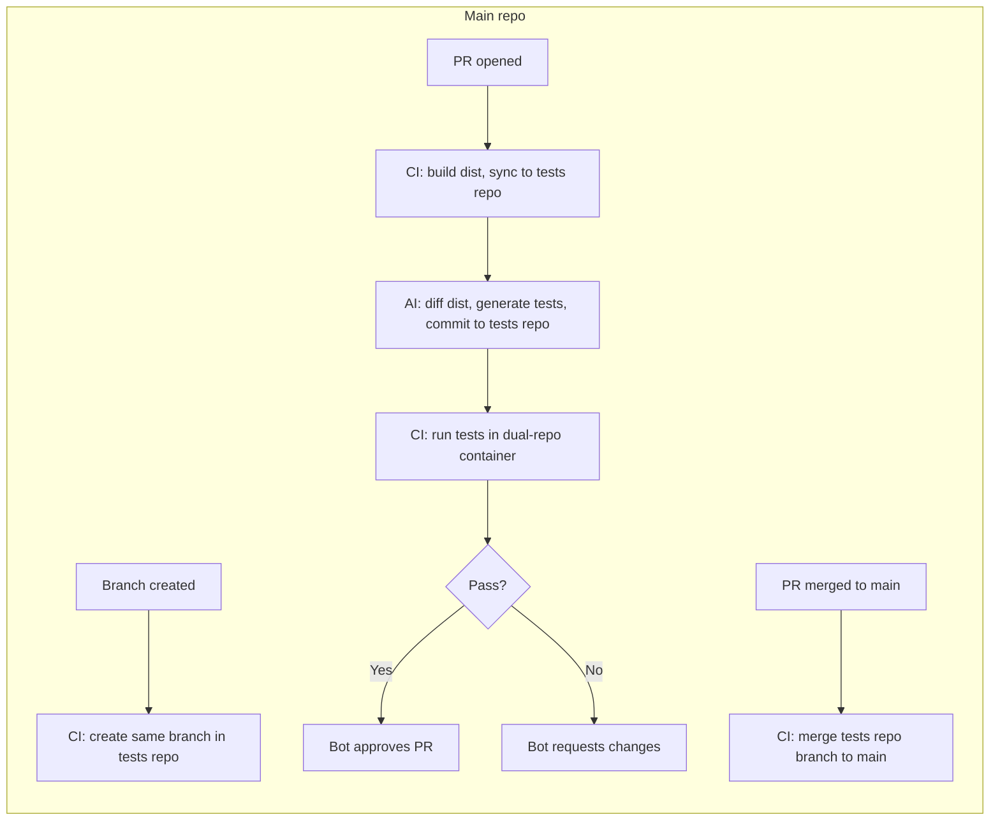

# Tests repo sync and TDD CI

## Scope

- **Main repo:** Eventiva (this repo) – code and build only; **no committed dist** (dist is produced only when CI runs).
- **Tests repo:** Eventiva/tests ([git@github.com](mailto:git@github.com):Eventiva/tests.git) – tests and **committed dist** (mirror of main’s build output) so that `git diff` vs target branch gives the API-surface diff for the AI. Uses Nx and the same `packages/` structure as main repo.
- **Secrets:** Use existing `BOT_TOKEN` for cross-repo and PR operations. Use `**CURSOR_API_KEY`** for the Cursor CLI–based AI test-creator step ([Cursor CLI GitHub Actions](https://cursor.com/docs/cli/github-actions), [Headless CLI](https://cursor.com/docs/cli/headless)).

## Workflow summary

---

## 1. Branch sync: create same branch on tests repo

**Trigger:** Push to any branch that is **not** `main` (so the branch exists before a PR is opened).

**Workflow file:** [.github/workflows/tests-repo-branch-sync.yml](.github/workflows/tests-repo-branch-sync.yml) (new).

**Behaviour:**

- On `push` to branches other than `main`, ensure the tests repo has a branch with the same name.
- Use `BOT_TOKEN` to call GitHub API or git push: if the branch does not exist in Eventiva/tests, create it from the tests repo default branch (e.g. `main`). Idempotent: if the branch already exists, do nothing (no force push).
- Implementation options: use an action such as `GuillaumeFalourd/create-other-repo-branch-action`, or a step that clones Eventiva/tests with `BOT_TOKEN`, checks out/create branch, and pushes. Unset `http.https://github.com/.extraheader` before push to avoid auth conflicts.

---

## 2. PR workflow: build, sync dist, AI test creation, run tests, approve/request changes

**Trigger:** `pull_request` (opened, synchronize, reopened) so the PR is blocked until this workflow completes.

**Workflow file:** [.github/workflows/tests-repo-pr-tdd.yml](.github/workflows/tests-repo-pr-tdd.yml) (new).

**Jobs (sequential where dependency matters):**

**Job 1 – Build and prepare dist**

- Checkout PR ref (this repo). Install deps, run build (e.g. `pnpm nx run-many -t build`) so `dist/` is produced. Main repo does **not** commit dist; it exists only in CI.
- Persist `dist/` as an artifact for the next jobs.

**Job 2 – Sync dist to tests repo (committed) and run AI test-creator via Cursor CLI**

- Checkout Eventiva/tests at the branch with the **same name** as the PR head branch. Use `BOT_TOKEN`. If the branch does not exist yet, create it from the tests repo default.
- Download the dist artifact from Job 1. Copy it into the tests repo workspace as `**dist/`** (mirroring main repo layout). **Do not** put `dist/` in tests repo `.gitignore` – it is committed so that diffing is trivial.
- Compute the API-surface diff by running `**git diff <target-branch> -- dist/`** (or diff against the base branch of the PR) in the tests repo workspace. That diff is the only schema input for the AI (no main-repo source code).
- **Run Cursor CLI** as the AI test-creator: install Cursor CLI (`curl https://cursor.com/install -fsS | bash`; add `$HOME/.cursor/bin` to `GITHUB_PATH`), set `CURSOR_API_KEY` from secrets, then run `agent -p "..." --force` with a prompt that: (1) includes the dist git-diff (schema only), (2) instructs the agent to add/update tests for new or changed surface only, never delete existing tests, and (3) restricts the agent to only modifying test files (restricted autonomy: CI step performs git add, commit, push). See [Cursor CLI GitHub Actions](https://cursor.com/docs/cli/github-actions) and [Headless CLI](https://cursor.com/docs/cli/headless). The agent will write/update test files in the tests repo workspace.
- Commit and push **both** the updated `dist/` and the new/updated test files to the same branch in Eventiva/tests using `BOT_TOKEN`.

**Job 3 – Run tests via main-repo Nx from `tests/`**

- Checkout this repo at the PR ref. Re-build dist (or restore artifact) so main repo has `dist/` populated. Clone Eventiva/tests (same branch name) into `**tests/**` in the main repo workspace (e.g. `tests/` is the tests repo root).
- **Nx in the main repo** discovers test projects under `tests/` (e.g. `tests/core` → project `tests-core`, `tests/extensions/hello-world` → `tests-extensions-hello-world`). When running tests, module resolution for `@eventiva/*` must point at the **main repo’s implementation** (main’s `dist/` or built packages), not at `tests/dist/`. Run the test target from the main repo (e.g. `pnpm nx run-many -t test`) so that all packages, including `tests-core`, `tests-extensions-hello-world`, etc., run as normal Nx projects.
- Capture test results (JUnit/JSON if available). **Report to the PR without exposing test structure:** post a Check or comment with pass/fail, failed count, and per failure only test/suite name and error message (no test file paths or code). Use `BOT_TOKEN` for the Checks API or comments.

**Job 4 – Approve or request changes**

- If Job 3 passed: use GitHub API with `BOT_TOKEN` to create a pull request review with event `APPROVE` and an optional body (e.g. “TDD checks passed.”).
- If Job 3 failed: create a review with event `REQUEST_CHANGES` and a body that summarizes failures using only the sanitized failure list (test name + error message, no test file paths or code).

Branch protection on the main repo should require the “TDD tests” (or equivalent) check to pass; the bot approval then satisfies “at least one approval” if you configure it that way.

---

## 3. Merge sync: merge tests repo when main PR is merged

**Trigger:** `pull_request` with `types: [closed]` and only when `merged == true` (or `push` to `main` if you prefer to react on merge to main).

**Workflow file:** Either a new [.github/workflows/tests-repo-merge-sync.yml](.github/workflows/tests-repo-merge-sync.yml) or an additional job in an existing “on merge” workflow.

**Behaviour:**

- When a PR to the default branch (e.g. `main`) is merged, get the PR’s head branch name. Call GitHub API with `BOT_TOKEN` to merge that branch into the default branch of Eventiva/tests (e.g. `POST /repos/Eventiva/tests/merges` with `base: main`, `head: <branch>`). Handle the case where the branch was already merged or does not exist (e.g. 204 or 404).

---

## 4. Tests repo structure (Eventiva/tests)

- **Mirror layout under `tests/`:** The tests repo uses the **same path structure** as the main repo but with `**tests/`** in place of `**packages/`**. For every main-repo package at `packages/<path>` (e.g. `packages/core`, `packages/extensions/hello-world`), there is a corresponding test package at `**tests/<path>`** (e.g. `tests/core`, `tests/extensions/hello-world`). The tests repo root is the root that gets cloned into the main repo’s `tests/` folder, so the repo layout is: `core/`, `extensions/hello-world/`, `dist/`, etc. (no extra `tests/` prefix inside the repo).
- **Scoped package names:** Each test package is a proper Nx project with its own `package.json`. The package name follows the pattern `**@eventiva/tests.<path>`** with path segments joined by dots. Examples: `@eventiva/core` at `packages/core` → `**@eventiva/tests.core`** at `tests/core`; `packages/extensions/hello-world` → `**@eventiva/tests.extensions.hello-world`** at `tests/extensions/hello-world`. This keeps a 1:1 mapping and allows Nx to treat test projects like any other workspace package.
- **Nx in tests repo:** Each `tests/<path>` has a `project.json` (or Nx-inferred config) with a project name like `**tests-core`**, `**tests-extensions-hello-world`** (Nx-friendly names). So `nx run tests-core:test` runs the tests for the core surface; `nx run-many -t test` runs all test projects.
- **Dist committed:** A **`dist/`** directory (populated by CI from main repo’s build, mirroring main’s `dist/`) is **committed** in the tests repo, **not** in `.gitignore`. Enables **`git diff <base> -- dist/`** to drive the AI.

- **Two-phase resolution (critical):**
  - **In the tests repo (authoring / IDE / Cursor CLI):** Resolve **`@eventiva/*`** to the **committed dist** (e.g. **`dist/core`**, **`dist/extensions/hello-world`** – the **`.d.ts`** and type surface only). Tests and the AI see **no implementation code**, so they cannot optimize for how things are implemented; they only see the contract (signatures, types). This is intentional and matches [tdd-and-test-creation.md](docs/learnings/tdd-and-test-creation.md).
  - **When tests are run (main repo, e.g. CI or local):** Resolution for **`@eventiva/*`** must switch to the **main repo’s actual implementation** – i.e. **`packages/...`** (or main’s built `dist/` produced from `packages/`). The test runner loads the **real code** from `/packages/core`, `/packages/extensions/hello-world`, etc., so that tests execute against the implementation, not against the type-only dist. So: author against types (dist/.d.ts); run against code (main repo packages).
- **CI ownership:** Main repo workflows drive build, sync, AI, and test run; tests repo does not need to run tests itself unless you want an optional separate check there.

## 5. Main repo: `tests/` folder and Nx integration

- `**tests/` folder:** In the main repo, `**tests/`** holds the tests repo content (subrepo/submodule or clone in CI). The layout is `**tests/core/`**, `**tests/extensions/hello-world/`**, `**tests/dist/**`, etc., mirroring the tests repo root.
- **Nx behaves as if tests were in the main repo:** Nx is configured so that projects under `**tests/`** are first-class workspace projects (e.g. include `**tests/**/project.json`** or equivalent so that `tests/core`, `tests/extensions/hello-world` are discovered). Then you can run `**nx run tests-core:test`**, `**nx run tests-extensions-hello-world:test`**, or `**nx run-many -t test**` and have Nx run both in-repo tests (if any) and the tests from the tests repo. When these tests run, **`@eventiva/*`** must resolve to the **main repo’s `/packages/...`** (or main’s `dist/` built from packages), not to `tests/dist/`, so tests execute against the real implementation (see two-phase resolution in §4). No special “tdd” target needed – the test target is the same as for other packages; test projects are just named `tests-<path>` and live under `tests/`.
- **Placeholder test:** To avoid Nx failing when `tests/` is missing or empty (e.g. local dev without the tests repo, or before first TDD CI run), add a **single always-passing placeholder test** in the main repo under `tests/` – e.g. a minimal Nx project at `**tests/.placeholder/`** (or `**tests/placeholder/`**) with one spec that does `expect(true).toBe(true)`, and a `project.json` so it is a valid project. That way `**nx run-many -t test`** never fails with “no tests”; the real tests run when `tests/` is populated (e.g. in CI after cloning the tests repo).

---

## 6. Secrets and permissions

- **BOT_TOKEN:** Already present; ensure it has: (1) `contents: write` (or repo push) for Eventiva/tests, (2) `pull_requests: write` (for review/approve and request changes), (3) `checks: read` if needed. Same token for merge in Eventiva/tests.
- **CURSOR_API_KEY:** Add in repo secrets for the Cursor CLI step. Generate from [Cursor dashboard](https://cursor.com/docs/cli/reference/authentication.md#api-key-authentication); use in the job as `env: CURSOR_API_KEY: ${{ secrets.CURSOR_API_KEY }}`.

---

## 7. Order of implementation (suggested)

1. **Branch sync** – Implement [.github/workflows/tests-repo-branch-sync.yml](.github/workflows/tests-repo-branch-sync.yml); verify branch appears in Eventiva/tests on push to a non-main branch.
2. **Tests repo layout** – In Eventiva/tests: Nx workspace, same `packages/` structure as main, `dist/` **not** in `.gitignore` (committed). TypeScript/IDE resolution from `dist/` for types only. Minimal test so “run tests” has something to run.
3. **Main repo: tests/ and placeholder** – Add `tests/` (subrepo or documented clone location). Configure Nx to run tests from `tests/` (project or glob). Add a single always-passing placeholder test under `tests/` so Nx never fails when tests repo is absent.
4. **PR workflow – build and sync** – Job 1 (build + artifact). Job 2: checkout tests repo (same branch), copy dist into tests repo as `dist/`, commit and push dist. Verify dist is committed and diffable.
5. **PR workflow – AI test-creator** – In Job 2: run `git diff <base> -- dist/` in tests repo; install Cursor CLI, set `CURSOR_API_KEY`, run `agent -p "..." --force` with prompt that includes the diff and restricts to adding/updating tests only (no deletes). CI step does git add/commit/push for test file changes. Tune prompt to [docs/learnings/tdd-and-test-creation.md](docs/learnings/tdd-and-test-creation.md).
6. **PR workflow – run tests** – Job 3: clone tests repo into main repo’s `tests/`, ensure resolution points at main’s implementation; run Nx test target, capture results, post sanitized summary (no test paths/code).
7. **PR workflow – approve/request changes** – Job 4: use `BOT_TOKEN` and GitHub API to submit review (APPROVE or REQUEST_CHANGES) based on Job 3.
8. **Merge sync** – On PR merge to main, merge the same branch in Eventiva/tests into its default branch.

---

## 8. Files to add or change (main repo)

| Path                                               | Action                                                                                                         |
| -------------------------------------------------- | -------------------------------------------------------------------------------------------------------------- |
| `.github/workflows/tests-repo-branch-sync.yml`     | New: create matching branch in tests repo on push (non-main).                                                  |
| `.github/workflows/tests-repo-pr-tdd.yml`          | New: build, sync dist (committed to tests repo), Cursor CLI AI, run tests via Nx from `tests/`, bot review.    |
| `.github/workflows/tests-repo-merge-sync.yml`      | New: on merge of PR to main, merge same branch in tests repo.                                                  |
| Main repo `tests/`                                 | Subrepo or clone location; Nx config to run tests from here; resolution to main’s implementation when running. |
| Main repo `tests/.placeholder.test.ts` (or equiv.) | New: single always-passing test so Nx does not fail when tests repo is empty.                                  |
| `docs/learnings/tdd-and-test-creation.md`          | Optional: reference tests repo and CI workflow names.                                                          |

Tests repo (Eventiva/tests): Nx workspace with **mirror layout** `tests/<path>` (e.g. `core/`, `extensions/hello-world/` at repo root → become `tests/core`, `tests/extensions/hello-world` when cloned into main); package names `**@eventiva/tests.core`**, `**@eventiva/tests.extensions.hello-world`**; **dist/ committed**; type resolution from dist for IDE; Cursor CLI–friendly structure.

---

## 9. Reporting constraint (reminder)

The “report back to the PR what errors occurred, without explaining how the tests are structured” requirement is met by: (1) using a single check or comment that lists only test/suite names and error messages, and (2) not attaching raw logs, test file paths, or code snippets to the PR. The workflow should explicitly filter the test runner output (e.g. parse JUnit/JSON) and post only that summary.