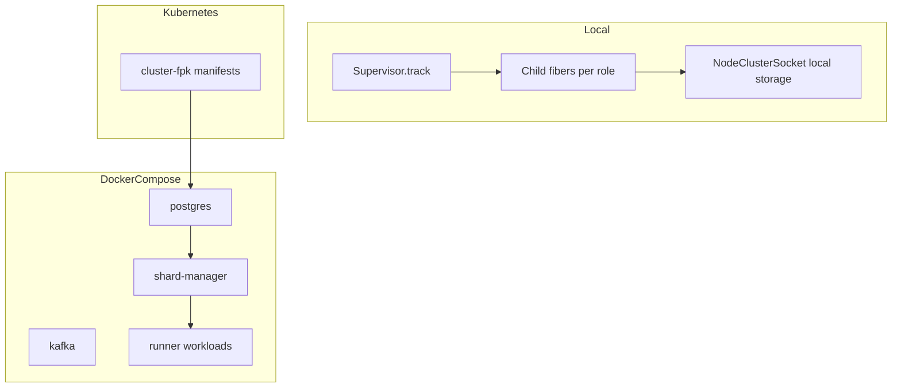

# Three-tier platform runtime (local / Compose / Kubernetes)

## Current state (what you already have)

- **Kubernetes**: FPK manifests under `[packages/cluster-fpk/](packages/cluster-fpk/)` and lifecycle CLIs in `[packages/cluster-ops/](packages/cluster-ops/)` render/apply the stack (Postgres, Kafka/Redpanda, shard-manager, runner, battleships, shooters). Workloads use `SHARD_MANAGER_HOST`, `CLUSTER_APP_MODE`, and `[makeClusterSqlRunnerLayer` / `makeClusterSqlClientLayer](packages/core/src/cluster/sql-socket-layers.ts)` built on `[NodeClusterSocket.layer({ storage: "sql" })](https://github.com/Effect-TS/effect/blob/main/packages/platform-node/src/NodeClusterSocket.ts)` from `@effect/platform-node`.
- **Hooks / registration**: `[shardingRegistrationHooksLayer](packages/core/src/hooks/sharding-registration-hooks.ts)` already listens to `@effect/cluster` `Sharding.getRegistrationEvents` — any tier that provides `Sharding` consistently will keep hook behaviour.
- **Hook bus**: `[CLUSTER_HOOK_BUS](packages/core/src/config/cluster-hook-config.ts)` supports `kafka` or `off`; local tiers can default to `off` to avoid a broker.
- **Prior art**: `[Examples/cluster-docker/](Examples/cluster-docker/)` shows the same env pattern as FPK (image + `SHARD_MANAGER_HOST`), but there is **no** `docker-compose.yml` in-repo yet. The Effect repo’s `[packages/platform-node/examples/cluster.ts](https://github.com/Effect-TS/effect/blob/main/packages/platform-node/examples/cluster.ts)` demonstrates `**NodeClusterSocket.layer({ storage: "local", shardingConfig: { runnerAddress: ... } })`** for **single-process** cluster-style RPC without SQL coordination — important for the localhost story.

## Target architecture

- **Tier 1 – Local**: One OS process (or one “orchestrator” process) uses [Effect Supervisor](https://effect.website/docs/observability/supervisor/) to **fork, track, and join** child fibers that run what today are separate `CLUSTER_APP_MODE` roles. Coordination options:
  - **Recommended default for “no infra”**: use `**storage: "local"`** for cluster socket/runner state (aligned with upstream example), with `**CLUSTER_HOOK_BUS=off`**, so you do not require Postgres/Redpanda for *cluster* metadata on the smallest path.
  - **Optional**: keep a **localhost Postgres** only for domain/app SQL if/when the product requires it — separate from cluster storage.
  - **Multi-shard simulation**: multiple children can each use distinct `runnerAddress` ports (same pattern as the loop in `cluster.ts`) if you want several logical runners on one machine; Supervisor exposes live fiber sets via `supervisor.value` for observability and shutdown ordering.
- **Tier 2 – Docker Compose**: Same **logical** topology as FPK (postgres + broker + shard-manager + N workloads), with Docker network DNS replacing `*.svc` names (e.g. `SHARD_MANAGER_HOST=shard-manager`). Reuse images built by `[cluster-ops:build-local-images](packages/cluster-ops/cli/build-local-images.ts)` and the same env contract as `[packages/cluster-fpk/src/shared/env.ts](packages/cluster-fpk/src/shared/env.ts)`. Use `**podman compose`** or `**docker compose`** interchangeably unless a feature gap appears (document which was validated).
- **Tier 3 – Kubernetes**: Unchanged FPK path; document as the scale/stability option. Validated on a cluster running under **Podman** (e.g. kind/k3s on Podman machine) as in your environment.

## Design decisions to lock early

1. **Supervisor scope**: Treat Supervisor as the **local analogue of pod/container lifecycle** (start/stop/join child fibers), not a replacement for `@effect/cluster`’s own sharding protocol. Fiber children either run isolated `Layer.launch` stacks (server on a port + clients) or a **collapsed** single-layer demo like upstream `cluster.ts` if you accept one runner address for the smallest install.
2. **Avoid duplicating three codepaths for business logic**: Keep extension/platform code in `[packages/extensions/](packages/extensions/)` and `[packages/platforms/postgresql/src/platform.ts](packages/platforms/postgresql/src/platform.ts)`; add only **thin orchestration** (profile-specific entry or env branch) that chooses socket storage and process/fiber topology.
3. **Compose vs FPK drift**: Prefer one **service list** (names, ports, env keys) documented next to `[packages/cluster-ops/src/stack.ts](packages/cluster-ops/src/stack.ts)` profiles (`postgresql`, `mysql`, `full`) so Compose and K8s stay aligned manually until you invest in generation.

## Documentation – README and docs hub

Primary audience lands on the root AsciiDoc overview; Markdown contributors use the docs hub.

1. `**[README.adoc](README.adoc)`** (section **Running Locally & Developing** or equivalent):
  - Short **comparison table**: Local (no K8s) vs Docker Compose vs Kubernetes — when to use each, prerequisites (Node/pnpm only vs Compose vs `kubectl` + cluster).
  - **Commands** (placeholders until Nx targets land): e.g. local supervisor target, `podman compose up` / `docker compose up`, existing `pnpm cluster:apply` + `cluster:wait` + log tailing.
  - Link to the detailed Markdown part below.
2. `**[docs/readme.md](docs/readme.md)`**:
  - Add a **Table of contents** row pointing to the procedural doc (new file `**docs/parts/local-dev/three-tier-platform-runtime.md`** or extend `[postgresql-cluster-runtime.md](docs/parts/local-dev/postgresql-cluster-runtime.md)` with a dedicated “Three tiers” section) so the hub stays navigable.
3. **Detailed procedures** in `docs/parts/local-dev/`:
  - Per-tier prerequisites, env vars (including `CLUSTER_HOOK_BUS`), build steps, run steps, how to **tail logs** (`kubectl logs -l ...`, `compose logs -f <service>`, single-process stdout).
  - Explicit note that Effect’s logger may add **timestamps/levels/structure**; validation uses **substring** matching on message text, not exact line equality.

## Regression testing plan (pre-upgrade log parity)

**Goal**: After implementation, each tier **builds**, **runs**, and emits logs that match **pre-upgrade** demo behaviour: the same substantive messages users already rely on for “cluster demo is healthy.”

### Canonical message patterns (source of truth in repo)

Match these as **substrings** in aggregated logs (case-sensitive unless you standardize otherwise):

| Substring      | Emitted by                                  | File                                                                                                               |
| -------------- | ------------------------------------------- | ------------------------------------------------------------------------------------------------------------------ |
| `Boom!`        | Runner `DemoEntity.Shoot`                   | `[packages/extensions/runner/src/runner.ts](packages/extensions/runner/src/runner.ts)` (`Effect.logInfo`)          |
| `Shooting at`  | Shooter loop                                | `[packages/extensions/shooter/src/shooter.ts](packages/extensions/shooter/src/shooter.ts)`; also slow-shooter      |
| `Shot at`      | Slow-shooter (includes `!` after ship name) | `[packages/extensions/slow-shooter/src/slow-shooter.ts](packages/extensions/slow-shooter/src/slow-shooter.ts)`     |
| `Shots fired:` | Speed-shooter batch log                     | `[packages/extensions/speed-shooter/src/speed-shooter.ts](packages/extensions/speed-shooter/src/speed-shooter.ts)` |

**Note**: User-facing wording “Shots fired ….” maps to the literal prefix `**Shots fired:`** in code.

### Per-tier procedure (executor environment)

Assume **Podman-backed Kubernetes**, **Podman Compose or Docker Compose**, and **bare-metal / local Node** as available.

1. **Build**
  - TypeScript: `pnpm nx run platforms-postgresql:build` (and MySQL platform if in scope).
  - Container images (Compose + K8s): `pnpm exec nx run cluster-ops:build-local-images` (or documented equivalent) so workloads match FPK image tags.
2. **Kubernetes tier**
  - Apply + wait: existing `cluster:apply` / `cluster:wait` (or `pnpm local-ci:cluster` pipeline without skipping cluster).
  - Collect logs: `pnpm cluster:logs:all`, or `kubectl logs` / stern-style tooling per namespace labels used by `[cluster-ops` logs targets](packages/cluster-ops/cli/logs-cluster-all.ts).
  - **Assert**: combined output contains `Boom!`, `Shooting at` , `Shot at` , and `Shots fired:` within a **bounded wait** (e.g. 2–5 minutes) after workloads are ready.
3. **Docker Compose tier** (once `docker-compose` exists)
  - `podman compose up -d` or `docker compose up -d` from documented compose path.
  - `compose logs -f` on shooter / slow-shooter / speed-shooter / runner (or single `compose logs` scrape).
  - **Assert**: same four substrings appear within the same bounded window.
4. **Local tier** (supervisor / single-process)
  - Run the new Nx target (or documented `tsx` entry) with `CLUSTER_HOOK_BUS=off` and local cluster storage as designed.
  - **Assert**: **all four** substrings appear in **process stdout/stderr** (or structured log sink if redirected), proving runner + all shooter variants participate in one supervised topology.
5. **Baseline / regression artifact**
  - Optionally save a **redacted sample** (timestamps stripped) under `docs/parts/local-dev/` or `tests/cluster-e2e/` as “expected shapes” for human diffing; automation can be a small script (e.g. `rg`/`grep` exit codes) invoked from Nx or CI later.
6. **Failure interpretation**
  - Missing `Boom!` → runner / RPC path or shard-manager connectivity broken for that tier.
  - Missing `Shooting at`  / `Shot at`  / `Shots fired:` → corresponding `CLUSTER_APP_MODE` workload not running or logs not collected from the right service.

## Implementation plan (suggested phases)

### Phase A – Runtime profile contract

- Introduce a single env (e.g. `EVENTIVA_RUNTIME_TIER=local|compose|kubernetes`) or document the existing env combination matrix (no new code strictly required).
- Add the three-tier procedural doc under `docs/parts/local-dev/` and wire it from `[docs/readme.md](docs/readme.md)`.

### Phase B – Docker Compose

- Add `docker-compose.yml` (and optionally overrides) at repo root or `packages/cluster-compose/` with services matching the `postgresql` stack from `[packages/cluster-ops/src/stack.ts](packages/cluster-ops/src/stack.ts)`: postgres, kafka, shard-manager, runner-related workloads, using the same image build outputs as K8s.
- Add Nx targets (e.g. on `cluster-ops` or a small `cluster-compose` project): `compose:up`, `compose:down`, `compose:logs`, mirroring the ergonomics of `[cluster-ops` CLI](packages/cluster-ops/cli/).
- Document: replace `*.svc` hostnames with Compose service names; port publishing for host-based `pnpm` clients if needed.

### Phase C – Local Supervisor orchestration

- In `[@eventiva/core](packages/core/src/cluster/sql-socket-layers.ts)`, add `**makeClusterLocalRunnerLayer` / `makeClusterLocalClientLayer`** (or a single factory) that call `NodeClusterSocket.layer({ storage: "local", ... })` with configurable `runnerAddress` / `clientOnly`, mirroring the existing SQL helpers.
- Add a **local orchestrator** entry (e.g. new file under `[packages/platforms/postgresql/src/](packages/platforms/postgresql/src/)` or `packages/cluster-local/src/`):
  - `yield* Supervisor.track`
  - For each configured role, `Effect.fork` (or `forkScoped` under a parent scope) an effect that runs the same `makeRunnerEntry` / `makeShooterEntry` pattern with **local** socket layers and the right `CLUSTER_APP_MODE` (via scoped `ConfigProvider` or explicit sub-layers).
  - Optional: periodic or event-driven logging from `supervisor.value` for shard/fiber counts ([Supervisor docs](https://effect.website/docs/observability/supervisor/)).
- Add Nx target e.g. `platforms-postgresql:run:local-fiber` (name TBD) with `CLUSTER_HOOK_BUS=off` and no K8s dependency.
- **Validation**: Prove registration hooks still fire using `Sharding.getRegistrationEvents` under `storage: "local"` (manual or Vitest in `tests/`** per TDD policy).

### Phase D – Polish and CI

- Extend `[docs/parts/local-dev/local-cluster-ci.md](docs/parts/local-dev/local-cluster-ci.md)` with an optional “Compose CI” job sketch when you want E2E without Kind.
- Module-boundaries: any new package gets `type:` + `layer:` tags per `[.cursor/rules/module-boundaries.mdc](.cursor/rules/module-boundaries.mdc)`.

### Phase E – README + regression pass (documentation gate)

- Apply **Documentation – README and docs hub** above.
- Run the **Regression testing plan** on all three tiers on the target machine (Podman K8s, Compose, local); capture pass/fail in PR description or checklist before calling the feature done.

## Risks and mitigations

| Risk                                                                 | Mitigation                                                                                              |
| -------------------------------------------------------------------- | ------------------------------------------------------------------------------------------------------- |
| `storage: "local"` semantics differ from SQL (no cross-host runners) | Document explicitly; local tier is for individuals/small communities only.                              |
| Multi-fiber same process + socket server port binding                | Assign distinct `runnerAddress` ports per supervised child; verify shutdown releases ports.             |
| Effect log format hides message text                                 | Use substring assertions; document default logger; optionally set log level / pretty printer for demos. |
| MySQL stack parity                                                   | Mirror Phase B/C for `platforms-mysql` after PostgreSQL path is stable.                                 |

## Out of scope (unless you expand the goal)

- Generating Compose from FPK TypeScript automatically (nice follow-up).
- Replacing `@effect/cluster` coordination with a custom Supervisor-based registry (Supervisor should **orchestrate** fibers, not reimplement cluster protocol).

