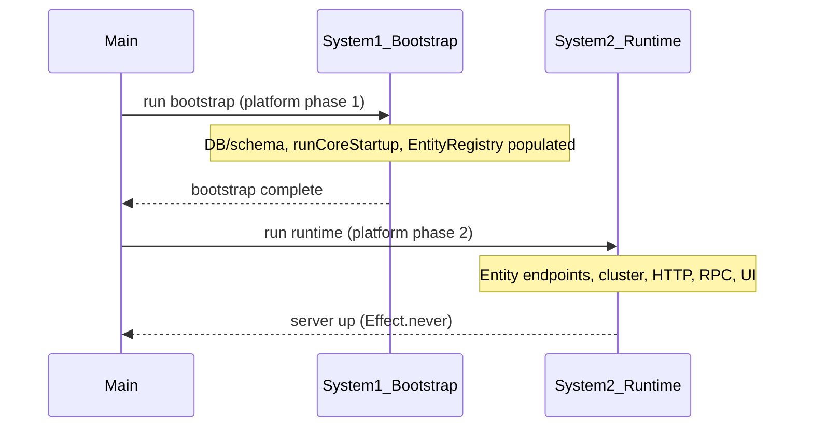

# Two-phase bootstrap and runtime (System 1 / System 2)

## Problem summary

With `/api/docs` up, the Contact extension is not exposed: `POST /api/rpc/contacts` returns `{"success":{"error":"Unknown pathPrefix: contacts"}}`.

**Root cause:** Effect builds the platform layer (including `makeEntityEndpointsLayer`) when the program is first run. The entity endpoints layer is **built** (its scoped effect `startServer` runs) as part of that build, so `EntityRegistry.getAll()` is called **before** the program has run `runCoreStartup`. At that moment the registry is still empty; only explicitly passed descriptors (e.g. `hello-worlds`) are in the route map. `runCoreStartup` runs later and populates `EntityRegistry` with Contact (and other dynamic entities), but the route map was already built without them.

**Relevant code:** In [packages/core/src/cluster/entity-endpoints.ts](packages/core/src/cluster/entity-endpoints.ts), `startServer` (inside `makeEntityEndpointsLayer`) does:

- `const allRegisteredEntities = EntityRegistry.getAll();`
- Builds `allDescriptors` from passed descriptors + registry entities, then builds the `map` used by the RPC handler.

That runs when the **layer** is built, not when the **program** reaches `yield* EntityEndpointsServer`. Because the full platform is provided in one go, Effect builds the entire layer graph (including the entity endpoints scoped effect) before or during initial execution, so the registry is still empty when the map is built.

---

## Target architecture: two systems, sequential

Two distinct phases; they never run at the same time.

- **System 1 (bootstrap / loading):** Database structuring, schema finalization, extension CORE_LOADED/EXTENSIONS_LOADED, **runCoreStartup** (integrity, relations, EntityRegistry population). Output: fully populated **EntityRegistry**, finalized schema, and any other "infrastructure" state the runtime needs. No HTTP server, no cluster endpoints, no RPC route map.
- **System 2 (runtime):** Uses the built state from System 1. Starts Effect cluster, entity endpoints (builds route map **after** EntityRegistry is populated), endpoint management, entity/RPC/HTTP, Swagger, UI, etc.

**Handoff:** System 1 runs to completion in the same process; then System 2 runs in the same process using the same in-memory state (EntityRegistry, FinalTableStore, etc.). No need for a second process unless you later choose to persist state and spawn a separate server process.

---

## Implementation approach

### 1. Split platform into two layers (phase 1 vs phase 2)

- **Phase 1 platform (bootstrap):** Everything needed for **runCoreStartup** only:
  - Observability, runtime config, extension config, schema stack (TableColumnRegistry, FinalTableStore, SchemaFinalizer, etc.), database layer, extension hooks, workflow registry, **merged extension entity layers** (so CORE_LOADED and schema finalization run).
  - Does **not** include: HTTP server, `makeEntityEndpointsLayer`, or any service that builds the entity route map.
  - Provides: all deps for `runCoreStartup` and for extension workflows that run on EXTENSIONS_LOADED (e.g. ContactSeedLayer).
- **Phase 2 platform (runtime):** Depends on "bootstrap already ran" (same process, so EntityRegistry and schema are already populated). Adds:
  - Node HTTP server, `makeEntityEndpointsLayer(descriptors, options)` (and any other endpoint/cluster layers).
  - When the Phase 2 layer is built, `startServer` runs **after** System 1 has completed, so `EntityRegistry.getAll()` returns Contact and all other dynamic entities; the route map and Swagger/CRUD are correct.

**Key files:** [packages/core/src/runtime/platform.ts](packages/core/src/runtime/platform.ts) (createPlatformTemplate), [packages/core/src/cluster/entity-endpoints.ts](packages/core/src/cluster/entity-endpoints.ts).

### 2. Runtime program: run System 1, then System 2

- **Current:** `defaultRuntimeProgram` does `runCoreStartup` then `EntityEndpointsServer` then `Effect.never`, with a **single** platform layer that already includes the entity endpoints layer (so Effect builds that layer too early).
- **New:** Use two sequential phases and two layer provisions:
  1. Run **bootstrap program** with **phase 1 platform only**: e.g. `runCoreStartup` then optional logging/metrics. No `EntityEndpointsServer` in this phase. Exit the bootstrap effect normally (no Effect.never).
  2. Run **runtime program** with **phase 2 platform** that **assumes EntityRegistry (and schema) are already populated**. This layer includes the HTTP server and `makeEntityEndpointsLayer`. The program does `yield* EntityEndpointsServer` then `Effect.never`.

So the main entrypoint becomes: build phase 1 layer → run bootstrap effect (with phase 1) → build phase 2 layer (with phase 1 services/state intact) → run runtime effect (with phase 2). Same process; System 1 and System 2 never concurrent.

**Key file:** [packages/core/src/runtime/run-runtime.ts](packages/core/src/runtime/run-runtime.ts).

### 3. Platform template API

- **Option A (recommended):** `createPlatformTemplate(options)` returns or accepts a way to get two layers:
  - `getBootstrapLayer()` or `platformPhase1`: layer for runCoreStartup (no HTTP, no entity endpoints).
  - `getRuntimeLayer()` or `platformPhase2`: layer that adds HTTP + entity endpoints (and any other runtime-only deps), to be provided **after** bootstrap has run.
- **Option B:** Keep a single `createPlatformTemplate` but have it expose two layers internally; the runtime entrypoint (e.g. `runMain`) composes the two-phase run as above.

Either way, the default platform ([packages/platforms/default/src/index.ts](packages/platforms/default/src/index.ts)) should use this two-phase flow so that with `/api/docs` up, Contact (and any other EntityRegistry entity) is in the route map.

### 4. Entity endpoints unchanged in behavior

- No change to the **shape** of entity endpoints: still `POST /api/rpc/:pathPrefix` with body `{ method, payload }`, and Swagger/CRUD as today. Only the **time** when the route map is built changes: it is built when the Phase 2 layer is built, which happens only after System 1 has run and EntityRegistry is populated.
- Optional: document that explicitly passed `entityEndpoints` descriptors (e.g. HelloWorld) are still merged with `EntityRegistry.getAll()` at route-map build time, so Contact will appear without adding it to `entityEndpoints` in the platform config.

### 5. What lives where

| Concern                                                                              | System 1 (bootstrap) | System 2 (runtime)  |
| ------------------------------------------------------------------------------------ | -------------------- | ------------------- |
| DB layer, schema stack, finalization                                                 | Yes                  | Uses existing state |
| runCoreStartup (integrity, CORE_LOADED, finalize, Phase 2 relations, EntityRegistry) | Yes                  | No                  |
| Extension layers (CORE_LOADED, markReady, EXTENSIONS_LOADED)                         | Yes                  | No                  |
| EntityRegistry population                                                            | Yes                  | Read-only           |
| HTTP server, entity endpoints layer, route map                                       | No                   | Yes                 |
| Cluster, RPC, Swagger, UI                                                            | No                   | Yes                 |

---

## To-dos

- **platform-split-phase1-phase2** – In [platform.ts](packages/core/src/runtime/platform.ts), split into phase 1 (bootstrap) and phase 2 (runtime) layer construction; phase 2 adds HTTP server + entity endpoints only.
- **run-runtime-two-phase** – In [run-runtime.ts](packages/core/src/runtime/run-runtime.ts), implement two-phase run: bootstrap with phase 1 layer, then runtime with phase 2 layer (and optional DevTools); adjust `runMain` / `runRuntime` to use this.
- **default-platform-wire** – In [packages/platforms/default/src/index.ts](packages/platforms/default/src/index.ts), use the new two-phase API (e.g. pass options to get both layers and run via the new entrypoint).
- **docs-two-phase** – Document the two-phase bootstrap vs runtime model in [docs/learnings/architecture.md](docs/learnings/architecture.md) (or a new doc).

---

## Files to touch (summary)

- **packages/core/src/runtime/platform.ts** – Split into phase 1 (bootstrap) and phase 2 (runtime) layer construction; phase 2 adds HTTP server + entity endpoints only.
- **packages/core/src/runtime/run-runtime.ts** – Implement two-phase run: bootstrap with phase 1 layer, then runtime with phase 2 layer (and optional DevTools); adjust `runMain` / `runRuntime` to use this.
- **packages/platforms/default/src/index.ts** – Use the new two-phase API (e.g. pass options to get both layers and run via the new entrypoint).
- **packages/core/src/cluster/entity-endpoints.ts** – No behavioral change to RPC/Swagger; only guaranteed to run after bootstrap (by virtue of being in phase 2 only).
- **docs/learnings/architecture.md** (or a new doc) – Document the two-phase bootstrap vs runtime model and that entity endpoints are built only after EntityRegistry is populated.

---

## Out of scope / alternatives

- **Defer route map per request:** Resolving `pathPrefix` from EntityRegistry on each request is an alternative fix but adds latency and complexity; the two-phase design is cleaner and keeps a single route map build.
- **Two separate processes:** If later you need System 1 to persist state (e.g. to disk or DB) and System 2 to start in another process, the same split (bootstrap vs runtime) applies; handoff would then be via persisted state or IPC instead of in-memory.
- **Passing Contact explicitly in entityEndpoints:** Works as a workaround only if Contact were a static import; Contact is created dynamically in runCoreStartup and registered in EntityRegistry, so it cannot be passed as a descriptor before bootstrap. The two-phase approach is the proper fix.
