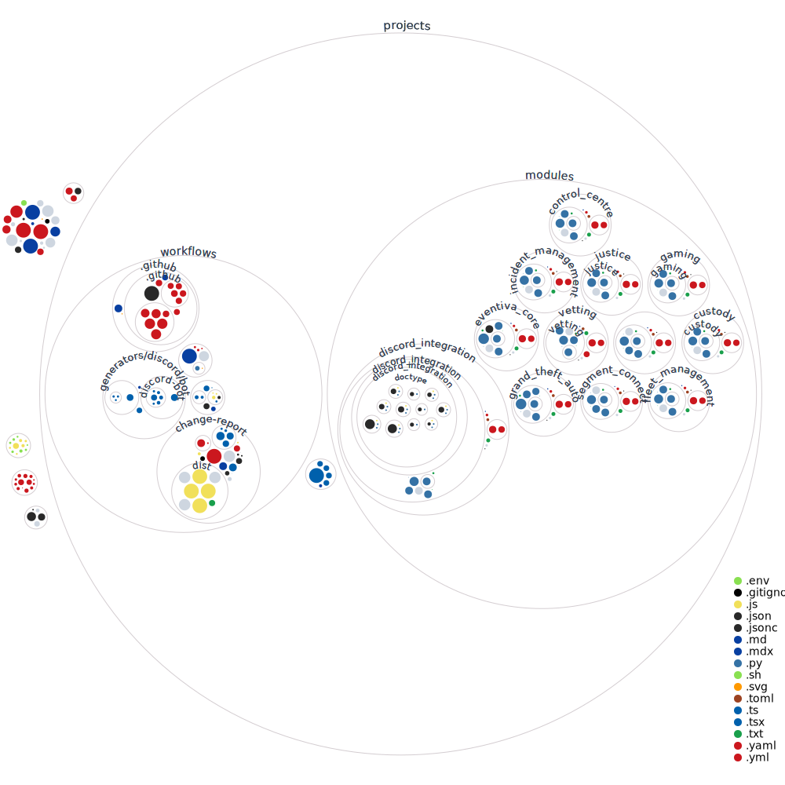

# EVENTIVA

[](https://codespaces.new/Eventiva/eventiva?quickstart=1)

## Index

<!-- toc -->

- [EVENTIVA](#eventiva)
  - [Index](#index)
  - [Introduction](#introduction)
  - [Why do we exist?](#why-do-we-exist)
  - [What is Eventiva Gaming](#what-is-eventiva-gaming)
  - [Why open-source?](#why-open-source)
  - [How to get support 👨‍👩‍👧‍👦](#how-to-get-support-)
  - [Contributing](#contributing)
    - [Visualisation of the codebase](#visualisation-of-the-codebase)
    - [Backlog](#backlog)
    - [Running Locally \& Developing](#running-locally--developing)
    - [Contributors ✨](#contributors-)
      - [prerequisites](#prerequisites)
      - [Codespaces Method (Recommended)](#codespaces-method-recommended)
      - [Devcontainer Method](#devcontainer-method)

<!-- tocstop -->

## Introduction

Welcome to the Eventiva repository. Eventiva is an open-source platform for Event Planning and Production logistics. We have created a custom-built directory focused on indexing, marketing and connecting event specialist Vendors, Venues and professionals. We then connected this to our innovative tools for event production planning which include scheduling, itinerary, task management, contact management, warehousing ticket sales, interactive site maps, online and in-person sales solutions, accounting, payroll and human resources.

## Why do we exist?

When surveyed, the industry revealed that over fifty-five percent of events did not have a management tool of any form. The remaining forty percent are split across solutions designed and implemented for office environments. Software like Flock and Excel barely cover the toolset which managers require to be effective in the preproduction sections of their work. While fifty-five percent of events did not have management tools, a full eighty percent of individuals surveyed believed that schedulers, task lists and other management tools would be helpful to their ongoing operations.

## What is Eventiva Gaming

Eventiva Gaming is born out of the desire to create the best tools for our industry. While gaming is an unusual route, we believe that the gaming industry, specifically role play communities, is a perfect fit for testing, developing and improving our tools. Within the Role Play Communities, there are may teams which need to coordinate, manage and plan digital events with the exact same requirements as physical events. We believe that by working with these communities we can create a better product for everyone.

For instance, the Eventiva Gaming team developed the initial version of the Fleet Management module. They designed it to manage the distribution, maintainance and deployment of vehicles within Emergency Service role play. Those same key features are now being used to manage the distribution, maintainance and deployment of vehicles within the events industry.

## Why open-source?

We believe in the power of community development, while our tools are designed and marketted for event planning, they can be utilised by organisations planning all variations of projects, we believe that through keeping our tools open-source we can connect with amazing developers who can contribute in ways we simply cannot fathom.

## How to get support 👨‍👩‍👧‍👦

For **Features Requests**, **Q&A**, **Show & Tell** and **Discussions** please use **[our discussion page](https://github.com/Eventiva/Eventiva/discussions)** 🚑.

We have a **FAQ** label in our **[discussion page](https://github.com/Eventiva/Eventiva/discussions)** where you can get quick answers, help with debugging weird issues, and general help.

Our extensive **documentation** can be found at **[here](https://github.com/Eventiva/Eventiva)**.

<!-- Contributing -->

## Contributing

<picture>
  <source media="(prefers-color-scheme: dark)" srcset="dist/github-snake-dark.svg" />
  <source media="(prefers-color-scheme: light)" srcset="dist/github-snake.svg" />
  
</picture>

Thank you for taking an interst in contributing. We have created development containers (`.devcontainer`) to allow you to jump straight in with coding. Everything is configured and ready to go, all you need to do is use one of the supported platforms: [VSCode](https://code.visualstudio.com/docs/remote/containers) | [Github Codespaces](https://github.com/features/codespaces)

This project utilises the [Smartcloud Project](https://github.com/Eventiva/smartcloud) to automate our workflow, alongside provide templates for issues and pull requests. If you want to learn more about precisely what this workflow accomplishes, please check out the documentation [here](https://github.com/Eventiva/smartcloud). You can find a example Pull Request, [here](https://github.com/Eventiva/eventiva/pull/36) which shows the standard flow for contributors.

For more information on contributing, please read the [contributing guidelines](./contributing.md).

### Visualisation of the codebase

## Bit Initialization Scripts

Eventiva includes automation scripts to simplify the initial setup of Bit within the project. The `bit-init.js` and `bit-init.sh` scripts handle the installation and configuration of Bit, streamlining the process for developers.

To run the `bit-init.js` script, use the command:

```
node scripts/bit-init.js
```

This script requires Node.js to be installed on your system.

To run the `bit-init.sh` script, use the command:

```
bash scripts/bit-init.sh
```

Ensure that Bash is available on your system to execute the shell script.

---

### Visualisation of the codebase

Eventiva/eventiva is built on the following main stack:

-  [Jest](http://facebook.github.io/jest/) – Javascript Testing Framework
-  [Python](https://www.python.org) – Languages
-  [Node.js](http://nodejs.org/) – Frameworks (Full Stack)
-  [JavaScript](https://developer.mozilla.org/en-US/docs/Web/JavaScript) – Languages
-  [TypeScript](http://www.typescriptlang.org) – Languages
-  [ESLint](http://eslint.org/) – Code Review
-  [Shell](https://en.wikipedia.org/wiki/Shell_script) – Shells
-  [Yarn](https://yarnpkg.com/) – Front End Package Manager
-  [Prettier](https://prettier.io/) – Code Review
-  [GitHub Actions](https://github.com/features/actions) – Continuous Integration
-  [OpenAI](https://openai.com/) – Large Language Models
-  [LangChain](https://github.com/hwchase17/langchain) – Large Language Model Tools
-  [pgvector](https://github.com/pgvector/pgvector/) – Database Tools

Full tech stack [here](/techstack.md)



### Backlog

Our backlog can be found on either our [Github Project](https://github.com/orgs/Eventiva/projects/12)

### Running Locally & Developing

### Contributors ✨

Thanks goes to these wonderful people ([emoji key](https://allcontributors.org/docs/en/emoji-key)):

<!-- ALL-CONTRIBUTORS-LIST:START - Do not remove or modify this section -->
<!-- prettier-ignore-start -->
<!-- markdownlint-disable -->
<table>
  <tbody>
    <tr>
      <td align="center" valign="top" width="14.28%"><a href="https://jonathanstevens.org/"><br /><sub><b>Jonathan S</b></sub></a><br /><a href="#business-TGTGamer" title="Business development">💼</a> <a href="https://github.com/Eventiva/eventiva/commits?author=TGTGamer" title="Code">💻</a> <a href="https://github.com/Eventiva/eventiva/commits?author=TGTGamer" title="Documentation">📖</a> <a href="#financial-TGTGamer" title="Financial">💵</a> <a href="#ideas-TGTGamer" title="Ideas, Planning, & Feedback">🤔</a> <a href="#research-TGTGamer" title="Research">🔬</a></td>
      <td align="center" valign="top" width="14.28%"><a href="http://verringer.com/"><br /><sub><b>Chris Verringer</b></sub></a><br /><a href="#business-Verringer" title="Business development">💼</a> <a href="#design-Verringer" title="Design">🎨</a> <a href="#ideas-Verringer" title="Ideas, Planning, & Feedback">🤔</a> <a href="https://github.com/Eventiva/eventiva/pulls?q=is%3Apr+reviewed-by%3AVerringer" title="Reviewed Pull Requests">👀</a></td>
      <td align="center" valign="top" width="14.28%"><a href="https://github.com/gavindsouza"><br /><sub><b>gavin</b></sub></a><br /><a href="https://github.com/Eventiva/eventiva/commits?author=gavindsouza" title="Documentation">📖</a> <a href="#tool-gavindsouza" title="Tools">🔧</a></td>
      <td align="center" valign="top" width="14.28%"><a href="https://github.com/maxprilutskiy"><br /><sub><b>Max Prilutskiy</b></sub></a><br /><a href="https://github.com/Eventiva/eventiva/commits?author=maxprilutskiy" title="Code">💻</a> <a href="#tool-maxprilutskiy" title="Tools">🔧</a></td>
      <td align="center" valign="top" width="14.28%"><a href="https://github.com/apps/atlassian-compass"><br /><sub><b>atlassian-compass[bot]</b></sub></a><br /><a href="#projectManagement-atlassian-compass[bot]" title="Project Management">📆</a></td>
      <td align="center" valign="top" width="14.28%"><a href="https://avilpage.com/"><br /><sub><b>Chillar Anand</b></sub></a><br /><a href="https://github.com/Eventiva/eventiva/commits?author=ChillarAnand" title="Documentation">📖</a></td>
      <td align="center" valign="top" width="14.28%"><a href="https://github.com/FHenry"><br /><sub><b>HENRY Florian</b></sub></a><br /><a href="https://github.com/Eventiva/eventiva/commits?author=FHenry" title="Documentation">📖</a></td>
    </tr>
    <tr>
      <td align="center" valign="top" width="14.28%"><a href="https://github.com/nasirrr"><br /><sub><b>nasirrr</b></sub></a><br /><a href="https://github.com/Eventiva/eventiva/commits?author=nasirrr" title="Documentation">📖</a></td>
      <td align="center" valign="top" width="14.28%"><a href="https://github.com/ankush"><br /><sub><b>Ankush Menat</b></sub></a><br /><a href="https://github.com/Eventiva/eventiva/commits?author=ankush" title="Documentation">📖</a></td>
      <td align="center" valign="top" width="14.28%"><a href="https://github.com/kennethsequeira"><br /><sub><b>Kenneth Sequeira</b></sub></a><br /><a href="https://github.com/Eventiva/eventiva/commits?author=kennethsequeira" title="Documentation">📖</a></td>
      <td align="center" valign="top" width="14.28%"><a href="https://restyled.io/"><br /><sub><b>Restyled Commits</b></sub></a><br /><a href="https://github.com/Eventiva/eventiva/commits?author=restyled-commits" title="Code">💻</a> <a href="#maintenance-restyled-commits" title="Maintenance">🚧</a></td>
      <td align="center" valign="top" width="14.28%"><a href="https://midocean.tech/"><br /><sub><b>Sagar Bhogayata</b></sub></a><br /><a href="https://github.com/Eventiva/eventiva/commits?author=sagar-bhogayata" title="Documentation">📖</a></td>
      <td align="center" valign="top" width="14.28%"><a href="https://github.com/zaid2229"><br /><sub><b>zaid</b></sub></a><br /><a href="https://github.com/Eventiva/eventiva/commits?author=zaid2229" title="Documentation">📖</a></td>
      <td align="center" valign="top" width="14.28%"><a href="https://github.com/mymi14s"><br /><sub><b>Anthony C. Emmanuel</b></sub></a><br /><a href="https://github.com/Eventiva/eventiva/commits?author=mymi14s" title="Documentation">📖</a></td>
    </tr>
    <tr>
      <td align="center" valign="top" width="14.28%"><a href="https://github.com/systonium"><br /><sub><b>systonium</b></sub></a><br /><a href="https://github.com/Eventiva/eventiva/commits?author=systonium" title="Documentation">📖</a></td>
      <td align="center" valign="top" width="14.28%"><a href="https://github.com/NagariaHussain"><br /><sub><b>Md Hussain Nagaria</b></sub></a><br /><a href="https://github.com/Eventiva/eventiva/commits?author=NagariaHussain" title="Documentation">📖</a></td>
      <td align="center" valign="top" width="14.28%"><a href="https://github.com/HUMENTH"><br /><sub><b>Himanshu Shivhare</b></sub></a><br /><a href="https://github.com/Eventiva/eventiva/commits?author=HUMENTH" title="Documentation">📖</a></td>
      <td align="center" valign="top" width="14.28%"><a href="https://github.com/robproject"><br /><sub><b>Robert Duncan</b></sub></a><br /><a href="https://github.com/Eventiva/eventiva/commits?author=robproject" title="Documentation">📖</a></td>
      <td align="center" valign="top" width="14.28%"><a href="https://github.com/roquegv"><br /><sub><b>Roque Vera</b></sub></a><br /><a href="https://github.com/Eventiva/eventiva/commits?author=roquegv" title="Documentation">📖</a></td>
      <td align="center" valign="top" width="14.28%"><a href="https://github.com/mohsinalimat"><br /><sub><b>MohsinAli</b></sub></a><br /><a href="https://github.com/Eventiva/eventiva/commits?author=mohsinalimat" title="Documentation">📖</a></td>
      <td align="center" valign="top" width="14.28%"><a href="https://github.com/Alchez"><br /><sub><b>Rohan</b></sub></a><br /><a href="https://github.com/Eventiva/eventiva/commits?author=Alchez" title="Documentation">📖</a></td>
    </tr>
    <tr>
      <td align="center" valign="top" width="14.28%"><a href="https://www.linkedin.com/in/yemi-kudaisi-543bba88/"><br /><sub><b>Yemi Kudaisi</b></sub></a><br /><a href="https://github.com/Eventiva/eventiva/commits?author=yemikudaisi" title="Documentation">📖</a></td>
      <td align="center" valign="top" width="14.28%"><a href="https://github.com/nextchamp-saqib"><br /><sub><b>Saqib Ansari</b></sub></a><br /><a href="https://github.com/Eventiva/eventiva/commits?author=nextchamp-saqib" title="Documentation">📖</a></td>
      <td align="center" valign="top" width="14.28%"><a href="https://github.com/apps/dependabot"><br /><sub><b>dependabot[bot]</b></sub></a><br /><a href="https://github.com/Eventiva/eventiva/issues?q=author%3Adependabot[bot]" title="Bug reports">🐛</a> <a href="https://github.com/Eventiva/eventiva/commits?author=dependabot[bot]" title="Code">💻</a> <a href="#maintenance-dependabot[bot]" title="Maintenance">🚧</a> <a href="#projectManagement-dependabot[bot]" title="Project Management">📆</a> <a href="#security-dependabot[bot]" title="Security">🛡️</a></td>
      <td align="center" valign="top" width="14.28%"><a href="https://github.com/apps/mergify"><br /><sub><b>mergify[bot]</b></sub></a><br /><a href="https://github.com/Eventiva/eventiva/pulls?q=is%3Apr+reviewed-by%3Amergify[bot]" title="Reviewed Pull Requests">👀</a></td>
      <td align="center" valign="top" width="14.28%"><a href="https://github.com/TMateSoft"><br /><sub><b>TMateSoft</b></sub></a><br /><a href="#maintenance-TMateSoft" title="Maintenance">🚧</a></td>
    </tr>
  </tbody>
</table>

<!-- markdownlint-restore -->
<!-- prettier-ignore-end -->

<!-- ALL-CONTRIBUTORS-LIST:END -->

This project follows the [all-contributors](https://github.com/all-contributors/all-contributors) specification. Contributions of any kind welcome!

[This section is being re-written based on the new development environment and major changes to the repository]

#### prerequisites

You can choose one of the following methods to get your development platform configured

#### Codespaces Method (Recommended)

[](https://codespaces.new/Eventiva/eventiva?quickstart=1)

GitHub Codespaces provides cloud-hosted development environments for any activity - whether it's a long-term project, or a short-term task like reviewing a pull request. You can connect to Codespaces from Visual Studio Code or a browser-based editor that's accessible anywhere. Download the VSCode extension [here](https://marketplace.visualstudio.com/items?itemName=GitHub.codespaces).

#### Devcontainer Method

The Dev Container lets you use a Docker container as a full-featured development environment. Whether you deploy to containers or not, containers make a great development environment because you can:

- Develop with a consistent, easily reproducible toolchain on the same operating system you deploy to.
- Quickly swap between different, separate development environments and safely make updates without worrying about impacting your local machine.
- Try out new technologies or clone a copy of a code base without impacting your local setup.

Simply install the [Dev containers extension](https://marketplace.visualstudio.com/items?itemName=ms-vscode-remote.remote-containers), clone the repository to your local device, and choose the [`Open Devcontainer` option](https://code.visualstudio.com/docs/devcontainers/containers).

<!-- #### Using Rush

Before we get started, a couple important points to keep in mind:

###### 1. Avoid certain commands in a Rush repo

Rush optimizes by installing all of your dependency packages in a central folder, and then uses [symlinks](https://en.wikipedia.org/wiki/Symbolic_link) to create the "node_modules" folder for each of your projects.

**Avoid using package manager commands that install/link dependencies.** For example, `npm run` will work fine, but these commands will get confused by Rush's symlinks: `npm install`, `npm update`, `npm link`, `npm dedupe`, etc. (The same goes for other package managers: Avoid commands such as `pnpm install` or `yarn install`.) If you want to use those commands, first run `rush unlink` to delete the symlinks created by Rush.

If you use `git clean -dfx` to clean up your folder, be aware that it handles symlinks poorly. To avoid trouble, always run `rush unlink` before using `git clean -dfx`.

Afterwards you can run `rush update` to recreate the symlinks. (There is a standalone `rush link` command, but it's rarely needed.)

###### 2. If you suspect your install is corrupted...

Rush's package management commands are "incremental", which means they save time by skipping steps that appear to be unnecessary. Since Rush runs in automated build environments, we have many safeguards to ensure these checks are accurate. However when debugging or tinkering with packages on your local machine, sometimes your NPM "node_modules" folder can get into a bad state, causing strange errors.

If you suspect your install is corrupted, try running `rush update --purge`. This will force a full reinstall of your packages, and usually get you back into a good state.

##### Creating new projects

\[coming soon\]

##### Achieving projects

To help keep the mono-repository clean, we have added the ability to achieve projects.

```
rush archive-project --package-name <your_package_name>
```

> restoring your project by `rush unarchive-project --package-name <your_package_name>`

**The automated archive process**

1. Find project configuration by Rush.js SDK
2. Check whether there are projects depends on target project
3. Run `git clean -xdf` under project folder
4. Create a checkpoint branch with the name `${projectName}-checkpoint-${date}`
5. Update checkpoint branch information in `common/_graveyard/projectCheckpoints.json` file
6. Record project configuration into `rush-metadata.json` file
7. Create a tarball by running `tar -czf <unscoped_package_name>.tar.gz -C <project_folder> .`
8. Move the tarball to `common/_graveyard` folder
9. Remove project config from `rush.json`
10. Delete project folder

**The automated unarchive process**

1. Find the tarball by `packageName`
2. Extract the tarball by running `tar xf <package_name>.tar.gz`
3. Get project configuration by reading `rush-metadata.json`
4. Remove checkpoint branch information from checkpoint metadata file if it exists
5. Move the code to project folder
6. Restore project configuration into `rush.json`
7. Delete metadata file and tarball -->
