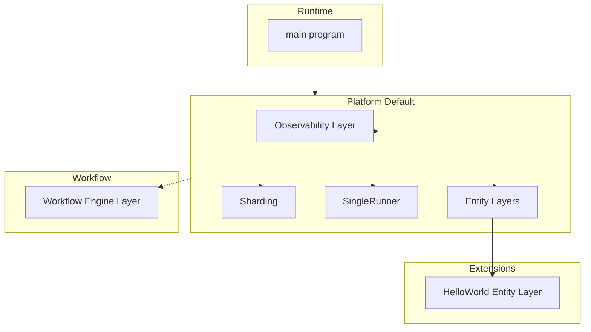

# Effect-TS CRM Framework – Basic Infrastructure Plan

**Goal:** Implement the basic infrastructure so that (1) extensions are Effect cluster entities, (2) entities are registered dynamically via Layers, (3) platform configs live in a templates folder with a default, (4) transform-manager/transforms are represented by an Effect workflow abstraction (extendable later), (5) **tracing, metrics, and logging are implemented and used in every function**, and (6) a runnable runtime plus a Hello World entity prove the setup.

**Priorities (non-negotiable):**

1. **#1 – Tracing, debugging, and metrics.** Every function in the framework and in extensions must **fully implement and use** tracing (spans), logging (structured logs at entry/exit and key events), and metrics (counters, timers, or gauges as appropriate). No function may ship without observability; this is the top priority to get right.
2. **#2 – Cluster infrastructure.** Entity registration, sharding, runner profiles, and platform composition follow after observability is in place and required everywhere.

**Architecture (high level):**

- **Extensions = Entities.** Each extension is an `Entity` (`Entity.make(type, protocol)` from `@effect/cluster`). Handlers are implemented with Effect Logger with full support for metrics & tracing. Registration = `entity.toLayer(handlers)`; composition = merging these layers.
- **One extension = one layer.** Each extension is a self-contained Layer (its entity + handlers). Runners can be configured to host a specific set of these layers (see "Dynamic runners" below). For scale to millions, use **individual layers per extension** (not fat combined layers) so each extension can be sharded and scaled independently—see "Recommendation: individual layers per extension" below.
- **Dynamic registration.** No Bit aspects; a "platform" is a Layer (or list of entity/service layers) composed in one place. Entity layers are merged and provided to the cluster runtime (e.g. `SingleRunner` for local).
- **Dynamic runners and "adding to the pool".** Effect cluster **does** support adding new runners dynamically in this sense: each runner is a **process** that builds its own Layer with the entity layers it hosts. When a new process starts (e.g. "Runner B" with extension "transform-date"), it registers with `RunnerStorage` and joins the pool; Sharding then assigns shards (by entity type / shard group) to it. So "register a new runner with a new extension" = start a new process whose Layer includes that extension's entity layer; the system adds that runner to the pool. There is **no** built-in "hot add" of an entity type into an already-running process—dynamic is at the **process/runner** level.
- **Platform templates.** A folder (e.g. `packages/core/src/platforms/` or `packages/core/platforms/`) holds template modules; `default` exports the default platform Layer (same role as common-crm's `default.bit-app.ts` but Effect-only). Templates can define "runner profiles" (which entity layers a runner process hosts) so different processes can run different extension sets.
- **Workflows.** Transform-manager/transforms become an Effect workflow layer: a thin wrapper around `@effect/cluster`'s `ClusterWorkflowEngine` (or a local workflow engine for single-node). First phase: types + engine placeholder and a single "workflow registry" service so multiple workflows can be combined later.
- **Observability (priority #1).** Logging, metrics, and tracing use [@effect/opentelemetry](https://effect-ts.github.io/effect/docs/opentelemetry): a single observability Layer that provides Effect Logger, Metrics, and Tracer backed by OpenTelemetry. **Every function** in the framework and in every extension must use this Layer: create a span for the operation (tracing), log at entry/exit or key events (logging), and record metrics (e.g. duration, count) where appropriate. No code path may omit observability; see "Observability requirements (every function)" below.

**Tech stack:** Effect 3.x, `@effect/cluster` (Entity, Sharding, SingleRunner for local), `@effect/opentelemetry` (Logger, Metrics, Tracer, NodeSdk/Otlp), `@effect/workflow` / ClusterWorkflowEngine where needed; TypeScript in Eventiva `packages/core`.

---

## Per-extension layers and dynamic runners (Effect cluster support)

- **Each extension as its own layer:** Yes. Each extension exports a single Layer (e.g. `HelloWorldEntity.toLayer(handlers)`). The platform or runner process composes only the layers it needs. So "extension A" and "extension B" are two separate layers that can be merged in different combinations per runner.
- **Provided to runners dynamically:** Effect cluster supports this by **runner process**: when a new runner process starts, it builds its Layer with **its** set of entity layers (e.g. from config: `RUNNER_ENTITIES=hello-world,transform-string`). That process registers with the cluster (via `RunnerStorage`); Sharding then adds it to the pool and assigns shards (by entity type / shard group). So "add a new runner with a new extension" = start a new process that includes that extension's layer; the system adds the runner to the pool. No restart of existing processes.
- **What Effect cluster does not provide:** Hot-add of an entity **type** into an already-running process (no `Sharding.registerEntity(type, layer)` at runtime). If you need that, you'd have to build a custom registry (e.g. `Ref<Map<EntityType, Layer>>`) and a way to spawn entity handlers in that process—outside standard cluster APIs.
- **Implementation takeaway:** Design the default platform so that "runner profile" or "entity set" is explicit (e.g. a list of entity layers per process). For phase 1 (SingleRunner), one process runs all configured entity layers. For multi-runner later, each process gets a subset of entity layers and registers; the pool grows as new processes start.

---

## Recommendation: individual layers per extension (for scale to millions)

**Choice: individual layers per extension** — each extension is its own entity type and its own Layer. Do **not** bundle multiple extensions into one "fat" shardable layer.

**Rationale:**

- **Independent scaling:** At millions of users, load will be uneven (e.g. transform/matching entities hot, reporting cold). With one layer per extension, you scale by starting more runner processes for only the entity types that need it (e.g. 100 transform runners, 2 reporting runners). With a single fat layer, you scale everything together and waste capacity.
- **Sharding granularity:** Effect cluster shards by entity type (and shard group). One entity type per extension keeps shard keys and rebalancing per domain; a single "all-in-one" entity type would create a bottleneck and coarse rebalancing.
- **Blast radius:** A bug or overload in one extension stays isolated to that entity type and its runners; other extensions keep serving. Fat layers increase blast radius.
- **Operational clarity:** Runner profiles (e.g. "transforms-only") map cleanly to "these entity layers"; per-extension layers keep profiles simple and deployment predictable.

**Plan commitment:** All framework and platform design assume **one Layer per extension (one entity type per extension)**. Runner profiles are lists of these extension layers; scaling is done by adding more processes per extension as needed.

---

## Observability requirements (every function)

**Mandatory for all framework and extension code.** Tracing, debugging, and metrics are priority #1; every function must fully implement and use them.

- **Tracing:** Every entry point or meaningful operation must create a span (e.g. `Tracer.withSpan` or equivalent from @effect/opentelemetry). Spans should be named meaningfully (e.g. `entity.HelloWorld.sayHello`, `runtime.start`). Nested operations create child spans. No function that handles a request or performs an operation may skip tracing.
- **Logging:** Every such function must log at least at entry (and optionally exit or key milestones) using the Effect `Logger` from context. Use structured fields (entityId, duration, status, etc.) so logs are queryable and debuggable. No `console.log`; no silent code paths.
- **Metrics:** Where applicable, record metrics—e.g. counter for "entity RPC invoked", timer for "entity RPC duration", or gauge for "active runs". The observability Layer provides the Metric registry; each extension or framework component should record at least one metric per logical operation (e.g. per RPC, per workflow step).
- **Checklist per function:** Before considering any function complete, confirm: (1) it runs inside a span or creates one, (2) it logs at least once with context, (3) it records at least one metric if the operation is user-facing or performance-sensitive. The Hello World handler and runtime entrypoint are the first places to implement this fully; they set the pattern for all future code.

---

## 1. Dependencies and build

- **Files:** package.json (root), packages/core/package.json.
- Add to **root** (if not present): `effect`, `@effect/cluster`, `@effect/opentelemetry`, `@effect/platform` (or rely on existing `@effect/experimental` and add cluster + opentelemetry).
- Add to **packages/core**: `effect`, `@effect/cluster`, `@effect/opentelemetry` (and optionally `@effect/workflow` for workflow types). Ensure versions are compatible (see pnpm-lock.yaml).
- Ensure `packages/core` builds with Nx (`nx run core:build`) and that tsconfig allows node types if the runtime runs in Node.

## 2. Observability Layer (logging, metrics, tracing) — Priority #1

- **Reference:** [@effect/opentelemetry](https://effect-ts.github.io/effect/docs/opentelemetry) — provides Logger, Metrics, Tracer, NodeSdk, OtlpLogger, OtlpMetrics, OtlpTracer, OtlpResource, etc.
- **Files:** Create `packages/core/src/observability/` (e.g. index.ts, logger.ts or use Otlp/NodeSdk directly, metrics.ts, tracer.ts).
- **Actions:**
    - Implement the observability Layer using **@effect/opentelemetry**: provide Effect Logger (e.g. via OtlpLogger or the package's Logger integration), **Metrics** (e.g. OtlpMetrics), **Tracer** (e.g. OtlpTracer). Use NodeSdk for Node so the OpenTelemetry SDK is initialized and logs/metrics/traces are exported (e.g. to OTLP or console).
    - Export a single Layer (e.g. ObservabilityLive or ObservabilityDefault) that the runtime and **all** entity handlers depend on. Document the "every function" contract: every function must use Tracer (span), Logger (structured log), and Metric (where appropriate).
    - Provide small helpers or patterns (e.g. `withSpanAndLog(name, effect)`) so that wrapping a function with tracing + logging is one line; metrics can be "record duration" or "increment counter" in the same wrapper.
    - Add `@effect/opentelemetry` to `packages/core` (and root if needed) in the Dependencies step.
- **Requirement:** All framework and extension code **must** use the provided Logger, Tracer, and Metrics from context. No raw `console.log`; no function without a span and at least one log; no user-facing or performance-sensitive path without at least one metric.

## 3. Cluster entities as extensions

- **Files:** packages/core/src/cluster/entities.ts, new packages/core/src/extensions/registry.ts (or equivalent).
- **Actions:**
    - In cluster/entities.ts: Document the pattern "one extension = one Entity"; export a helper or type for defining an entity (e.g. ExtensionEntity type alias or a small factory that wraps Entity.make and **requires** Logger, Tracer, and Metrics in handler context so every handler fully implements observability).
    - In extensions/registry.ts: Provide a way to "collect" entity layers (e.g. a type ExtensionLayer and a function that merges an array of entity layers into one Layer). Support "runner profile": a named set of entity layers (e.g. default, transforms-only) so a runner process can be configured with a profile and only load those extensions. No Bit-style slots; pure Layer merge.
    - Re-export from packages/core/src/index.ts so that cluster and extensions are the public API for "add an entity extension".

## 4. Platform config templates

- **Files:** Create packages/core/src/platforms/ (or packages/core/platforms/): index.ts, default.ts.
- **Actions:**
    - default.ts: Export a "default" platform Layer that composes: Observability Layer, Sharding (e.g. from @effect/cluster), SingleRunner (or in-memory runner) for local execution, a list of entity layers – initially only the Hello World entity (see below). Optionally export a "runner profile" (e.g. defaultProfile = [HelloWorldLayer]) so that multi-runner setups can reuse the same list per process.
    - index.ts: Export DefaultPlatform (or defaultPlatform) and any shared types (e.g. PlatformTemplate = a Layer that provides Sharding + Runner + entities; RunnerProfile = array of entity layers for one process).
    - Follow conventions.md: file headers, naming (\*.runtime.ts if there is a runtime file here).

## 5. Workflow engine (transform-manager equivalent)

- **Files:** packages/core/src/workflow/engine.ts, packages/core/src/workflow/types.ts.
- **Actions:**
    - **Types:** In workflow/types.ts, define a minimal Workflow type (name, payload schema, result/error schemas) and a "workflow registry" service interface: e.g. register(workflow, executeFn) and execute(workflow, options). This mirrors ClusterWorkflowEngine register/execute without requiring cluster persistence in phase 1.
    - **Engine:** In workflow/engine.ts, provide a Layer that implements this registry (e.g. in-memory map of name → execute function). **Every** register and execute call must run inside a span, with logging and metrics (e.g. workflow.execute.duration). Later this can be replaced or backed by ClusterWorkflowEngine.layer. Export the Layer and the service type so platform templates can include "workflow engine" in the stack and extensions can register workflows.
    - No concrete workflows (e.g. string/date transforms) in this phase; only the engine and one optional "no-op" workflow to prove registration if desired.

## 6. Runtime entrypoint

- **Files:** Create packages/core/src/runtime.ts (or apps/cluster-runtime/main.ts if you prefer a separate app). If under core, add an Nx target or script to run it (e.g. node dist/packages/core/runtime.js or nx run core:run).
- **Actions:**
    - Compose the default platform Layer (observability + Sharding + SingleRunner + entity layers).
    - Run an Effect program that: (Observability required) Creates a root span for "runtime.start", logs startup with structured fields, and records a metric (e.g. "runtime.started" or "runtime.duration"). Then acquires Sharding (and Runner) from the layer. Gets a client for the Hello World entity and sends one RPC (e.g. sayHello); the handler's span/log/metrics will appear in the same trace. Logs the hello result and records success; then exits cleanly. No code path without span + log + metric.
    - Use SingleRunner (or equivalent from @effect/cluster) so the test runs in one process without external cluster infra.
    - Ensure the program exits cleanly after the proof (e.g. one shot then exit, or a short delay then exit).

## 7. Hello World extension (first entity)

- **Files:** Create packages/core/src/extensions/hello-world/ (or a separate package packages/extensions/hello-world if you prefer strict boundaries): e.g. entity.ts, handlers.ts, index.ts.
- **Actions:**
    - Define an Entity with type "HelloWorld" and one RPC, e.g. sayHello (no args, or return a string for testing).
    - **Handlers (observability mandatory):** Implement the RPC so that it (1) creates a span (e.g. HelloWorld.sayHello), (2) logs at entry (and optionally exit) with structured fields (e.g. entityId), (3) records at least one metric (e.g. "hello_world.say_hello.count" or duration). Use Logger, Tracer, and Metric from context; no code path without all three. Then perform the "Hello World" log and return success.
    - Export the entity's toLayer(handlers) as the extension Layer.
    - Add this Layer to the default platform in platforms/default.ts and run the runtime; confirm one "Hello World" log, a trace with the handler span, and the metric recorded.

## 8. Documentation and conventions

- **Files:** docs/learnings/architecture.md (short update), new docs/plans/2026-03-07-effect-crm-framework-infrastructure.md (this plan saved).
- **Actions:**
    - Update architecture.md with one short subsection: "Effect cluster extensions = entities; registration = Layer merge; platform = template Layer (default); workflows = workflow engine + registry. **Observability is priority #1:** every function must use Tracer (span), Logger (structured log), and Metric (where appropriate)."
    - Save this plan under docs/plans/ with the date and name above.

---

## Dependency flow (mermaid)

- **Single process (phase 1):** One runtime builds DefaultPlatform (Observability + Sharding + SingleRunner + all entity layers) and runs.
- **Multiple runners (later):** Each runner process builds the same base (Observability + Sharding + Runners) but only merges **its** entity layers (by runner profile). New runner = new process with its extension layers → cluster adds it to the pool.

---

## Verification

- Run the runtime (e.g. via Nx run target); expect:
    - No unhandled errors.
    - At least one log line containing "Hello World" (from the entity handler).
    - **Observability:** A trace containing at least the runtime root span and the HelloWorld.sayHello span; at least one metric (e.g. counter or duration) recorded; structured logs with context.
    - Clean process exit.
- Build: `nx run core:build` succeeds.
- TDD: Per .cursor/rules/tdd-test-creation.mdc, do not add tests in the same work that implements the feature; a separate test-creator agent can add tests from the public API/schema.

---

## Out of scope for this phase

- Real multi-runner or multi-node cluster (SingleRunner only).
- Concrete workflows (string/date/currency transforms) and full workflow composition.
- Gateway, HTTP, or other transport (only in-process entity call).
- Odoo-style auto-install or manifest-driven discovery from config file (registration is explicit in the default platform Layer for now).
